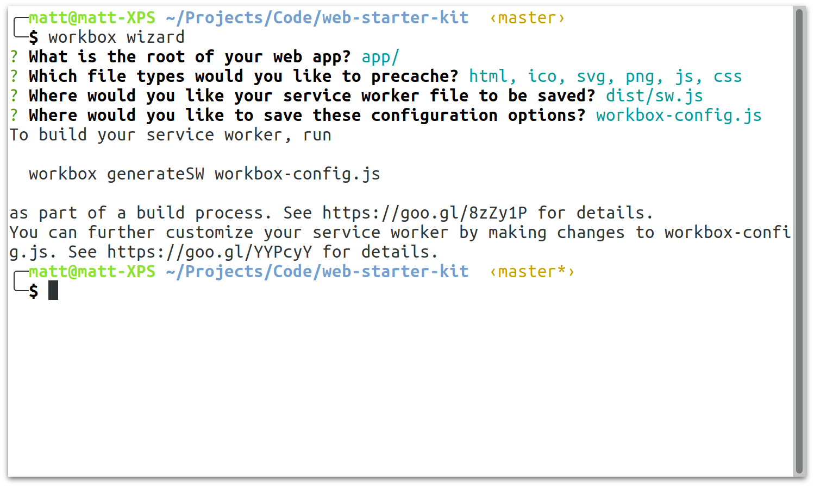

project_path: /web/tools/workbox/_project.yaml
book_path: /web/tools/workbox/next/_book.yaml
description: A guide on how to precache files with Workbox.

{# wf_updated_on: 2017-11-15 #}
{# wf_published_on: 2017-11-15 #}

# Precache Files {: .page-title }



If you want your web app to work offline or there are assets you know can be
cached for a long time, precaching is the best approach.

Precaching a file will ensure that a file is downloaded and cached before a
service worker is installed, meaning that if you service worker is installed,
your files will be cached.

Workbox provides an easy way to precache files, ensuring that as your service
worker changes, the precached files are maintained efficiently, only
downloaded updated files and cleaning up after the service worker is made
redundant.

```javascript
workbox.precaching.preacheAndRoute([
    '/styles/index.0c9a31.css',
    '/scripts/main.0d5770.js',
    { url: '/index.html', revision: '383676' },
]);
```

This command will download the files `/styles/index.0c9a31.css`,
`/scripts/main.0d5770.js` and `/index.html` during the service worker install
event and then create a route that serves these files directly from the cache.

First we'll cover some of the options that relate to precaching before looking
at how you can generate a list of files to precache (we call this array of
files the "precache manifest").

## Handling "/" and "/index.html"

It's fairly common to have an `index.html` file that is served when a
url ending in a `/` is request.

By default, the *precache route *will append an `index.html` to any url ending
in a slash to check if it's precached as `index.html`. This means that any
`index.html` file you've precached will be accessible via `/index.html` or `/`.

You can alter this behavior by changing the
[directoryIndex option](../reference-docs/latest/workbox.precaching#.addRoute).
For example, if you wanted to disable this behaviour, you can pass in null.

```javascript
workbox.precaching.precacheAndRoute(
  [
    '/styles/index.0c9a31.css',
    '/scripts/main.0d5770.js',
    { url: '/index.html', revision: '383676' },
  ],
  {
    directoryIndex: null,
  }
);
```

## Ignoring Search Parameters

By default Workbox will treat URL's as different if the search parameters are
different. This means that if you precached `/index.html` and someone made a
request for `/index.html?example=search`, Workbox **wouldn't** match the URL
with the precached file.

You can alter this behavior with the `ignoreUrlParametersMatching` option
which will remove any search parameters matching a regex in this option.

For example, if we wanted to convert the URL `/example.html?key1=1&key2=2`
such that `key1` wasn't a part of the URL, you set the
`ignoreURLParametersMatching` option to remove it, like so:

```javascript
workbox.precaching.precacheAndRoute(
  [
    { url: '/example.html?key2=2', revision: '6821e0' }
  ],
  {
    ignoreUrlParametersMatching:[/key1/],
  }
);
```

By default, this is set to `[/^utm_/]` to ensure tracking metrics don't
affect precaching. If you wanted to ignore all search parameters you use
the regex `[/./]`.

## Generating the Precache Manifest

Most users of Workbox will generate the list of files to precache by using
one of the following Workbox tools:

- [Workbox CLI](../modules/workbox-cli)
- [workbox Build](../modules/workbox-build)
- [Workbox Webpack Plugin](../modules/workbox-webpack-plugin)

In the rest of this document we'll cover how you can use these tools to
generate the precache manifest and inject it in your service worker, but
it's worth noting that this list can be generated from other tools. The
format for the list must be an array of objects with a `url` and `revision`
property like so:

```javascript
{
  url: '<URL of file to precache>',
  revision: '<Hash of the file contents>'
}
```

The most imporant thing to note is that the `revision` is updated whenever
there is a change to the file. An md5 hash of the file contents is normally
enough. If the revision isn't updated files will fail to be
updated when you update your service worker, see the
[workbox.precaching for more info](../modules/workbox-precaching).

The [Workbox CLI](../modules/workbox-cli),
[Workbox Build](../modules/workbox-build) and
[Workbox WebPack Plugin](../modules/workbox-webpack-plugin)
modules provide methods to generate a complete service worker for you.
This is perfect for a wide range of use cases, especially static sites. If
this sounds like something you want, stop reading this guide
and check out
[Generate a Complete Service Worker Guide](./generate-complete-sw).

### Setup

Before you can inject a manifest into your service worker, you need to make sure
that your service worker file has the following snippet of code:

```javascript
workbox.precaching.precacheAndRoute([]);
```

The reason this is needed is that the Workbox tools will look for this snippet
and "inject" the list of assets to precache into the empty array.

```javascript
workbox.precaching.precacheAndRoute([
  {
    "url": "basic.html",
    "revision": "7ca37fd5b27f91cd07a2fc68f20787c3"
  },
  {
    "url": "favicon.ico",
    "revision": "1378625ad714e74eebcfa67bb2f61d81"
  },
  {
    "url": "images/hamburger.svg",
    "revision": "d2cb0dda3e8313b990e8dcf5e25d2d0f"
  },

  ...

]);
```

If you haven't already, make sure you have a `sw.js` file and make sure that
you've added the snippet above to it.

### Using the Workbox Command Line Interface

The Workbox Command Line Interface (a.k.a the Workbox CLI) has the ability to
setup a config file for your project which can then be used to generate the
list of files to precache and inject that list into your service worker.

This method is useful if you aren't too familiar with Node and aren't using
webpack.

Start by install the cli:

<pre class="devsite-terminal">
npm install workbox-cli -g
</pre>

You should be able to run the command `workbox --help` after it's installed.

<pre class="devsite-terminal">
workbox --help

  workbox-cli is the command line interface for Workbox.

  Usage:
  $ workbox <command> [options]

  ...
</pre>

The next to set up precaching it run the wizard which will ask a set of
questions about your project to determine which files should be precached.

Running `workbox wizard` will step through a set of questions to understand
your project. Below is an example set of questions.



After you've run the wizard we'll need to add the location of our service
worker to the config file. Notice the `swSrc` entry added to the workbox
config.

```javascript
module.exports = {
  "globDirectory": "app/",
  "globPatterns": [
    "**/*.{html,ico,svg,png,js,css}"
  ],
  "swDest": "dist/sw.js",
  "swSrc": "app/sw.js"
};
```

With this, you can run the `injectManifest` command that will read the file
defined in `swSrc` and generate a version of it with the manifest to the
location defined in `swDest`.

In this case it will take `app/sw.js`, inject the manifest and write the file
to `dist/sw.js`.

When the inject manifest command is run, it'll print up some stats on the
number of files and the total size.

<pre class="devsite-terminal">
workbox injectManifest workbox-config.js
The service worker was written to dist/sw.js
11 files will be precached, totalling 43.5 kB.
</pre>

Run the `workbox injectManifest` command before you deploy your site to ensure
the precache list is up to date.

### Using workbox-build

The `workbox-build` module provides a method to inject the precace manifest
into your service worker.

This module is the best option if you currently have a Node based build process
for your project (i.e. you are using a tool like [Gulp](https://gulpjs.com/)).

To install the module just run:

<pre class="devsite-terminal">
npm install workbox-build --save-dev
</pre>

Then in your build process you'll want to `require` in the module and
use the
[injectManifest method](../reference-docs/latest/module-workbox-build#.injectManifest)
to read in your service worker and output a version with the injected manifest.

```javascript
const workboxBuild = require('workbox-build');

workboxBuild.injectManifest({
  swSrc: path.join(__dirname, 'app', 'sw.js'),
  swDest: path.join(__dirname, 'dist', 'sw.js'),
  injectionPointRegexp: /(\.precacheAndRoute\()\s*\[\s*\]\s*(\))/,
})
.catch((err) => {
  console.error(`Unable to inject the precache manifest into sw.js`);
  throw err;
});
```

Running this will read in `app/sw.js` and output a version of it to `dist/sw.js`
with the manifest injected into it.

To use this in Gulp, you would do the following:

```javascript
const workboxBuild = require('workbox-build');
const gulp = require('gulp');

gulp.task('build-sw', () => {
  return workboxBuild.injectManifest({
    swSrc: path.join(__dirname, 'app', 'sw.js'),
    swDest: path.join(__dirname, 'dist', 'sw.js'),
    injectionPointRegexp: /(\.precacheAndRoute\()\s*\[\s*\]\s*(\))/,
  })
  .catch((err) => {
    console.error(`Unable to inject the precache manifest into sw.js`);
    throw err;
  });
});
```
