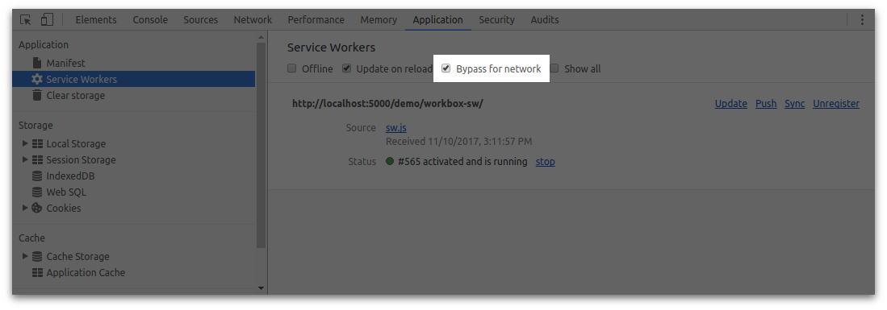
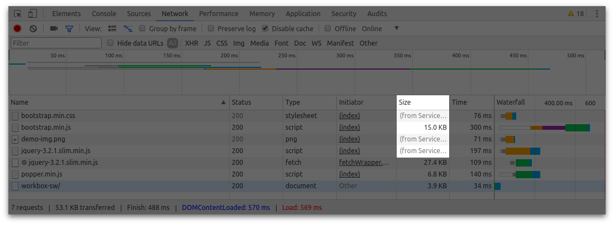

project_path: /web/tools/workbox/_project.yaml
book_path: /web/tools/workbox/_book.yaml
description: A guide on how to troubleshoot and debugging issues with Workbox.

{# wf_updated_on: 2020-01-16 #}
{# wf_published_on: 2017-11-15 #}
{# wf_blink_components: N/A #}

# Troubleshoot and Debug {: .page-title }

Working with service workers can be challenging, especially when
starting out. This page will cover a few useful tips to help working
with service workers and help with Workbox.

## Get to Know Your Developer Tools

Chrome's developer tools have a number of tools to make it easier to
work with service workers.

The most common features used are the following.

### Update on Reload

The "update on reload" toggle will force Chrome to check for a new service
worker every time you refresh the page. This means that any new changes will
be found on each page load.


### Clear Storage

There will come a point where you'll want to start from a clean state.
No service workers, not caching, nothing. You can clear everything with
the "Clear site data" button.


## Bypass for Network

When you aren't working with service workers at all, you can make the browser
go straight to the network (i.e. not use the service worker) with the "Bypass
for Network" toggle.



You'll know that this is working because the network panel will stop showing
"(from ServiceWorker)".



There are plenty more features, but the above list should help as you start
working on your service worker files.
[Learn what other features exist in DevTools here](/web/tools/chrome-devtools/progressive-web-apps#service-workers).

## Common Problems

There are a set of problems that are common for developers to hit when
working with service workers.

**_Q:_** Why does my service worker load, but not get used?

**_A:_** This can occur if the "scope" of your service worker doesn't
match your page.

You can check if this is the problem by following these steps:

1. Open DevTools for your site and go to `Application > Service Workers`.
1. Find your service worker and look for a `Clients` entry. If you don't see
   it, like the image below, then scoping is likely to be an
   issue.

    

    If the scoping is correct, your web page will show up as a client, as shown
    below.

    

This normally occurs because the location of the service worker is not
at the root of the site (i.e. instead of `/sw.js` it's under a directory
like `/scripts/sw.js`).

The easiest solution is to move your service worker to the root of your domain.
An alternative solution is to add a `Service-Worker-Allowed` header to the
service worker response. You can then change the scope and register your service
worker like so:

```javascript
// OK when 'Service-Worker-Allowed' header is set to '/'
navigator.serviceWorker.register('/blog/sw.js', {scope: '/'});
```

You can [learn more about service worker scope here](/web/fundamentals/primers/service-workers/lifecycle#scope_and_control).

**_Q:_** Why are changes to my service worker not shown?

**_A:_** The reason that you might find that your service worker isn't
updating is because it's stuck in a pending state. This is normally caused
by having multiple tabs or windows open that are using the service worker.

You can determine if this is the case by looking under your service worker
in `Application > Service Workers`.


You can fix this by clicking the "skipWaiting" link or by closing the extra
tabs so you only have one tab using the website (this enables the service
worker to update on a refresh).

**_Q:_** My service worker isn't pending, but it's still not loading new changes.

**_A:_** Browsers will actually use a cached version of a service worker if
the service worker file is served with a cache expiration header. The cached
version will only be used for up to 24 hours, but it can still be difficult
to reason with.
**The best practice is to set the cache expiration header to 0 for your service worker file**.
This forces the browser to update the service worker whenever your page loads.

## Debugging Workbox

If you are finding it difficult to debug what Workbox is doing, there are a few
things you can do to get some extra information.

### Use a Debug Build

The debug builds of Workbox perform extra checks on the input and output
arguments, provide extra logging and come unminified. This should help you
debug a range of issues.

If you are using `workbox-sw`, you just need to set the config to `debug: true`
to force Workbox to use debug builds.

```javascript
workbox.setConfig({
  debug: true
});
```

### Enable 'debug' Logs

The debug builds of Workbox will, by default, log extensive messages to the [JavaScript
console](/web/tools/chrome-devtools/console/). These messages are tagged with specific log levels,
and your JavaScript console might not be configured to show all log levels by default.

We recommend checking your JavaScript console's [log level
filtering](/web/tools/chrome-devtools/console/log#level) and adjusting it accordingly. Setting it to
display the "Verbose" level will result in seeing the most detailed messages, and can help in your
debugging.

Note: to prevent all Workbox messages from being logged to the console when in
development mode, you can set the variable `self.__WB_DISABLE_DEV_LOGS` to
`true` in your service worker.

## Stack Overflow

If you are still struggling to figure out your problem, try posting a question
to [Stack Overflow with the `workbox` tag](https://stackoverflow.com/questions/ask?tags=workbox).
This enables a wide audience of people to view, answer and learn from your
question.
