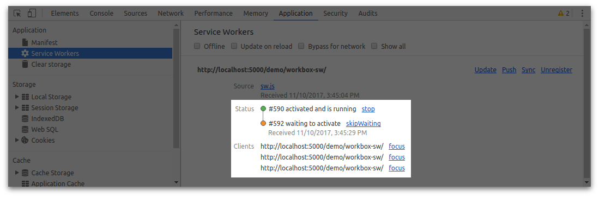

project_path: /web/tools/workbox/_project.yaml
book_path: /web/tools/workbox/next/_book.yaml
description: A guide on how to troubleshoot and debugging issues with Workbox.

{# wf_updated_on: 2017-11-15 #}
{# wf_published_on: 2017-11-15 #}

# Troubleshoot and Debug {: .page-title }



Working with service workers can be challenging, especially when
starting out. This page will cover a few useful tips to help working
with service workers and help with Workbox.

## Get to Know Your Developer Tools

Chrome's developer tools have a number of tools to make it easier to
work with service workers.

The most common features use are the following.

### Update on Reload

The "update on reload" toggle will force Chrome to check for a new service
worker every time you refresh the page. This means that any new changes will
be found on each page load.


### Clear Storage

There will come a point where you'll want to start from a claim state.
No service workers, not caching, nothing. You can clear everything with
the "Clear site data" button.


## Bypass for Network

When you aren't working with service workers at all, you can make the browser
go straight to the network (i.e. not use the service worker) with the "Bypass
for Network" toggle.


You'll know what this is working because the network panel will stop showing
"(from ServiceWorker)".


There are plenty more features, the above list should help as you start
working on your service worker files.
[Learn what other features exist in DevTools here](/web/tools/chrome-devtools/progressive-web-apps#service-workers).

## Common Problems

There are a set of problems that are common for developers to hit when
working with developers.

**_Q:_** Why isn't my new service worker loading?

**_A:_** The reason that you might find that your service worker isn't
loading is because it's stuck in a pending state. This is normally caused
by having multiple tabs or windows open that are using the service worker.

You can determine if this is the case by looking under your service worker
in Application > Service Workers.



You can fix this by clicking the "skipWaiting" link or by closing the extra
tabs so you only have one tab using the website (this enables the service
worker to update on a refresh).

**_Q:_** My service worker isn't pending, but it's still no loading new changes.

**_A:_** Browsers will actually use a cached version of a service worker if
the service worker file is served with a cache expiration header. The cached
version will only be used for up to 24 hours, but it can still be difficult
to reason with.
**The best practice is to set the cache expiration header to 0 for your service worker file**.
This forces the browser to update the service worker whenever your page loads.

## Debugging Workbox

If you are finding it difficult to debug what Workbox is doing there are a few
things you can do to get some extra information.

### Use a Debug Build

The debug builds of Workbox perform extra checks on the inputs and outputs
arguments, provide extra logging and come unminified. This should help with
debug a range of issues.

If you are using `workbox-sw`, you just need to set the config to `debug: true`
to force Workbox to use debug builds.

```javascript
workbox.setConfig({
  debug: true
});
```

If you are using the module files directly, just swap `.prod.js` for `.dev.js`.

### Enable 'debug' Logs

To avoid clogging up the console with Workbox logs it has a log level feature
that by default will be set to `log` for debug builds. Changing the log level
to `debug` will result in more logs being printed to the console.

```javascript
workbox.core.setLogLevel(workbox.core.LOG_LEVELS.debug);
```

## Stackoverflow

If you are still struggling to figure out your problem try posting a question
to [Stackoverflow with the `workbox` tag](https://stackoverflow.com/questions/ask?tags=workbox).
This enables a wide audience of people to view, answer and learn from your
question.
