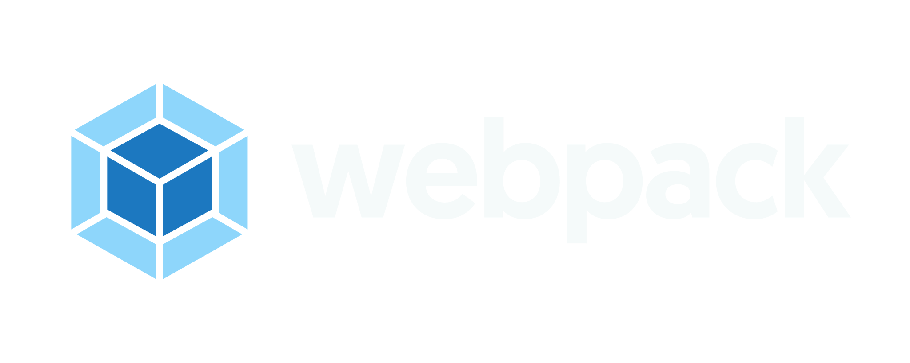
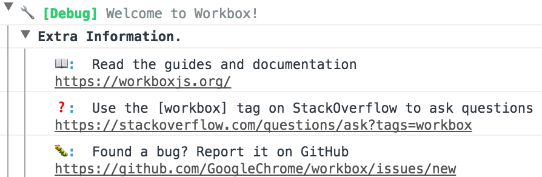

project_path: /web/tools/_project.yaml
book_path: /web/tools/_book.yaml
description: Service Worker Libraries.

{# wf_published_on: 2017-10-04 #}
{# wf_updated_on: 2017-10-31 #}

<style>
.index__install-options {
  display: flex;
  flex-direction: column;
  width: 100%;
  margin-bottom: 16px;
}

.index__install-option {
  display: flex;
  width: 100%;

  justify-content: center;
  align-items: center;

  padding: 32px 32px;
  box-sizing: border-box;
}

.index__install-option img {
  width: 100%;
}

.index__install-webpack {
  background-color: black;
}

.index__install-gulp {
  background-color: #D04843;
  margin: 10px 0;
}

.index__install-npm {
  background-color: #2a333c;
}

.workbox-logo {
  padding: 0 30px;
}

.page-title {
  display: none;
}

@media (min-width: 780px) {
  .index__install-options {
    flex-direction: row;
  }

  .index__install-option {
    width: 0;
    flex: 1;
  }

  .index__install-gulp {
    margin: 0 10px;
  }
}
</style>

# Workbox {: .page-title }

<figure class="attempt-right workbox-logo">
  
</figure>

Workbox is a collection of libraries and build tools that make it easy to
store your website’s files locally, on your users’ devices. Consider Workbox
if you want to:

- Make your site work offline.
- Improve load performance on repeat-visits. Even if you don’t want to go
fully-offline, you can use Workbox to store and serve common files locally,
rather than from the network.

<p><a class="button" href="overview">Learn more</a></p>

## Get Started
### Choose your build tool to get started:

<div class="index__install-options">
  <a href="./get-started/webpack.html" class="index__install-option index__install-webpack">
    
  </a>

  <a href="./get-started/gulp.html" class="index__install-option index__install-gulp">
    
  </a>

  <a href="./get-started/npm-script.html" class="index__install-option index__install-npm">
    
  </a>
</div>

### Not using a build tool?

Install our command-line interface:

```
$ npm install workbox-cli --global

# Generate a service worker with some smart defaults
$ workbox generate:sw
```

### Want to work directly in your service worker?

We support that too with workbox-sw.

```
$ npm install --save workbox-sw
```

Then reference the file from your service worker:

```
importScripts('/node_modules/workbox-sw/build/workbox-sw.vX.X.X.prod.js');
```

## Features

### Easy precaching

```javascript
importScripts('/node_modules/workbox-sw/build/workbox-sw.vX.X.X.prod.js');

const workboxSW = new WorkboxSW();
workboxSW.precache([
  {
    url: '/index.html',
    revision: 'bb121c',
  }, {
    url: '/styles/main.css',
    revision: 'acd123',
  }, {
    url: '/scripts/main.js',
    revision: 'a32caa',
  }
]);
```

### Comprehensive caching strategies

```javascript
const workboxSW = new WorkboxSW();
const networkFirst = workboxSW.strategies.networkFirst();
workboxSW.router.registerRoute('/schedule', networkFirst);
```

- Cache only
- Cache first, falling back to network
- Cache, with network update
- Network only
- Network first, falling back to cache

### Powerful debugging support



### The next version of sw-precache &amp; sw-toolbox

Workbox is a rethink of our previous service worker libraries with a focus on
modularity. It aims to reduce friction with a unified interface, while keeping
the overall library size small. Same great features, easier to use and
cross-browser compatible.

## Workbox: Flexible PWA Libraries @ Chrome Dev Summit 2017

In this talk, Jeff Posnick gives an overview of Workbox's support for caching
strategies, precaching, and handling navigation requests. It's filled throughout
with real-world examples of how companies like Pinterest and WIRED are using
Workbox in production.

<div class="video-wrapper">
  <iframe class="devsite-embedded-youtube-video" data-video-id="DtuJ55tmjps"
          data-autohide="1" data-showinfo="0" frameborder="0" allowfullscreen>
  </iframe>
</div>
