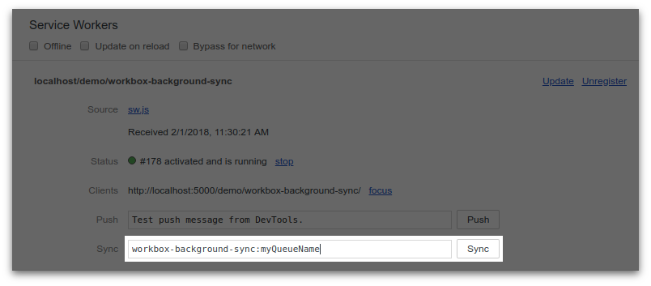

project_path: /web/tools/workbox/_project.yaml
book_path: /web/tools/workbox/_book.yaml
description: The module guide for workbox-background-sync.

{# wf_blink_components: N/A #}
{# wf_updated_on: 2018-02-01 #}
{# wf_published_on: 2017-11-27 #}

# Workbox Background Sync {: .page-title }



## What is Workbox Background Sync?

When you send data to a web server, sometimes the requests will fail. It
may be because the user has lost connectivity, or it may be because the
server is down; in either case you often want to try sending the requests
again later.

The new [BackgroundSync API](https://wicg.github.io/BackgroundSync/spec/)
is an ideal solution to this problem. When a service worker detects that a
network request has failed, it can register to receive a `sync` event,
which gets delivered when the browser thinks connectivity has returned.
Note that the sync event can be delivered *even if the user has left the
application*, making it a much more effective than traditional method of
retrying failed requests.

Workbox Background Sync is designed to make it easier to use the
BackgroundSync API and integrate its usage with other Workbox modules. It
also implements a fallback strategy for browsers that don't yet implement
BackgroundSync.

## Basic Usage

The easiest way to use Background Sync is to use the `Plugin` that will
automatically Queue up failed requests and retry them when  future `sync`
events are fired.

```javascript
const bgSyncPlugin = new workbox.backgroundSync.Plugin('myQueueName', {
  maxRetentionTime: 24 * 60 // Retry for max of 24 Hours
});

workbox.routing.registerRoute(
  /\/api\/.*\/*.json/,
  workbox.strategies.networkOnly({
    plugins: [bgSyncPlugin]
  }),
  'POST'
);
```

## Advanced Usage

Workbox Background Sync also provides a `Queue` class, which you can
instantiate and add failed requests to. The failed requests are stored
in [IndexedDB](https://developer.mozilla.org/en-US/docs/Web/API/IndexedDB_API)
and are retried when the browser thinks connectivity is restored (i.e.
when it receives the sync event).

### Creating a Queue

To create a Workbox Background Sync Queue you need to construct it with
 a queue name (which must be unique to your
[origin](https://developer.mozilla.org/en-US/docs/Web/Security/Same-origin_policy#Definition_of_an_origin)):

```js
const queue = new workbox.backgroundSync.Queue('myQueueName');
```

The queue name is used as part of the tag name that gets
[`register()`](https://wicg.github.io/BackgroundSync/spec/#dom-syncmanager-register)-ed
by the global
[`SyncManager`](https://wicg.github.io/BackgroundSync/spec/#sync-manager-interface). It's
also used as the
[Object Store](https://developer.mozilla.org/en-US/docs/Web/API/IDBObjectStore) name for
the IndexedDB database. 

**Note**: it's not important that you know these
details, but they're the reason the queue name has to be unique to your
origin.

### Adding a request to the Queue

Once you've created your Queue instance, you can add failed requests to it.
You add failed request by invoking the `.addRequest()` method. For example,
the following code attempts to make a POST request to an API. If the
request fails, it's added to the queue:

```js
const queue = new workbox.backgroundSync.Queue('myQueueName');
const request = new Request('/path/to/api', {
  method: 'POST',
  body: someformData,
});

try {
  await fetch(request);
} catch (err) {
  queue.addRequest(request);
}
```

Once added to the queue, the request is automatically retried when the
service worker receives the `sync` event (which happens when the browser
thinks connectivity is restored). Browsers that don't support the
BackgroundSync API will retry the queue every time the service worker is
started up. This requires the page controlling the service worker to be 
running, so it won't be quite as effective.

## Testing Workbox Background Sync

Sadly, testing BackgroundSync sync is somewhat unintuitive and difficult
for a number of reasons.

The best approach to test your implementation is to do the following:

1. Load up a page and register your service worker.
1. Turn off your computers network or turn off your web server.
    - ⚠️ **DO NOT USE CHROME DEVTOOLS OFFLINE** ⚠️ The offline checkbox in 
    DevTools only affects requests from the page. Service Worker requests
    will continue to go through.
1. Make network requests that should be queued with Workbox Background Sync.
    - You can check the requests have been queued by looking in
    `Chrome DevTools > Application > IndexedDB > workbox-background-sync > requests`
1. Now turn on your network or web server.
1. Force an early `sync` event by going to
  `Chrome DevTools > Application > Service Workers`, enter the tag name of 
  `workbox-background-sync:<your queue name>` where "<your queue name>" should be
  the name of the queue you set and then clicking the 'Sync'
  button.

    

1. You should see network requests go through for the failed requests and
  the IndexedDB data should now be empty since the requests have been 
  successfully replayed.