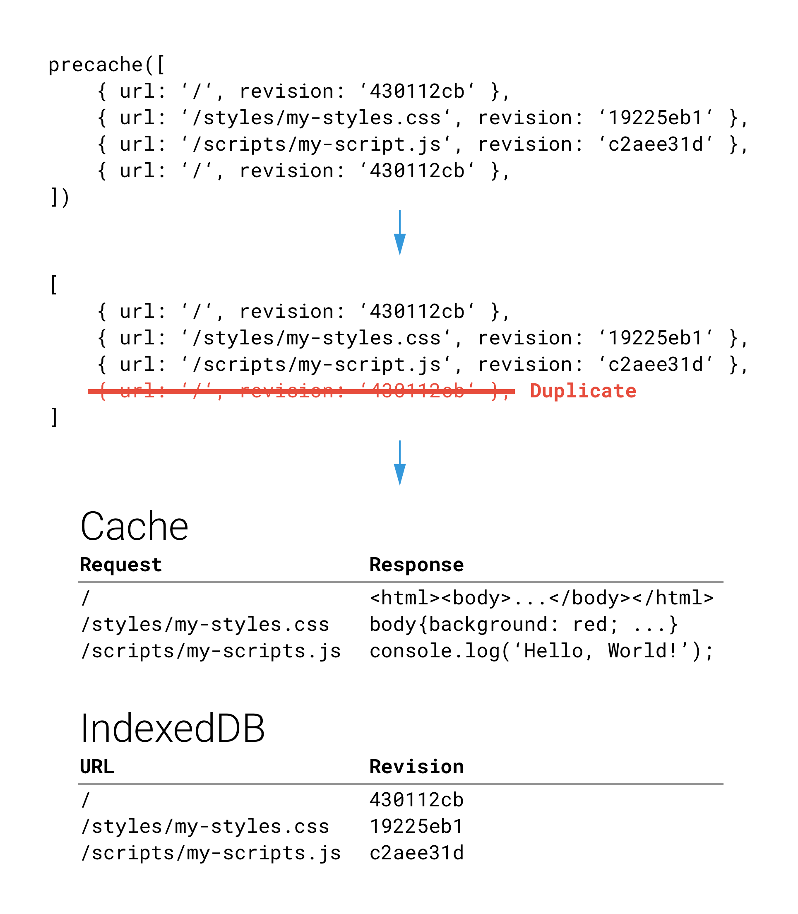
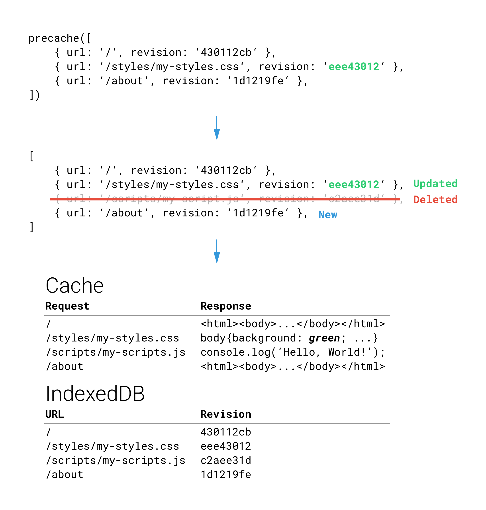
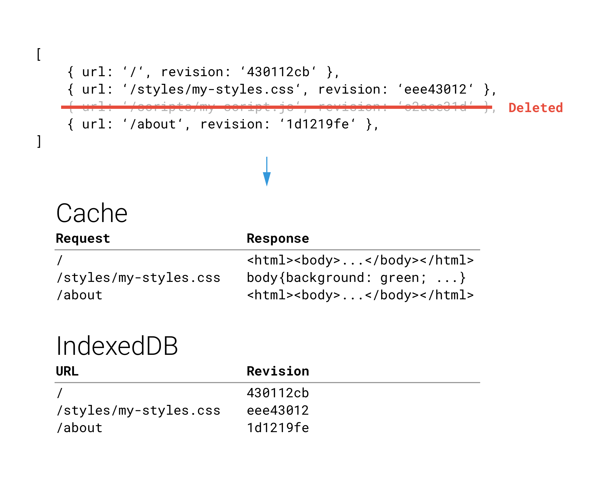

project_path: /web/tools/workbox/_project.yaml
book_path: /web/tools/workbox/next/_book.yaml
description: The module guide for workbox-core.

{# wf_updated_on: 2017-11-27 #}
{# wf_published_on: 2017-11-27 #}

# Workbox Precaching {: .page-title }



[Demo](https://workbox-demos.firebaseapp.com/demo/workbox-precaching/) | [Reference Docs](http://localhost:8080/web/tools/workbox/reference-docs/latest/workbox.precaching)

## What is Precaching?

One feature of service workers is the ability to save a set of files to the
cache when the service worker is installing. This is often referred to as
"precaching", since you are caching content ahead of the service worker being
used.

The main reasons for doing this is that it gives developers control over the
cache, meaning they can determine when and how long a file is cached as well
as serve it to the browser without going to the network, meaning it can be
used to create web apps that work offline.

Workbox takes a lot of the heavy lifting out of precaching by simplifying
the API and ensuring assets are downloaded efficiently.

## How workbox-precaching Works

When a web app is loaded for the first time workbox-precaching will

look at all the assets you want to download, remove any duplicates and hook
up the relevant service worker events to download and store the assets,
saving information about the revision of the asset in indexedDB.



 workbox-precaching does all of this during the service worker's
 [install event](https://developer.mozilla.org/en-US/docs/Web/API/Service_Worker_API/Using_Service_Workers#Install_and_activate_populating_your_cache).

When a user later re-visits your web app and you have a new service worker with
different precached assets, workbox-precaching will look at the new list
and determine which assets are completely new and which of the existing assets
need updating, based of their revisioning. These assets will be updated in the
cache and their revision details will be updated or added to indexedDB during
this new service workers install event.



This new service worker won't be used until it's activated and it’s activate
event has been triggered. It’s in the activate event that workbox-precaching
will check for any old cached assets and remove them from the cache and
indexedDB.



Precache will perform these steps each time your service worker is install
and activated, ensuring the user has the latest assets, only downloading the
files that have changed.

## Explanation of the Precache List

workbox-precaching expects an Array of strings or an Array of objects like so:

```javascript
workbox.precaching.precacheAndRoute([
  '/styles/example.ac29.css',
  {
    url: '/index.html',
    revision: 'as46',
  }
]);
```

This list references a set of URLs, each with their own piece of "revisioning"
information. For the first item in the example above,
'/styles/example.ac29.css', the revisioning information
**is in the URL itself**. This is a best practice for web as it allows
browsers to safely cache these URLs for a long time. For assets with
revisioning like this, you can add them to the precache list as is.

For assets where you don't have revisioning information in the URL,
**you need to add a revision property which should be a hash of the file contents**.
This allows workbox-precaching to know when the file has changed and update it.

Workbox comes with tools to help with generating this list:

- workbox-build
  - This is an NPM module that can be used in a gulp task or as an npm
    run script.
- workbox-webpack-plugin
  - Webpack users can use the Workbox webpack plugin.
- workbox-cli
  - Our CLI can also be used to generate the list of assets and add them
    to your service worker.

These tools make it easy to generate and use the list of assets for your site
but you can generate the list yourself, just make sure you include unique
revision properties that change whenever the file is updated.

```javascript
// Revisioned files added via a glob
workbox.precaching.precache([
  '/styles/example-1.abcd.css',
  '/styles/example-2.1234.css',
  '/scripts/example-1.abcd.js',
  '/scripts/example-2.1234.js',
]);

// Precache entries from workbox-build or somewhere else
workbox.precaching.precache([
  {
    url: '/index.html',
    revision: 'abcd',
  }, {
    url: '/about.html',
    revision: '1234',
  }
]);

// Add Precache Route
workbox.precaching.addRoute();
```

## Advanced Usage

By default, workbox-precaching will set up the install and activate listeners
for you. For developers familiar with service workers, this may not be
desirable and you may want finer grained control.

Instead of using the default export, you can use the
[PrecacheController](/web/tools/workbox/reference-docs/latest/workbox.precaching.PrecacheController)
to add items to the precache, determine when these assets are installed and
when cleanup should occur.

```javascript
const precacheController = new workbox.precaching.PrecacheController();
precacheController.addToCacheList([
  '/styles/example-1.abcd.css',
  '/styles/example-2.1234.css',
  '/scripts/example-1.abcd.js',
  '/scripts/example-2.1234.js',
]);

precacheController.addToCacheList([
  {
    url: '/index.html',
    revision: 'abcd',
  }, {
    url: '/about.html',
    revision: '1234',
  }
]);


self.addEventListener('install', (event) => {
  event.waitUntil(precacheController.install());
});
self.addEventListener('activate', (event) => {
  event.waitUntil(precacheController.cleanup());
});
self.addEventListener('fetch', (event) => {
  event.respondWith(caches.match(event.request).then(...));
});
```
