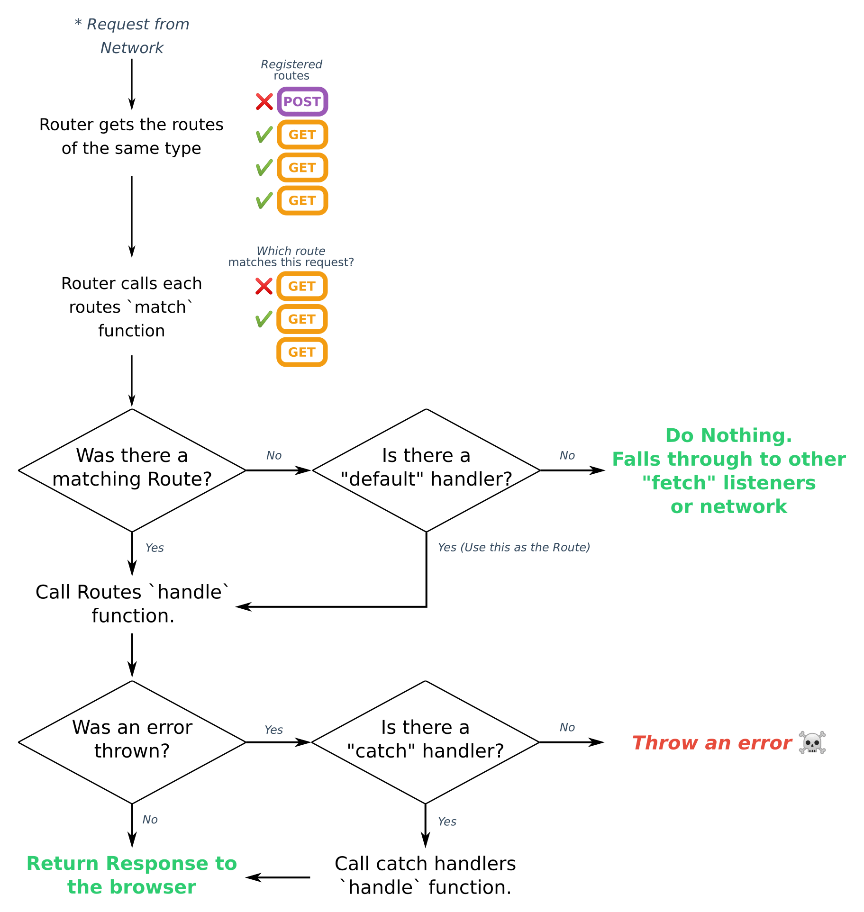
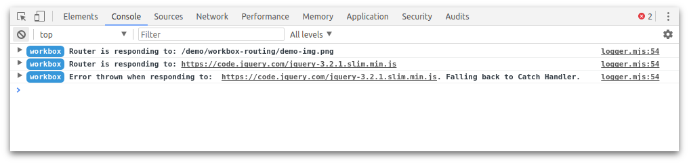
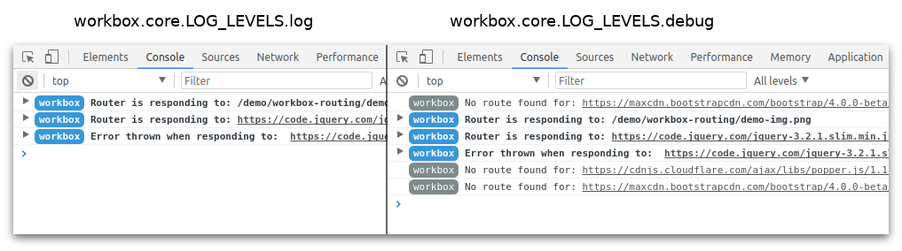

project_path: /web/tools/workbox/_project.yaml
book_path: /web/tools/workbox/_book.yaml
description: The module guide for workbox-routing.

{# wf_blink_components: N/A #}
{# wf_updated_on: 2020-01-16 #}
{# wf_published_on: 2017-11-27 #}

# Workbox Routing {: .page-title }

## What is Workbox Routing?

A service worker can intercept network requests for a page. It may respond to
the browser with cached content, content from the network or content generated
in the service worker.

`workbox-routing` is a module which makes it easy to "route" these requests to
different functions that provide responses.

## How Routing is Performed

When a network request causes a service worker fetch event, `workbox-routing`
will attempt to respond to the request using the supplied routes and handlers.



The main things to note from the above are:

- The method of a request is important. By default, Routes are registered for
  `GET` requests. If you wish to intercept other types of requests, you’ll need
  to specify the method.

- The order of the Route registration is important. If multiple Routes are
  registered that could handle a request, the Route that is registered first
  will be used to respond to the request.

There are a few ways to register a route: you can use callbacks, regular
expressions or Route instances.

## Matching and Handling in Routes

A "route" in workbox is nothing more than two functions: a “matching” function
to determine if the route should match a request and a “handling” function,
which should handle the request and respond with a Response.

Workbox comes with some helpers that’ll perform the matching and handling for
you, but if you ever find yourself wanting different behaviour, writing a
custom match and handler function is the best option.

A match function will be given a `FetchEvent` and a URL object and you can
match against a request by returning a truthy value. For a simple example,
you could match against a specific URL like so:

```js
const matchCb = ({url, event}) => {
  return (url.pathname === '/special/url');
};
```

Most use cases can be covered by examining / testing either the `url` or the
`event.request` to match against a Request.

A "handler" will be given the URL and event as well and you can determine how
to respond, whether it’s from the network, from the cache or generated in the
service worker.

```js
const handlerCb = ({url, event, params}) => {
  return fetch(event.request)
  .then((response) => {
    return response.text();
  })
  .then((responseBody) => {
    return new Response(`${responseBody} <!-- Look Ma. Added Content. -->`);
  });
};
```

Your handler must return a Promise that resolves to a Response. The `params`
value is the value returned by the "match" function. This may
be useful if you parsed the URL or request and want to pass values into
the “handler” for a matching request.

You can register these callbacks like so:

```js
import {registerRoute} from 'workbox-routing';

registerRoute(matchCb, handlerCb);
```

The only limitation is that the "match" callback **must synchronously** return a truthy
value, you can’t perform any asynchronous work. The reason for this is that
the `Router` must synchronously respond to the fetch event or allow falling
through to other fetch events.

The "handler" callback should return a Promise that resolves to a
[Response](https://developer.mozilla.org/en-US/docs/Web/API/Response).
Where that Response comes from is up to you; it could come from the
network, from a cache, or it could be generated in the service worker.

Normally the "handler" callback would use one of the strategies provided
by [workbox-strategies](./workbox-strategies) like so:

```js
import {registerRoute} from 'workbox-routing';
import {StaleWhileRevalidate} from 'workbox-strategies';

registerRoute(
  matchCb,
  new StaleWhileRevalidate()
);
```

In this page, we’ll focus on `workbox-routing` but you can
[learn more about these strategies on workbox-strategies](./workbox-strategies).

## How to Register a Regular Expression Route

A common practice is to use a regular expression instead of a "match" callback.
Workbox makes this easy to implement like so:

```js
import {registerRoute} from 'workbox-routing';

registerRoute(
  new RegExp('/styles/.*\\.css'),
  handlerCb
);
```

For requests from the
[same origin](https://developer.mozilla.org/en-US/docs/Web/Security/Same-origin_policy),
this regular expression will match as long as the request’s URL matches the
regular expression.

- https://example.com<span style="color: #2ecc71">/styles/main.css</span>
- https://example.com<span style="color: #2ecc71">/styles/nested/file.css</span>
- https://example.com/nested<span style="color:#2ecc71">/styles/directory.css</span>

However, for cross-origin requests, regular expressions
**must match the beginning of the URL**. The reason for this is that it’s
unlikely that with a regular expression `new RegExp('/styles/.*\\.css')`
you intended to match third-party CSS files.

- <span style="color: #e74c3c">https://cdn.third-party-site.com</span><span style="color: #2ecc71">/styles/main.css</span>
- <span style="color: #e74c3c">https://cdn.third-party-site.com</span><span style="color: #2ecc71">/styles/nested/file.css</span>
- <span style="color: #e74c3c">https://cdn.third-party-site.com/nested</span><span style="color: #2ecc71">/styles/directory.css</span>

If you *did* want this behaviour, you just need to ensure that the regular
expression matches the beginning of the URL. If we wanted to match the
requests for `https://cdn.third-party-site.com` we could use the regular
expression `new RegExp('https://cdn\\.third-party-site\\.com.*/styles/.*\\.css')`.

- <span style="color: #2ecc71">https://cdn.third-party-site.com/styles/main.css</span>
- <span style="color: #2ecc71">https://cdn.third-party-site.com/styles/nested/file.css</span>
- <span style="color: #2ecc71">https://cdn.third-party-site.com/nested/styles/directory.css</span>

If you wanted to match both local and third parties you can use a wildcard
at the start of your regular expression, but this should be done with caution
to ensure it doesn’t cause unexpected behaviors in you web app.

## How to Register a Navigation Route

If your site is a single page app, you can use a
[NavigationRoute](/web/tools/workbox/reference-docs/latest/module-workbox-routing.NavigationRoute) to
return a specific response for all
[navigation requests](/web/fundamentals/primers/service-workers/high-performance-loading#first_what_are_navigation_requests).

```javascript
import {createHandlerBoundToURL} from 'workbox-precaching';
import {NavigationRoute, registerRoute} from 'workbox-routing';

// This assumes /app-shell.html has been precached.
const handler = createHandlerBoundToURL('/app-shell.html');
const navigationRoute = new NavigationRoute(handler);
registerRoute(navigationRoute);
```

Whenever a user goes to your site in the browser, the request for the page
will be a navigation request and it will be served the cached page
`/app-shell.html`. (Note: You should have the page cached via
`workbox-precaching` or through your own installation step.)

By default, this will respond to *all* navigation requests. If you want to
restrict it to respond to a subset of URLs, you can use the `allowlist`
and `denylist` options to restrict which pages will match this route.

```javascript
import {createHandlerBoundToURL} from 'workbox-precaching';
import {NavigationRoute, registerRoute} from 'workbox-routing';

// This assumes /app-shell.html has been precached.
const handler = createHandlerBoundToURL('/app-shell.html');
const navigationRoute = new NavigationRoute(handler, {
  allowlist: [
    new RegExp('/blog/'),
  ],
  denylist: [
    new RegExp('/blog/restricted/'),
  ],
});
registerRoute(navigationRoute);
```

The only thing to note is that the `denylist` will win if a URL is in both
the `allowlist` and `denylist`.

## Set a Default Handler

If you want to supply a "handler" for requests that don’t match a route, you
can set a default handler.

```javascript
import {setDefaultHandler} from 'workbox-routing';

setDefaultHandler(({url, event, params}) => {
  // ...
});
```

## Set a Catch Handler

In the case of any of your routes throwing an error, you can capture and
degrade gracefully by setting a catch handler.

```javascript
import {setCatchHandler} from 'workbox-routing';

setCatchHandler(({url, event, params}) => {
  ...
});
```

## Defining a Route for Non-GET Requests

All routes by default are assumed to be for `GET` requests.

If you would like to route other requests, like a `POST` request, you need
to define the method when registering the route, like so:

```javascript
import {registerRoute} from 'workbox-routing';

registerRoute(
  matchCb,
  handlerCb,
  'POST'
);
registerRoute(
  new RegExp('/api/.*\\.json'),
  handlerCb,
  'POST'
);
```

## Router Logging

You should be able to determine the flow of a request using the logs from
`workbox-routing` which will highlight which URLs are being processed
through Workbox.



If you need more verbose information, you can set the log level to `debug` to
view logs on requests not handled by the Router. See our
[debugging guide](../guides/troubleshoot-and-debug) for more info on
setting the log level.



## Advanced Usage

If you want to have more control over when the Workbox Router is given
requests, you can create your own
[Router](/web/tools/workbox/reference-docs/latest/module-workbox-routing.Router) instance and call
it’s [`handleRequest()`](/web/tools/workbox/reference-docs/latest/module-workbox-routing.Router#handleRequest)
method whenever you want to use the router to respond to a request.

```javascript
import {Router} from 'workbox-routing';

const router = new Router();
self.addEventListener('fetch', (event) => {
  const responsePromise = router.handleRequest(event);
  if (responsePromise) {
    // Router found a route to handle the request
    event.respondWith(responsePromise);
  } else {
    // No route found to handle the request
  }
});
```

When using the `Router` directly, you will also need to use the `Route` class,
or any of the extending classes to register routes.

```javascript
import {Route, RegExpRoute, NavigationRoute, Router} from 'workbox-routing';

const router = new Router();
router.registerRoute(new Route(matchCb, handlerCb));
router.registerRoute(new RegExpRoute(new RegExp(...), handlerCb));
router.registerRoute(new NavigationRoute(handlerCb));
```
