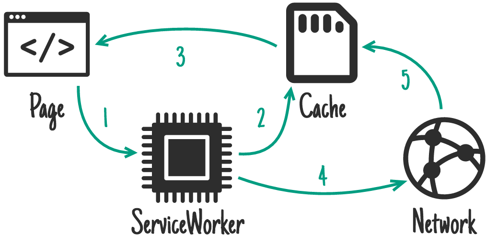
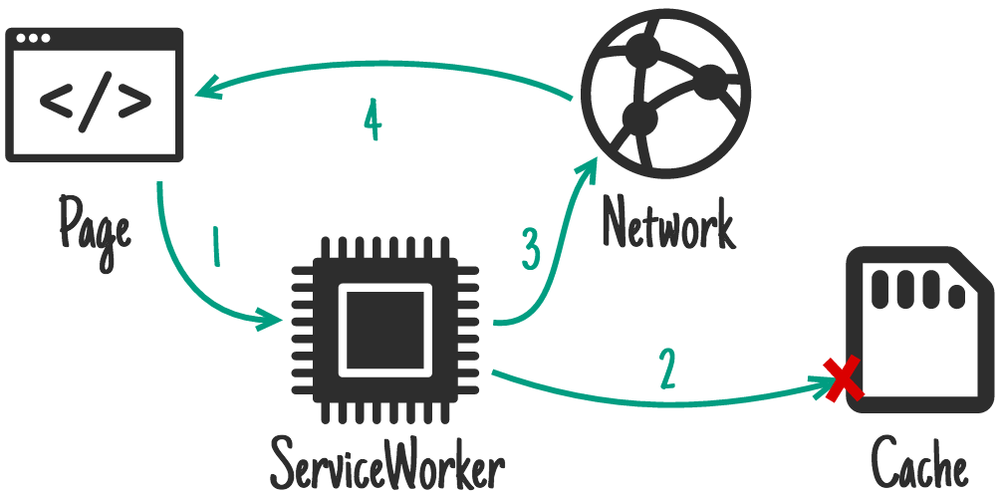
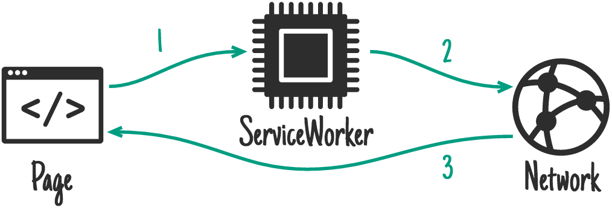
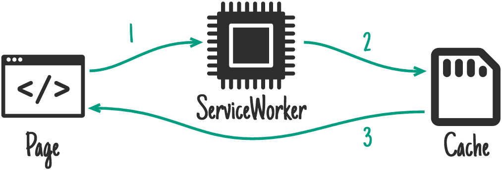

project_path: /web/tools/workbox/_project.yaml
book_path: /web/tools/workbox/_book.yaml
description: The module guide for workbox-routing.

{# wf_blink_components: N/A #}
{# wf_updated_on: 2020-02-13 #}
{# wf_published_on: 2017-11-27 #}

# Workbox Strategies {: .page-title }

## What are Workbox Strategies?

When service workers were first introduced, a set of common caching strategies
emerged. A caching strategy is a pattern that determines how a service worker
generates a response after receiving a fetch event.

`workbox-strategies` provides the most common caching strategies so it’s easy to
apply them in your service worker.

We won’t go into much detail outside of the strategies supported by Workbox,
but you can [learn more in the Offline Cookbook](/web/fundamentals/instant-and-offline/offline-cookbook/).

## Using Strategies

In the following examples, we’ll show you how to use the Workbox caching
strategies with `workbox-routing`. There are some options you can define with
each strategy that are covered in the
[Configuring Strategies section of this doc](#configuring_strategies).

In the [Advanced Usage section](#advanced_usage), we’ll cover how you can use
the caching strategies directly without `workbox-routing`.

### Stale-While-Revalidate



The [stale-while-revalidate](/web/fundamentals/instant-and-offline/offline-cookbook/#stale-while-revalidate)
pattern allows you to respond to the request as quickly as possible with a
cached response if available, falling back to the network request if it’s
not cached. The network request is then used to update the cache.

This is a fairly common strategy where having the most up-to-date resource
is not vital to the application.

```javascript
import {registerRoute} from 'workbox-routing';
import {StaleWhileRevalidate} from 'workbox-strategies';

registerRoute(
  new RegExp('/images/avatars/'),
  new StaleWhileRevalidate()
);
```

### Cache First (Cache Falling Back to Network)



Offline web apps will rely heavily on the cache, but for assets that are
non-critical and can be gradually cached, a
[cache first](/web/fundamentals/instant-and-offline/offline-cookbook/#cache-falling-back-to-network)
is the best option.

If there is a Response in the cache, the Request will be fulfilled using the
cached response and the network will not be used at all. If there isn't a cached
response, the Request will be fulfilled by a network request and the response
will be cached so that the next request is served directly from the cache.

```javascript
import {registerRoute} from 'workbox-routing';
import {StaleWhileRevalidate} from 'workbox-strategies';

registerRoute(
  new RegExp('/styles/'),
  new CacheFirst()
);
```

### Network First (Network Falling Back to Cache)


For requests that are updating frequently, the
[network first](/web/fundamentals/instant-and-offline/offline-cookbook/#network-falling-back-to-cache)
strategy is the ideal solution. By default, it will try to fetch the latest
response from the network. If the request is successful, it’ll put the response
in the cache. If the network fails to return a response, the cached response
will be used.

```javascript
import {registerRoute} from 'workbox-routing';
import {NetworkFirst} from 'workbox-strategies';

registerRoute(
  new RegExp('/social-timeline/'),
  new NetworkFirst()
);
```

### Network Only



If you require specific requests to be fulfilled from the network, the
[network only](/web/fundamentals/instant-and-offline/offline-cookbook/#network-only)
is the strategy to use.

```javascript
import {registerRoute} from 'workbox-routing';
import {NetworkOnly} from 'workbox-strategies';

registerRoute(
  new RegExp('/admin/'),
  new NetworkOnly()
);
```

### Cache Only



The [cache only](/web/fundamentals/instant-and-offline/offline-cookbook/#cache-only)
strategy ensures that responses are obtained from a cache. This is less common
in workbox, but can be useful if you have your own precaching step.

```javascript
import {registerRoute} from 'workbox-routing';
import {CacheOnly} from 'workbox-strategies';

registerRoute(
  new RegExp('/app/v2/'),
  new CacheOnly()
);
```

## Configuring Strategies

All of the strategies allow you to configure:

- The name of the cache to use in the strategy.
- Cache expiration restrictions to use in the strategy.
- An array of plugins that will have their lifecycle methods called when
  fetching and caching a request.

### Changing the Cache Used by a Strategy
You can change the cache a strategy used by supplying a cache name. This is
useful if you want to separate out your assets to help with debugging.

```javascript
import {registerRoute} from 'workbox-routing';
import {CacheFirst} from 'workbox-strategies';

registerRoute(
  new RegExp('/images/'),
  new CacheFirst({
    cacheName: 'image-cache',
  })
);
```

### Using Plugins

Workbox comes with a set of plugins that can be used with these strategies.

- [workbox-background-sync](/web/tools/workbox/reference-docs/latest/module-workbox-background-sync)
- [workbox-broadcast-update](/web/tools/workbox/reference-docs/latest/module-workbox-broadcast-update)
- [workbox-cacheable-response](/web/tools/workbox/reference-docs/latest/module-workbox-cacheable-response)
- [workbox-expiration](/web/tools/workbox/reference-docs/latest/module-workbox-expiration)
- [workbox-range-requests](/web/tools/workbox/reference-docs/latest/module-workbox-range-requests)

To use any of these plugins (or a custom plugin), you just need to pass in
instances to the `plugins` option.

```javascript
import {registerRoute} from 'workbox-routing';
import {CacheFirst} from 'workbox-strategies';
import {ExpirationPlugin} from 'workbox-expiration';

registerRoute(
  new RegExp('/images/'),
  new CacheFirst({
    cacheName: 'image-cache',
    plugins: [
      new ExpirationPlugin({
        // Only cache requests for a week
        maxAgeSeconds: 7 * 24 * 60 * 60,
        // Only cache 10 requests.
        maxEntries: 10,
      }),
    ]
  })
);
```

## Advanced Usage

If you want to use the strategies in your own fetch event logic, you can
use the strategy classes to run a request through a specific strategy.

For example, to use the stale-while-revalidate strategy, you can do the
following:

```javascript
self.addEventListener('fetch', (event) => {
  const {request} = event;
  const url = new URL(request.url);

  if (url.origin === location.origin && url.pathname === '/') {
    event.respondWith(new StaleWhileRevalidate().handle({event, request}));
  }
});
```

You can find the list of available classes in the
[workbox-strategies reference docs](/web/tools/workbox/reference-docs/latest/module-workbox-strategies).
