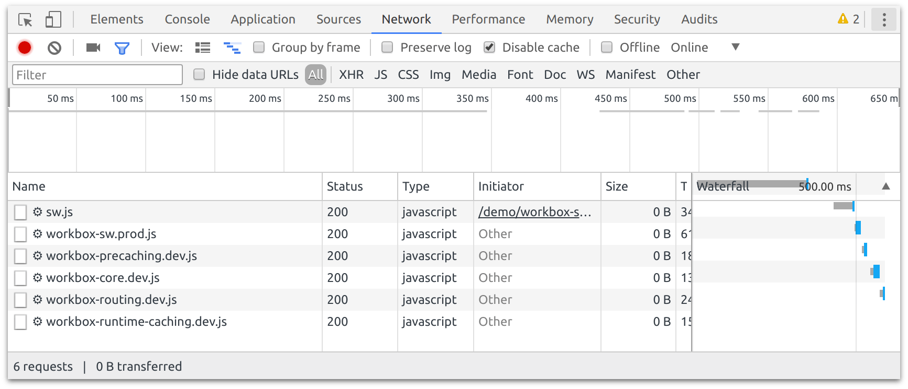

project_path: /web/tools/workbox/_project.yaml
book_path: /web/tools/workbox/_book.yaml
description: The module guide for workbox-sw.

{# wf_blink_components: N/A #}
{# wf_updated_on: 2020-01-15 #}
{# wf_published_on: 2017-11-27 #}

# Workbox {: .page-title }

## What is Workbox SW?

The `workbox-sw` module provides an extremely easy way to get up and running
with the Workbox modules, simplifies the loading of the Workbox modules, and
offers some simple helper methods.

You can use `workbox-sw` via our CDN or you use it with a set of workbox files
on your own server.

## Using Workbox SW via CDN

The easiest way to start using this module is via the CDN. You just need to
add the following to your service worker:

<pre class="prettyprint js">
importScripts('');
</pre>

With this you’ll have the `workbox` namespace in your service worker that will
provide access to all of the Workbox modules.

<pre class="prettyprint js">
workbox.precaching.*
workbox.routing.*
etc
</pre>

There is some magic that happens as you  start to use the additional modules.

When you reference a module for the first time, `workbox-sw` will detect this
and load the module before making it available. You can see this happening in
the network tab in DevTools.



These files will be cached by your browser making them available for future
offline use.

## Using Local Workbox Files Instead of CDN

If you don’t want to use the CDN, it’s easy enough to switch to Workbox files
hosted on your own domain.

The simplest approach is to get the files via [`workbox-cli`'s `copyLibraries`
command](/web/tools/workbox/modules/workbox-cli#copylibraries) or from a [GitHub
Release](https://github.com/GoogleChrome/workbox/releases), and then tell
`workbox-sw` where to find these files via the `modulePathPrefix` config option.

If you put the files under `/third_party/workbox/`, you would use them like so:

<pre class="prettyprint js">
importScripts('/third_party/workbox/workbox-sw.js');

workbox.setConfig({
  modulePathPrefix: '/third_party/workbox/'
});
</pre>

With this, you’ll use only the local Workbox files.

## Avoid Async Imports

Under the hood, loading new modules for the first time involves calling
[`importScripts()`](https://developer.mozilla.org/en-US/docs/Web/API/WorkerGlobalScope/importScripts)
with the path to the corresponding JavaScript file (either hosted on the CDN, or via a local URL).
In either case, an important restriction applies: the implicit calls to `importScripts()` can only
happen inside of a service worker's `install` handler *or* during the synchronous,
[initial execution](https://stackoverflow.com/questions/38835273) of the service worker script.

In order to avoid violating this restriction, a best practice is to reference the various
`workbox.*` namespaces outside of any event handlers or asynchronous functions.

For example, the following top-level service worker code is fine:

<pre class="prettyprint js">
importScripts('');

// This will work!
workbox.routing.registerRoute(
  new RegExp('\\.png$'),
  new workbox.strategies.CacheFirst()
);
</pre>

But the code below could be a problem if you have not referenced `workbox.strategies` elsewhere in your
service worker:

<pre class="prettyprint js">
importScripts('');

self.addEventListener('fetch', (event) => {
  if (event.request.url.endsWith('.png')) {
    // Oops! This causes workbox-strategies.js to be imported inside a fetch handler,
    // outside of the initial, synchronous service worker execution.
    const cacheFirst = new workbox.strategies.CacheFirst();
    event.respondWith(cacheFirst.handle({request: event.request}));
  }
});
</pre>

If you need to write code that would otherwise run afoul of this restriction, you can explicitly
trigger the `importScripts()` call outside of the event handler by using the
[`workbox.loadModule()`](/web/tools/workbox/reference-docs/latest/workbox#.loadModule) method:

<pre class="prettyprint js">
importScripts('');

// This will trigger the importScripts() for workbox.strategies and its dependencies:
workbox.loadModule('workbox-strategies');

self.addEventListener('fetch', (event) => {
  if (event.request.url.endsWith('.png')) {
    // Referencing workbox.strategies will now work as expected.
    const cacheFirst = new workbox.strategies.CacheFirst();
    event.respondWith(cacheFirst.handle({request: event.request}));
  }
});
</pre>

Alternatively, you can create a reference to the relevant namespaces outside of your event handlers,
and then use that reference later on:

<pre class="prettyprint js">
importScripts('');

// This will trigger the importScripts() for workbox.strategies and its dependencies:
const {strategies} = workbox;

self.addEventListener('fetch', (event) => {
  if (event.request.url.endsWith('.png')) {
    // Using the previously-initialized strategies will work as expected.
    const cacheFirst = new strategies.CacheFirst();
    event.respondWith(cacheFirst.handle({request: event.request}));
  }
});
</pre>

Note: Some versions of Chrome do not honor this restriction, and asynchronous calls to
`importScripts()` don't trigger the expected failure. Developers are advised *not* to rely on this
broken behavior. Chrome [plans](https://www.chromestatus.com/feature/5748516353736704) on making
a change to start disallowing this usage, bringing it in line with what other browsers already do.

## Force Use of Debug or Production Builds

All of the Workbox modules come with two builds, a debug build which
contains logging and additional type checking and a production build which
strips the logging and type checking.

By default, `workbox-sw` will use the debug build for sites on localhost,
but for any other origin it’ll use the production build.

If you want to force debug or production builds, you can set the `debug` config
option:

<pre class="prettyprint js">
workbox.setConfig({
  debug: &lt;true or false&gt;
});
</pre>

## Convert code using import statements to use `workbox-sw`

When loading Workbox using `workbox-sw`, all Workbox packages are accessed via
the global `workbox.*` namespace.

If you have a code sample that uses `import` statements that you want to convert
to use `workbox-sw`, all you have to do is load `workbox-sw` and replace all `import` statements with local variables that reference
those modules on the global namespace.

This works because every Workbox [service worker
package](/web/tools/workbox/modules/) published to npm is also
available on the global `workbox` namespace via a
[camelCase](https://en.wikipedia.org/wiki/Camel_case) version of the name (e.g.
all modules exported from the `workbox-precaching` npm package can be found on
`workbox.precaching.*`. And all the modules exported from the
`workbox-background-sync` npm package can be found on
`workbox.backgroundSync.*`).

As an example, here's some code that uses `import` statements referencing
Workbox modules:

```javascript
import {registerRoute} from 'workbox-routing';
import {CacheFirst} from 'workbox-strategies';
import {CacheableResponse} from 'workbox-cacheable-response';

registerRoute(
  /\.(?:png|jpg|jpeg|svg|gif)$/,
  new CacheFirst({
    plugins: [
      new CacheableResponsePlugin({statuses: [0, 200]})
    ],
  })
);
```

And here's the same code rewritten to use `workbox-sw` (notice that only the
import statements have changed—the logic has not been touched):

```javascript
importScripts('');

const {registerRoute} = workbox.routing;
const {CacheFirst} = workbox.strategies;
const {CacheableResponse} = workbox.cacheableResponse;

registerRoute(
  /\.(?:png|jpg|jpeg|svg|gif)$/,
  new CacheFirst({
    plugins: [
      new CacheableResponsePlugin({statuses: [0, 200]})
    ],
  })
);
```
