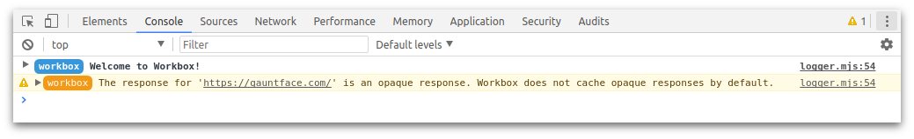

project_path: /web/tools/workbox/v3/_project.yaml
book_path: /web/tools/workbox/v3/_book.yaml
description: A guide on how to handle third party requests with Workbox.

{# wf_updated_on: 2017-11-06 #}
{# wf_published_on: 2017-11-06 #}

# Handle Third Party Requests {: .page-title }

A lot of websites will use files from a different origin. For example, if you
use Google Fonts, you’ll be importing the styles and fonts from
`https://fonts.googleapis.com/`. Any request for a file from a different
origin is known as a cross-origin request and these requests require special
handling in Workbox.

In this guide we are going to look at how a cross-origin request can be
different and what you can do in Workbox to support these requests.

## Cross-Origin Requests and Opaque Responses

One of the security mechanisms in browsers is that when a piece of JavaScript
requests a URL on a different origin, it’s not prevented from being able to
view the response. The reason for this is so websites can’t try and scan for
URLs on a user’s network.

When you get a response like this, it’s known as an "opaque response". Some
requests can be read in JavaScript if the server returns
[CORS headers](https://developer.mozilla.org/en-US/docs/Web/HTTP/CORS), but a
number of sites will not do this.

In service workers you can make requests to third-parties and cache the
responses. For opaque responses the contents of the Response will still
be hidden. You can’t even check that status code of the response. Because
of this Workbox treats opaque responses differently.

You can learn more from this
[Stackoverflow Q&A](https://stackoverflow.com/questions/39109789/what-limitations-apply-to-opaque-responses).

## Workbox Caches Opaque Response Sometimes

In general, Workbox will not cache opaque responses.

The reason for this is that it’s very easy to get into a bad state.

Let’s say a developer set up a route with a "cache first" strategy.

```javascript
workbox.routing.registerRoute(
  'https://cdn.google.com/example-script.min.js',
  workbox.strategies.cacheFirst(),
);
```

This response would cache the opaque response and serve it up from that point
onwards. The problem is that if that request fails for any reason, Workbox
won’t be able to detect this and will continue to serve up the broken response.
The user will be in a broken state.

However, it’s not a bad thing to want to try and add some fault tolerance to
these requests so Workbox will allow opaque responses to be cached with the
`networkFirst` and `stalteWhileRevalidate` strategies. Since these strategies
regularly update the cached response it’s much safer to cache them as
hopefully a bad request will be short lived and used rarely.

```javascript
workbox.routing.registerRoute(
  'https://cdn.google.com/example-script.min.js',
  workbox.strategies.networkFirst(),
);

// OR

workbox.routing.registerRoute(
  'https://cdn.google.com/example-script.min.js',
  workbox.strategies.staleWhileRevalidate(),
);

```

If you use another caching strategy and an opaque response is returned,
Workbox will log a warning letting you know that the response wasn’t cached.



## Force Caching of Opaque Responses

If you are certain that you want to cache an opquae response, you can do
so using the `CachaeablResponsePlugin`, like so:

```javascript
workbox.routing.registerRoute(
  'https://cdn.google.com/example-script.min.js',
  workbox.strategies.cacheFirst({
    cacheableResponse: {
      statuses: [0, 200]
    }
  }),
);
```

<aside markdown="1" class="warning">
<strong>Warning:</strong> This will cache a response that could be an error and it will not
get updated!
</aside>
