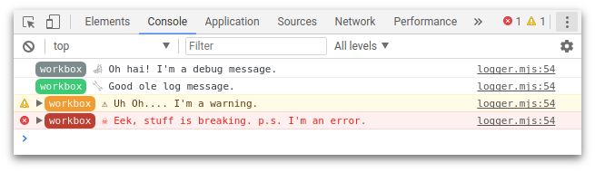

project_path: /web/tools/workbox/v3/_project.yaml
book_path: /web/tools/workbox/v3/_book.yaml
description: The module guide for workbox-core.

{# wf_updated_on: 2017-11-06 #}
{# wf_published_on: 2017-11-06 #}

# Workbox Core {: .page-title }

[Demo](https://workbox-demos.firebaseapp.com/demo/workbox-core/) | [Reference Docs](http://localhost:8080/web/tools/workbox/v3/reference-docs/latest/workbox.core)

## What is Workbox Core?

Workbox has been built to be modular, allowing developers to select the pieces they want to use without forcing them to download everything in a single file.

There is however overlap between modules, for example, each module will like need to interact with the console, throw meaningful errors and make use of the network or cache. To avoid each module implementing the same logic, `workbox-core` contains this common code which each module relies on.

This module does provide some functionality to developers, but beyond log levels and caching, `workbox-core` offers internal logic to each module, rather than the end developer.

## Change the Log Level

Workbox uses a very thin wrapper over `console.log` so that you can filter out the Workbox messages separate from your own logic.



To adjust the log level, all you need to do is call `setLogLevel()` and pass in a value from `LOG_LEVELS`.

```javascript
// The most verbose - displays all logs.
workbox.core.setLogLevel(workbox.core.LOG_LEVELS.debug);

// Shows logs, warnings and errors.
workbox.core.setLogLevel(workbox.core.LOG_LEVELS.log);

// Show warnings and errors.
workbox.core.setLogLevel(workbox.core.LOG_LEVELS.warn);

// Show *just* errors
workbox.core.setLogLevel(workbox.core.LOG_LEVELS.error);

// Silence all of the Workbox logs.
workbox.core.setLogLevel(workbox.core.LOG_LEVELS.silent);
```

You can see what the current log level is like so:

```javascript
console.log(workbox.core.logLevel);
```

The default log level changes depending on the build type. If you use the debug build, `workbox-core.dev.js`, the log level will be set to `LOG_LEVELS.log` (i.e. it will log everything except debug messages). For production builds, `workbox-core.prod.js`, the log level will be set to `LOG_LEVELS.warn`, meaning you’ll only see warnings and errors.

## View and Change the Default Cache Names

Workbox defines it's caches via `workbox.core.cacheNames`:

```javascript
console.log(workbox.core.cacheNames.precache);

console.log(workbox.core.cacheNames.runtime);

console.log(workbox.core.cacheNames.googleAnalytics);
```

These cache names are constructed in the format of a prefix, a name and suffix, where the name changes based on the use of the cache.

`<prefix>-<cache id (precache | runtime | googleAnalytics)>-<suffix>`

You can change these default names by altering all or some of the values passed into `setCacheNameDetails()`.

```javascript
workbox.core.setCacheNameDetails({
  prefix: 'my-app',
  suffix: 'v1',
  precache: 'install-time',
  runtime: 'run-time',
  googleAnalytics: 'ga',
});

// Will print 'my-app-install-time-v1'
console.log(workbox.core.cacheNames.precache);

// Will print 'my-app-run-time-v1'
console.log(workbox.core.cacheNames.runtime);

// Will print 'my-app-ga-v1'
console.log(workbox.core.cacheNames.googleAnalytics);
```

The main use case for the prefix and suffix is that if you use Workbox for multiple projects and use the same localhost for each project, setting a custom prefix for each module will prevent the caches from conflicting with each other.
