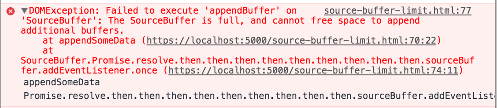
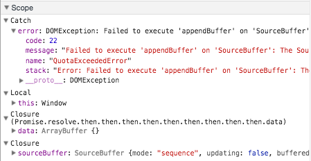

project_path: /web/_project.yaml
book_path: /web/updates/_book.yaml
description: There are several ways to deal with <code>QuotaExceededError</code>.

{# wf_updated_on: 2017-10-23 #}
{# wf_published_on: 2017-10-23 #}
{# wf_tags: media,mediasourceextensions #}
{# wf_featured_image: /web/updates/images/generic/animations.png #}
{# wf_featured_snippet: There are several ways to deal with <code>QuotaExceededError</code>. #}
{# wf_blink_components: Blink #}

# Exceeding the buffering quota {: .page-title }



# Exceeding the Buffering Quota

If you're working with Media Source Extensions (MSE), one thing you will
eventually need to deal with is an over-full buffer. When this occurs, you'll
get what's called a `QuotaExceededError`. In this article, I'll cover some of
the ways to deal with it.

# What is the QuotaExceededError?

Basically, `QuotaExceededError` is what you get if you try to add too much data
to your `SourceBuffer` object. (Adding more `SourceBuffer` objects to a parent
`MediaSource` element can also throw this error. That's outside the scope of
this article.) If `SourceBuffer` has too much data in it, calling
`SourceBuffer.appendBuffer()` will trigger the following message in the Chrome
console window.

There are a few things to note about this. First, notice that the name
`QuotaExceededError` appears nowhere in the message. To see that, set a
breakpoint at a location where you can catch the error and examine it in your
watch or scope window. I've shown this below.

Second, there's no definitive way to find out how much data the `SourceBuffer`
can handle.

# Behavior in other browsers

At the time of writing, Safari does not throw a `QuotaExceededError` in many of
its builds. Instead it removes frames using a two step algorithm, stopping if
there is enough room to handle the `appendBuffer()`. First, it frees frames from
between 0 and 30 seconds before the current time in 30 second chunks. Next, it
frees frames in 30 second chunks from duration backwards to as close as 30
seconds after `currentTime`. You can read more about this in a [Webkit
changeset from
2014]([https://trac.webkit.org/changeset/172657/webkit](https://trac.webkit.org/changeset/172657/webkit)).

Fortunately, along with Chrome, Edge and Firefox do throw this error. If you're
using another browser, you'll need to do your own testing. Though probably not
what you'd build for a real-life media player, François Beaufort's [source
buffer limit
test]([https://beaufortfrancois.github.io/sandbox/media/source-buffer-limit.html](https://beaufortfrancois.github.io/sandbox/media/source-buffer-limit.html))
at least lets you observe the behavior.

## How much data can I append?

The exact number varies from browser to browser. Since you can't query for the
amount currently appended data, you'll have to keep track of how much you're
appending yourself. As for what to watch, here's the best data I can
gather at the time of writing. For Chrome these numbers are upper limits meaning
they can be smaller when the system encounters memory pressure.

|          | Chrome  | Chromecast* | Firefox | Safari | Edge    |
|----------|---------|-----------|---------|--------|---------|
| Video    | 150MB   | 30MB      | 100MB   | 290MB  | Unknown |
| Audio    | 12MB    | 2MB       | 15MB    | 14MB   | Unknown |

* Or other limited memory Chrome device.

# So what do I do?

Since the amount of supported data varies so widely and you can't find the
amount of data in a `SourceBuffer`, you must get it indirectly by handling the
`QuotaExceededError`. Now let's look at a few ways to do that.

There are several approaches to dealing with `QuotaExceededError`. In reality a
combination of one or more approaches is best. Your approach should be to base
the work on how much you're fetching and attempting to append beyond
`HTMLMediaElement.currentTime` and adjusting that size based on the
`QuotaExceededError`. Also using a manifest of some kind such as an [mpd
file]([https://developers.google.com/web/fundamentals/media/manipulating/cheatsheet#all_together_now](https://developers.google.com/web/fundamentals/media/manipulating/cheatsheet#all_together_now))
(MPEG-DASH) or an [m3u8
file]([https://developers.google.com/web/fundamentals/media/manipulating/cheatsheet#hlsmp4](https://developers.google.com/web/fundamentals/media/manipulating/cheatsheet#hlsmp4))
(HLS) can help you keep track of the data you're appending to the buffer.

Now, let's look at several approaches to dealing with the
`QuotaExceededError`.

+  Remove unneeded data and re-append.
+  Append smaller fragments.
+  Lower the playback resolution.

Though they can be used in combination, I'll cover them one at a time.

## Remove unneeded data and re-append

Really this one should be called, "Remove least-likely-to-be-used-soon data, and
then retry append of data likely-to-be-used-soon." That was too long of a title.
You'll just need to remember what I really mean.

Removing recent data is not as simple as calling `SourceBuffer.remove()`. To
remove data from the `SourceBuffer`, it's updating flag must be false. If it is
not, call `SourceBuffer.abort()` before removing any data.

There are a few things to keep in mind when calling `SourceBuffer.remove()`.

+  **This could have a negative impact on playback.** For example, if you
    want the video to replay or loop soon, you may not want to remove the
    beginning of the video. Likewise, if you or the user seeks to a part of the
    video where you've removed data, you'll have to append that data again to
    satisfy that seek.
+  **Remove as conservatively as you can.** Beware of removing the currently
    playing group of frames beginning at the keyframe at or before
    `currentTime` because doing so could cause playback stall. Such information
    may need to be parsed out of the bytestream by the web app if it is not
    available in the manifest. A media manifest or app knowledge of keyframe
    intervals in the media can help guide your app's choice of removal ranges to
    prevent removing the currently playing media. Whatever you remove, don't
    remove the currently playing group of pictures or even the first few beyond
    that. Generally, don't remove beyond the current time unless you're certain
    that the media is not needed any longer. If you remove close to the
    playhead you may cause a stall.
+  **Safari 9 and Safari 10 do not correctly implement `SourceBuffer.abort()`**.
    In fact, they throw errors that will halt playback. Fortunately there are
    open bug trackers [here]([http://goo.gl/UZ2rPp](http://goo.gl/UZ2rPp)) and
    [here]([https://goo.gl/rC3CLj](https://goo.gl/rC3CLj)). In the meantime,
    you'll have to work around this somehow. [Shaka Player does
    it](https://github.com/google/shaka-player/blob/3cd18bb3362841d76db737204a15141b815b7c92/lib/polyfill/mediasource.js#L60-L74)
    by stubbing out an empty `abort()` function on those versions of Safari.

## Append smaller fragments

I've shown the procedure below. This may not work in every case, but it has the
advantage that the size of the smaller chunks can be adjusted to suit your
needs. It also doesn't require going back to the network which might incur
additional data costs for some users.

    const pieces = new Uint8Array([data]);
    (function appendFragments(pieces) {
      if (sourceBuffer.updating) {
        return;
      }
      pieces.forEach(piece => {
        try {
          sourceBuffer.appendBuffer(piece);
        }
        catch e {
          if (e.name !== 'QuotaExceededError') {
            throw e;
          }

          // Reduction schedule: 80%, 60%, 40%, 20%, 16%, 12%, 8%, 4%, fail.
          const reduction = pieces[0].byteLength * 0.8;
          if (reduction / data.byteLength < 0.04) {
            throw new Error('MediaSource threw QuotaExceededError too many times');
          }
          const newPieces = [
            pieces[0].slice(0, reduction),
            pieces[0].slice(reduction, pieces[0].byteLength)
          ];
          pieces.splice(0, 1, newPieces[0], newPieces[1]);
          appendBuffer(pieces);  
        }
      });
    })(pieces);

## Lower the playback resolution

This is similar to removing recent data and re-appending. In fact, the two may be done together, though the example below only shows lowering the resolution.

There are a few things to keep in mind when using this technique:

+  **You must append a new initialization segment.** You must do this any time
   you change representations. The new initialization segment must be for the
   media segments that follow.
+  **The presentation timestamp of the appended media should match the timestamp
   of the data in the buffer as closely as possible, but not jump ahead.**
   Overlapping the buffered data may cause a stutter or brief stall, depending
   on the browser. Regardless of what you append, don't overlap the playhead as
   this will throw errors.
+  **Seeking may interrupt playback.** You may be tempted to seek to a specific
   location and resume playback from there. Be aware that this will cause
   playback interruption until the seek is completed.


