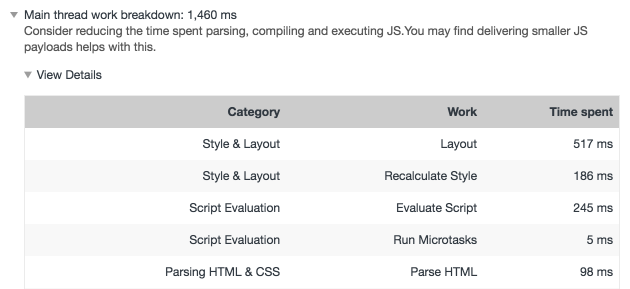
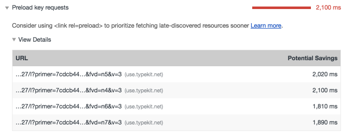
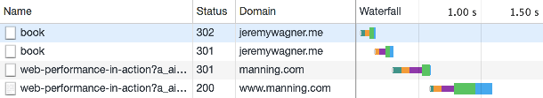
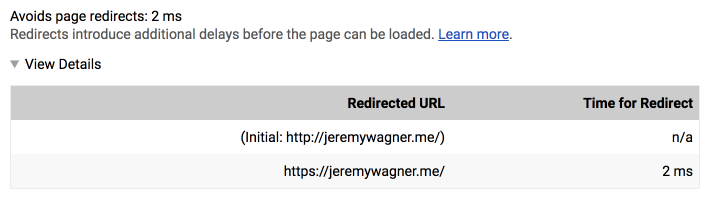
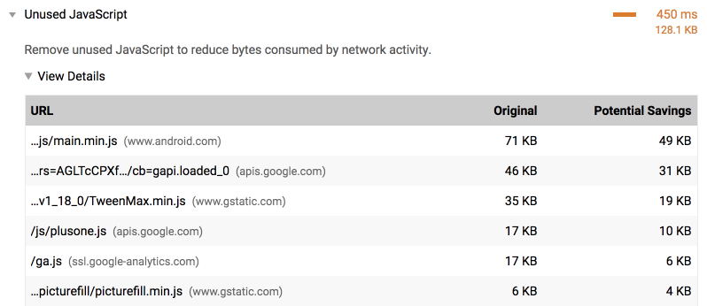
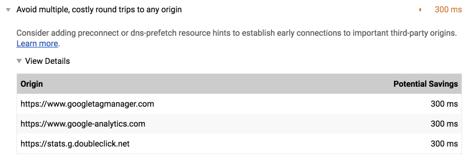
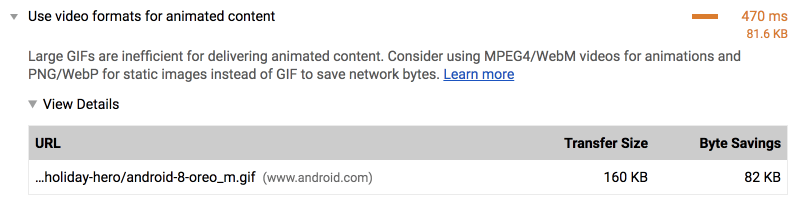
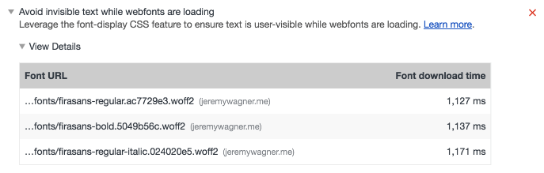
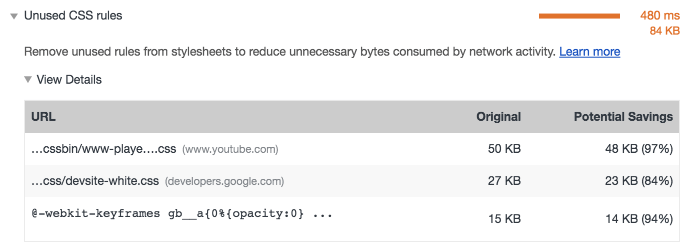

project_path: /web/_project.yaml
book_path: /web/updates/_book.yaml
description: New perf audits for preload, preconnect, GIFs, and more.

{# wf_updated_on: 2018-06-11 #}
{# wf_published_on: 2018-05-08 #}
{# wf_tags: lighthouse #}
{# wf_featured_image: /web/progressive-web-apps/images/pwa-lighthouse.png #}
{# wf_featured_snippet: New perf audits for preload, preconnect, GIFs, and more. #}
{# wf_blink_components: N/A #}



# Using Lighthouse To Improve Page Load Performance {: .page-title }



  <iframe class="devsite-embedded-youtube-video" data-video-id="Mv-l3-tJgGk"
          data-autohide="1" data-showinfo="0" frameborder="0" allowfullscreen>
  </iframe>

[Lighthouse](/web/tools/lighthouse/) is an automated tool for improving the
quality of your site. You give it a URL, and it provides a list of
recommendations on how to improve page performance, make pages more accessible,
adhere to best practices and more. You can run it from within Chrome DevTools,
as a Chrome Extension, or even as a [Node
module](https://www.npmjs.com/package/lighthouse), which is useful for
continuous integration.

For a while now, Lighthouse has provided many tips for improving page load
performance, such as [enabling text
compression](/web/tools/lighthouse/audits/text-compression) or [reducing
render-blocking scripts](/web/tools/lighthouse/audits/blocking-resources). The
Lighthouse team continues to ship new audits to give you even more useful advice
for making your sites faster. This post is a roundup of useful performance
audits that you may not be aware of, such as:

* [Main Thread Work Breakdown](#main_thread_work_breakdown)
* [Preload Key Requests](#preload_key_requests)
* [JavaScript Boot-up Time is High](#javascript_boot-up_time_is_high)
* [Avoids Page Redirects](#avoids_page_redirects)
* [Unused JavaScript](#unused_javascript)
* [Uses Inefficient Cache Policy on Static Assets](#uses_inefficient_cache_policy_on_static_assets)
* [Avoid Costly Multiple Round-Trips to Any Origin](#avoid_costly_multiple_round-trips_to_any_origin)
* [Use Video Formats for Animated Content](#use_video_formats_for_animated_content)
* [All text remains visible during webfont loads](#all_text_remains_visible_during_web_font_loads)
* [Unminified CSS & JavaScript](#unminified_css_javascript)
* [Unused CSS Rules](#unused_css_rules)

## Main Thread Work Breakdown

If you've ever used the performance panel in DevTools, you know it can
be a bit of a chore to get a breakdown of where CPU time was spent loading a
page. We're pleased to announce that this information is now readily and
conveniently available via the new **Main Thread Work Breakdown** audit.

<figure>
  
  <figcaption><strong>Figure 1</strong>. A breakdown of main thread activity in
Lighthouse.</figcaption>
</figure>

This new diagnostic evaluates how much and what kind of activity occurs during
page load, which you can use to get a handle on loading performance issues
related to layout, script eval, parsing, and other activity.

## Preload Key Requests

When browsers retrieve resources, they do so as they find references to them
within the document and its subresources. This can be suboptimal at times,
because some critical resources are discovered rather late in the page load
process. Thankfully, [`rel=preload`](/web/updates/2016/03/link-rel-preload)
gives developers the ability to hint to compliant browsers which resources
should be fetched as soon as possible. The new [**Preload Key
Requests**](/web/tools/lighthouse/audits/preload) audit lets developers know
what resources could benefit from being loaded sooner by `rel=preload`.

<figure>
  
  <figcaption><strong>Figure 2</strong>. The Preload Key Requests Lighthouse audit
recommending a list of resources to consider preloading.</figcaption>
</figure>

It's super important you test and compare performance changes with and without
`rel=preload`, as it can affect loading performance in ways you might not
expect. For example, preloading a large image could delay initial render, but
the tradeoff is that the preloaded image will appear sooner in the layout.
Always make sure you're cool with the results!

## JavaScript Boot-up Time is High

When too much JavaScript is loaded, the page can become unresponsive as the
browser parses, compiles, and executes it. 3rd-party scripts and advertisements
are a particular source of excessive script activity that can bog down even
powerful devices. The new [**JavaScript Boot-up Time is
High**](/web/tools/lighthouse/audits/bootup) audit reveals how much CPU time
each script on a page consumes, along with its URL:

<figure>
  
  <figcaption><strong>Figure 3</strong>. Lighthouse displaying the amount of
evaluation, parsing, and compiling time for scripts on a page.</figcaption>
</figure>

When you run this audit, you can also [enable third party badges in the network
panel](/web/fundamentals/performance/optimizing-content-efficiency/loading-third-party-javascript/#chrome_devtools_third-party_script_badging)
and filter the list to identify third party script resources. With the data from
this audit, you'll be better equipped to find sources of excessive JavaScript
activity that turn pages from snappy to laggy. For scripts specific to your
application, you can employ techniques like [code
splitting](https://webpack.js.org/guides/code-splitting/) and [tree
shaking](https://webpack.js.org/guides/tree-shaking/) to limit the amount of
JavaScript on each page of your site.

## Avoids Page Redirects

Sometimes when a browser requests a URL, the server can respond with a
[300-level status
code](https://developer.mozilla.org/en-US/docs/Web/HTTP/Status#Redirection_messages).
This causes the browser to redirect to another URL. While redirects are
necessary for SEO and convenience purposes, they add latency to requests. This
is especially true if they redirect to other origins, which can incur additional
DNS lookup and connection/TLS negotiation time.

<figure>
  
  <figcaption><strong>Figure 4</strong>. A redirect chain as seen in the network
panel of Chrome's developer tools.</figcaption>
</figure>

Redirects are undesirable for landing pages on your site. To help you reduce
latency and improve loading performance, Lighthouse now offers the **Avoids Page
Redirects** audit, which lets you know when a navigation triggers any redirects.

<figure>
  
  <figcaption><strong>Figure 5</strong>. A list of page redirects in
Lighthouse.</figcaption>
</figure>

Note that this audit is difficult to trigger in the DevTools version of
Lighthouse, because it analyzes the current URL in the address bar of the page,
which reflects the resolution of all redirects. You're likeliest to see this
audit populated in the Node CLI.

## Unused JavaScript

Dead code can be a serious problem in JavaScript-heavy applications. While it
doesn't pose execution costs as it's never invoked, it does carry other
undesirable effects. Dead code is still downloaded, parsed, and compiled by the
browser. This affects loading performance and JavaScript boot-up time. Similar
to the coverage panel in DevTools, the **Unused JavaScript** audit reveals
JavaScript downloaded by the current page, but is never used.

<figure>
  
  <figcaption><strong>Figure 6</strong>. Lighthouse displaying the amount of
unused JavaScript on a page.</figcaption>
</figure>

With this audit, you can identify dead code in your applications and remove it
to improve loading performance and reduce system resource usage. Pro tip: You
can also use [the code coverage
panel](/web/updates/2017/04/devtools-release-notes#coverage) in Chrome's
DevTools to find this information!

Note: This audit is off by default! It can be enabled in the Node CLI by using
the `lighthouse:full` configuration profile.

## Uses Inefficient Cache Policy on Static Assets

While much performance advice tends to focus on boosting the speed of a website
for first time users, it's also important to [use
caching](/web/fundamentals/performance/optimizing-content-efficiency/http-caching)
to improve loading performance for returning users. [**The Uses Inefficient
Cache Policy on Static Assets**](/web/tools/lighthouse/audits/cache-policy)
audit inspects caching headers for network resources, and notifies you if cache
policies for static resources are substandard.

<figure>
  
  <figcaption><strong>Figure 7</strong>.</figcaption>
</figure>

With the help of this audit, you'll be able to easily find and fix problems with
your current cache policy. This will greatly improve performance for returning
users, and they'll appreciate the extra speed!

## Avoid Costly Multiple Round-Trips to Any Origin

When browsers retrieve resources from a server, it can take significant time to
perform a DNS lookup and establish a connection to a server.
[`rel=preconnect`](/web/fundamentals/performance/resource-prioritization#preconnect)
allows developers to mask this latency by establishing connections to other
servers before the browser would in due course. The **Avoid Costly Multiple
Round-Trips to Any Origin** audit will help you discover opportunities to use
`rel=preconnect`!

<figure>
  rel=preconnect</code> in Lighthouse.">
  <figcaption><strong>Figure 8</strong>. A list of origins recommended for
<code>rel=preconnect</code> in Lighthouse.</figcaption>
</figure>

When latency for cross-origin assets is reduced, users will perceive that things
are moving along a bit quicker. With this new Lighthouse audit, you'll learn of
new opportunities to use `rel=preconnect` to do just that.

## Use Video Formats for Animated Content

Animated GIFs are _huge_, often consuming at least several hundred kilobytes if
not several megabytes of data. If you care about loading performance,
[converting those GIFs to
video](/web/fundamentals/performance/optimizing-content-efficiency/replace-animated-gifs-with-video/)
is the way to go. Thankfully, the **Use Video Formats for Animated Content**
audit has your back.

<figure>
  
  <figcaption><strong>Figure 9</strong>. A recommendation to convert a GIF to
video in Lighthouse.</figcaption>
</figure>

If your site has any GIFs that are over 100 KB, this audit will automatically
flag them and direct you to some guidance on how to convert them to video and
embed them. Sites like Imgur have significantly improved loading performance by
converting their GIFs to video. Additionally, if your site is on a hosting plan
with metered bandwidth, the potential cost savings alone should be enough to
persuade you!

## All Text Remains Visible During Web Font Loads

When we load web fonts for pages, browsers often render invisible text until the
font loads. This phenomenon, known as the [Flash of Invisible Text
(FOIT)](https://www.zachleat.com/web/webfont-glossary/#foit)), may be preferable
to you from a design standpoint, but it's actually a problem. Text that's
blocked from rendering can't be read until it renders and becomes visible. On
high latency and/or high bandwidth connections, this means a core part of your
user experience is missing. It can also be a sort of perceptual performance
issue in that the page is not rendering meaningful content as quickly as it
otherwise could. Thankfully, the **All Text Remains Visible During Web Font
Loads** audit helps you to find opportunities to fix this on your site!

<figure>
  
  <figcaption><strong>Figure 10</strong>. Lighthouse giving recommendations for
improving font rendering.</figcaption>
</figure>

If Lighthouse finds web fonts in your application that are delaying text
rendering, there's a few potential remedies. You can control text rendering with
the [`font-display` CSS property](https://css-tricks.com/font-display-masses/),
and/or [the Font Loading
API](/web/fundamentals/performance/optimizing-content-efficiency/webfont-optimization#the_font_loading_api).
If you want to dig deeper, consider reading [_A Comprehensive Guide to Font
Loading Strategies_](https://www.zachleat.com/web/comprehensive-webfonts/), an
excellent guide by [Zach Leatherman](https://www.zachleat.com/web/) which is an
excellent resource for optimal font loading.

## Unminified CSS & JavaScript

[Minification](/web/fundamentals/performance/webpack/decrease-frontend-size#enable-minification)
has been a suggested technique since web performance has been a thing, and for
good reason. It significantly reduces the size of text-based resources, which in
turn is good for loading performance. However, it's easy to overlook this
optimization, especially if build processes don't take care of it for you. The
[**Minify CSS**](/web/tools/lighthouse/audits/minify-css) and **Minify
JavaScript** audits will compile a list of unminified resources it finds on the
current page. From there, you can take action by minifying those files manually,
or augmenting your build system to do it for you.

## Unused CSS Rules

As a site gets a bit long in the tooth, it's inevitable that the cruft left over
from refactoring begins to build up. One such source of cruft comes in the form
of unused CSS rules which are no longer necessary for the site to function, yet
still consume bandwidth. For your convenience, the **Unused CSS Rules** audit
reveals which CSS resources on the page contain unused CSS.

<figure>
  
  <figcaption><strong>Figure 11</strong>. Lighthouse showing a list of CSS
resources containing unused CSS rules.</figcaption>
</figure>

If Lighthouse finds unused CSS on the page, there are ways to get rid of it.
[UnCSS](https://github.com/uncss/uncss) is one such utility that does this for
you automatically (although it must be used with care). A more manual method
involves using [the code coverage
panel](/web/updates/2017/04/devtools-release-notes#coverage) in DevTools. Just
remember, though, that unused CSS on one page could be necessary on another.
Another approach may be to split your CSS into template-specific files that are
only loaded where necessary. Whatever you decide to do, Lighthouse will be there
to let you know if your CSS cruft is getting to be a bit much.

## Give Lighthouse a try!

If you're excited about these new audits, update Lighthouse and give them a try!

* [The Lighthouse Chrome
extension](https://chrome.google.com/webstore/detail/lighthouse/blipmdconlkpinefehnmjammfjpmpbjk)
should automatically update, but you can manually update it via
`chrome://extensions`.
* In DevTools, you can run Lighthouse in the audits panel. Chrome updates to a new
version about every 6 weeks, so some newer audits may not be available. If
you're antsy to use the latest audits available, you can run the latest Chrome
code by downloading [Chrome
Canary](https://www.google.com/chrome/browser/canary.html).
* For Node users: Run `npm update lighthouse`, or `npm update lighthouse -g` if
you installed Lighthouse globally.

_Special thanks to [Kayce Basques](/web/resources/contributors/kaycebasques),
[Patrick Hulce](/web/resources/contributors/patrickhulce), [Addy
Osmani](/web/resources/contributors/addyosmani), and [Vinamrata
Singal](/web/resources/contributors/vinamratasingal) for their valuable
feedback, which significantly improved the quality of this article._




