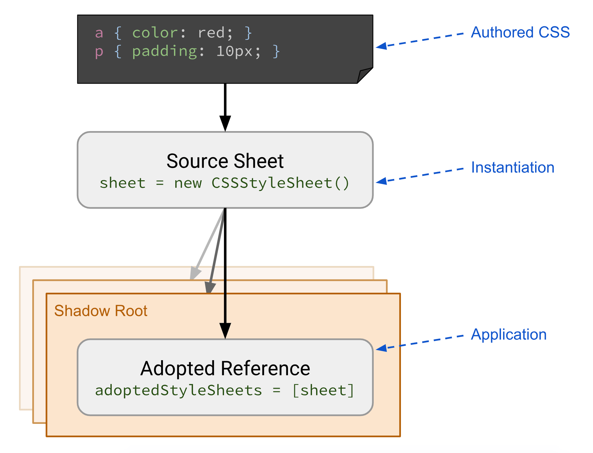

project_path: /web/_project.yaml
book_path: /web/updates/_book.yaml
description: Shipping in Chrome 73, Constructable Stylesheets provide a seamless way to create and distribute styles to documents or shadow roots without worrying about FOUC.

{# wf_published_on: 2019-02-08 #}
{# wf_updated_on: 2019-02-08 #}
{# wf_featured_image: /web/updates/images/generic/styles.png #}
{# wf_tags: chrome73,css,style #}
{# wf_featured_snippet: Shipping in Chrome 73, Constructable Stylesheets provide a seamless way to create and distribute styles to documents or shadow roots without worrying about FOUC. #}
{# wf_blink_components: Blink>CSS #}

# Constructable Stylesheets: seamless reusable styles {: .page-title }



[Constructable Stylesheets](https://wicg.github.io/construct-stylesheets) are a
new way to create and distribute reusable styles when using [Shadow
DOM](/web/fundamentals/web-components/shadowdom). 

> Note: As of October 2019, Constructable Stylesheets are only available in Chrome
> (versions 73 and higher). [Support in other browsers can be tracked
> here](https://chromestatus.com/feature/5394843094220800).

It has always been possible to create stylesheets using JavaScript. However, the
process has historically been to create a `<style>` element using
`document.createElement('style')`, and then access its sheet property to obtain
a reference to the underlying
[CSSStyleSheet](https://developer.mozilla.org/en-US/docs/Web/API/CSSStyleSheet)
instance. This method can produce duplicate CSS code and its attendant bloat,
and the act of attaching leads to a flash of unstyled content whether there is
bloat or not. The CSSStyleSheet interface is the root of a collection of CSS
representation interfaces referred to as the
[CSSOM](https://developer.mozilla.org/en-US/docs/Web/API/CSS_Object_Model),
offering a programmatic way to manipulate stylesheets as well as eliminating the
problems associated with the old method.



Constructable Stylesheets make it possible to define and prepare shared CSS
styles, and then apply those styles to multiple Shadow Roots or the Document
easily and without duplication. Updates to a shared CSSStyleSheet are applied to
all roots into which it has been adopted, and [adopting a
stylesheet](https://wicg.github.io/construct-stylesheets/#using-constructed-stylesheets)
is fast and synchronous once the sheet has been loaded.

The association set up by Constructable Stylesheets lends itself well to a
number of different applications. It can be used to provide a centralized theme
used by many components: the theme can be a CSSStyleSheet instance passed to
components, with updates to the theme propagating out to components
automatically. It can be used to distribute [CSS Custom
Property](https://developer.mozilla.org/en-US/docs/Web/CSS/--*) values to
specific DOM subtrees without relying on the
[cascade](https://developer.mozilla.org/en-US/docs/Web/CSS/Cascade). It can even
be used as a direct interface to the browser’s CSS parser, making it easy to
preload stylesheets without injecting them into the DOM.

## Constructing a StyleSheet
Rather than introducing a new API to accomplish this, the [Constructable
StyleSheets](https://wicg.github.io/construct-stylesheets) specification makes
it possible to create stylesheets imperatively by invoking the `CSSStyleSheet()`
constructor. The resulting CSSStyleSheet object has two new methods that make it
safer to add and update stylesheet rules without triggering [Flash of Unstyled
Content](https://en.wikipedia.org/wiki/Flash_of_unstyled_content) (FOUC).
[`replace()`](https://wicg.github.io/construct-stylesheets/#dom-cssstylesheet-replace)
returns a Promise that resolves once any external references (`@imports`) are
loaded, whereas
[`replaceSync()`](https://wicg.github.io/construct-stylesheets/#dom-cssstylesheet-replacesync)
doesn’t allow external references at all:

```js
const sheet = new CSSStyleSheet();

// replace all styles synchronously:
sheet.replaceSync('a { color: red; }');

// this throws an exception:
try {
  sheet.replaceSync('@import url("styles.css")');
} catch (err) {
  console.error(err); // imports are not allowed
}

// replace all styles, allowing external resources:
sheet.replace('@import url("styles.css")')
  .then(sheet => {
    console.log('Styles loaded successfully');
  })
  .catch(err => {
    console.error('Failed to load:', err);
  });
```

## Using Constructed StyleSheets

The second new feature introduced by Constructable StyleSheets is an
[adoptedStyleSheets](https://wicg.github.io/construct-stylesheets/#using-constructed-stylesheets)
property available on [Shadow
Roots](https://developer.mozilla.org/en-US/docs/Web/Web_Components/Using_shadow_DOM)
and [Documents](https://developer.mozilla.org/en/docs/Web/API/Document). This
lets us explicitly apply the styles defined by a CSSStyleSheet to a given DOM
subtree. To do so, we set the property to an array of one or more stylesheets to
apply to that element.

```js
// Create our shared stylesheet:
const sheet = new CSSStyleSheet();
sheet.replaceSync('a { color: red; }');

// Apply the stylesheet to a document:
document.adoptedStyleSheets = [sheet];

// Apply the stylesheet to a Shadow Root:
const node = document.createElement('div');
const shadow = node.attachShadow({ mode: 'open' });
shadow.adoptedStyleSheets = [sheet];
```

Notice that we’re overriding the value of `adoptedStyleSheets` instead of
changing the array in place. This is required because the array is frozen;
in-place mutations like `push()` throw an exception, so we have to assign a new
array. To preserve any existing StyleSheets added via `adoptedStyleSheets`, we
can use concat to create a new array that includes the existing sheets as well
as additional ones to add:

```js
const sheet = new CSSStyleSheet();
sheet.replaceSync('a { color: red; }');

// Combine existing sheets with our new one:
document.adoptedStyleSheets = [...document.adoptedStyleSheets, sheet];
```

## Putting it All Together

With Constructable StyleSheets, web developers now have an explicit solution for
creating CSS StyleSheets and applying them to DOM trees. We have a new
Promise-based API for loading StyleSheets from a string of CSS source that uses
the browser’s built-in parser and loading semantics. Finally, we have a
mechanism for applying stylesheet updates to all usages of a StyleSheet,
simplifying things like theme changes and color preferences.

<video autoplay loop muted playsinline height="298" width="379"
src="../../images/2019/02/constructable-stylesheets/demo.mp4"></video>

**[View Demo](https://construct-stylesheets.glitch.me/)**

## Looking Ahead
The initial version of Constructable Stylesheets is shipping with the API
described here, but there’s work underway to make things easier to use. There’s
a [proposal](https://github.com/WICG/construct-stylesheets/issues/45) to extend
the adoptedStyleSheets FrozenArray with dedicated methods for inserting and
removing stylesheets, which would obviate the need for array cloning and avoid
potential duplicate stylesheet references. 

## More Information
* [Chrome Platform Status](https://www.chromestatus.com/feature/5394843094220800)
* [Example](https://construct-stylesheets.glitch.me/)
* [API](https://wicg.github.io/construct-stylesheets/)
* [Explainer](https://github.com/WICG/construct-stylesheets/blob/gh-pages/explainer.md)
* [Intent to Implement](https://groups.google.com/a/chromium.org/d/topic/blink-dev/irhrlr6n5YQ/discussion)
* [Intent to Ship](https://groups.google.com/a/chromium.org/d/topic/blink-dev/gL2EVBzO5og/discussion)
* [Discourse](https://discourse.wicg.io/t/proposal-constructable-stylesheet-objects/2572)





