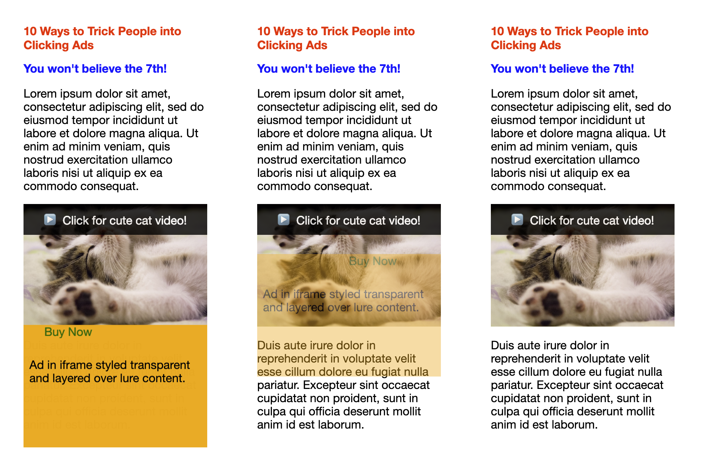

project_path: /web/_project.yaml
book_path: /web/updates/_book.yaml
description: Augment IntersectionObserver to report information about occlusion and visual effects.

{# wf_updated_on: 2019-02-06 #}
{# wf_published_on: 2019-02-06 #}
{# wf_tags: intersectionobserver #}
{# wf_featured_image: /web/updates/images/generic/timeline.png #}
{# wf_featured_snippet: Lorem ipsum. #}
{# wf_blink_components: Blink>Layout #}

# Trust is Good, Observation is Better—Intersection Observer&nbsp;v2 {: .page-title}



<div class="clearfix"></div>

Intersection Observer&nbsp;v1 is one of these APIs that's probably universally loved, and, now that
[Safari supports it](https://webkit.org/blog/8582/intersectionobserver-in-webkit/) too, it's also
universally usable in all major browsers. For a quick refresher of the API, I recommend watching
[Surma](../../../resources/contributors/surma)'s
[Supercharged Microtip](https://www.youtube.com/embed/kW_atFXMG98) on Intersection
Observer&nbsp;v1—also embedded below for your viewing pleasure—or reading his in-depth
[article](../../2016/04/intersectionobserver).
People have used Intersection Observer&nbsp;v1 for a wide range of use cases, like, for example,
[lazy loading of images and videos](https://developers.google.com/web/fundamentals/performance/lazy-loading-guidance/images-and-video/),
[being notified when elements reach `position: sticky`](https://developers.google.com/web/updates/2017/09/sticky-headers),
[fire analytics events](https://github.com/ampproject/amphtml/blob/master/extensions/amp-analytics/0.1/visibility-manager.js),
and many others.

<iframe width="560" height="315" src="https://www.youtube.com/embed/kW_atFXMG98" frameborder="0"
    allow="accelerometer; autoplay; encrypted-media; gyroscope; picture-in-picture" allowfullscreen>
</iframe>

As a short reminder, this is what the Intersection Observer&nbsp;v1 API looks like in the most
basic case:

```javascript
const onIntersection = (entries) => {
  entries.forEach((entry) => {
    if (entry.isIntersecting) {
      console.log(entry);
    }
  });
};

const observer = new IntersectionObserver(onIntersection);
observer.observe(document.querySelector('#some-target'));
```

## What's challenging with Intersection Observer&nbsp;v1?

Let's get this straight: there's nothing wrong with Intersection Observer&nbsp;v1, yet there are
some corner cases where the API falls short. Let's have a closer look!
The Intersection Observer&nbsp;v1 API can perfectly tell you when an element is scrolled into the
window's viewport, but it doesn't tell you whether the element is covered by any other page content
(that is, when the element is "occluded") or whether the element's visual display has been modified
by visual effects like `transform`, `opacity`, `filter`, etc., which makes it effectively invisible.

Now while for an element in the top-level document this information can be determined by analyzing
the DOM via JavaScript, for example via
[`DocumentOrShadowRoot.elementFromPoint()`](https://developer.mozilla.org/en-US/docs/Web/API/DocumentOrShadowRoot/elementFromPoint)
and then digging deeper, the same information cannot be obtained if the element in question is
located in a third-party iframe.

## Why is actual visibility such a big deal?

The Internet is, unfortunately, a place that attracts bad actors with even worse intentions.
For example, a publisher that serves pay-per-click ads on a content site might be incentivized
to trick people into clicking these ads to increase their ad payout.
Typically, such ads are served in iframes.
Now if the publisher wanted to get users to click such ads, they could make the iframe with the ad
completely transparent by applying a CSS rule `iframe { opacity: 0; }` and overlaying the iframe
on top of something attractive, like a cute cat video that users would actually want to click.
This is called *click-jacking*.
You can see such a click-jacking attack in action in this [demo](https://trick-ad-click.glitch.me/)
(try watching the 🐈 cat video).



## How does Intersection Observer&nbsp;v2 fix this?

Intersection Observer&nbsp;v2 introduces the concept of tracking the actual "visibility" of a target
element as a human being would define it.
By setting an option in the
[`IntersectionObserver` constructor](https://developer.mozilla.org/en-US/docs/Web/API/IntersectionObserver/IntersectionObserver),
intersecting
[`IntersectionObserverEntry`](https://developer.mozilla.org/en-US/docs/Web/API/IntersectionObserverEntry)s
(pardon the wrong plural ending here) will then contain a new boolean field named `isVisible`.
A `true` value for `isVisible` is a strong guarantee from the underlying implementation
that the target element is completely unoccluded by other content
and has no visual effects applied that would alter or distort its display on screen.
In contrast, a `false` value means that the implementation cannot make that guarantee.

An important detail of the spec is that the implementation is permitted to report false negatives
(that is, setting `isVisible` to `false` even when the target element is completely visible and
unmodified), but it may never report a false positive.
For performance or other reasons, an implementation may use an algorithm which is not 100% accurate,
as long as all inaccuracies are false negatives.

## How does the new code look like in practice?
