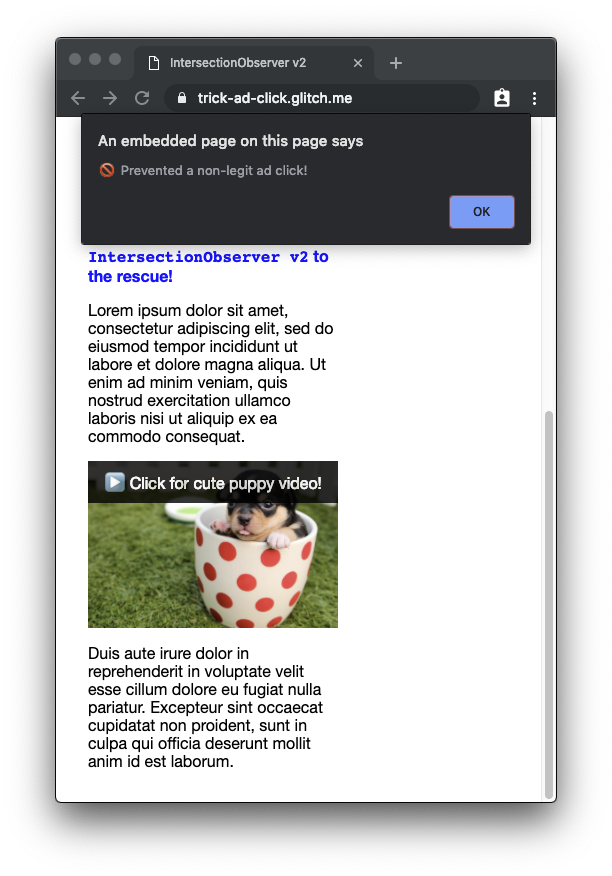

project_path: /web/_project.yaml
book_path: /web/updates/_book.yaml
description: Intersection Observer v2 adds the capability to not only observe intersections per se, but to also detect if the intersecting element was visible at the time of intersection.

{# wf_updated_on: 2019-02-15 #}
{# wf_published_on: 2019-02-15 #}
{# wf_tags: intersectionobserver #}
{# wf_featured_image: /web/updates/images/generic/timeline.png #}
{# wf_featured_snippet: Intersection Observer v2 adds the capability to not only observe intersections per se, but to also detect if the intersecting element was visible at the time of intersection. #}
{# wf_blink_components: Blink>Layout #}

# Trust is Good, Observation is Better—Intersection Observer v2 {: .page-title}



<div class="clearfix"></div>

Intersection Observer&nbsp;v1 is one of those APIs that's probably universally loved, and, now that
[Safari supports it](https://webkit.org/blog/8582/intersectionobserver-in-webkit/) as well,
it's also finally universally usable in all major browsers. For a quick refresher of the API,
I recommend watching [Surma](../../../resources/contributors/surma)'s
[Supercharged Microtip](https://www.youtube.com/embed/kW_atFXMG98) on Intersection
Observer&nbsp;v1—also embedded below for your viewing pleasure—or reading Surma's in-depth
[article](../../2016/04/intersectionobserver).
People have used Intersection Observer&nbsp;v1 for a wide range of use cases like
[lazy loading of images and videos](../../../fundamentals/performance/lazy-loading-guidance/images-and-video/),
[being notified when elements reach `position: sticky`](../../2017/09/sticky-headers),
[fire analytics events](https://github.com/ampproject/amphtml/blob/master/extensions/amp-analytics/0.1/visibility-manager.js),
and many more.

<iframe width="560" height="315" src="https://www.youtube.com/embed/kW_atFXMG98" frameborder="0"
    allow="accelerometer; autoplay; encrypted-media; gyroscope; picture-in-picture" allowfullscreen>
</iframe>

For the full details, check out the
[Intersection Observer docs on MDN](https://developer.mozilla.org/en-US/docs/Web/API/Intersection_Observer_API),
but as a short reminder, this is what the Intersection Observer&nbsp;v1 API looks like in the most
basic case:

```js
const onIntersection = (entries) => {
  for (const entry of entries) {
    if (entry.isIntersecting) {
      console.log(entry);
    }
  }
};

const observer = new IntersectionObserver(onIntersection);
observer.observe(document.querySelector('#some-target'));
```

## What's challenging with Intersection Observer&nbsp;v1?

To be clear, Intersection Observer&nbsp;v1 is great, but it's not perfect. There are
some corner cases where the API falls short. Let's have a closer look!
The Intersection Observer&nbsp;v1 API can perfectly tell you when an element is scrolled into the
window's viewport, but it *doesn't* tell you whether the element is covered
by any other page content (that is, when the element is occluded) or whether
the element's visual display has been modified by visual effects like `transform`, `opacity`,
`filter`, etc., which *effectively* can make it invisible.

Now while for an element in the top-level document this information can be determined by analyzing
the DOM via JavaScript, for example via
[`DocumentOrShadowRoot.elementFromPoint()`](https://developer.mozilla.org/en-US/docs/Web/API/DocumentOrShadowRoot/elementFromPoint)
and then digging deeper, the same information cannot be obtained if the element in question is
located in a third-party iframe.

## Why is actual visibility such a big deal?

The Internet is, unfortunately, a place that attracts bad actors with even worse intentions.
For example, a shady publisher that serves pay-per-click ads on a content site might be incentivized
to trick people into clicking their ads to increase the publisher's ad payout (at least
for a short period, until the ad network catches them).
Typically, such ads are served in iframes.
Now if the publisher wanted to get users to click such ads, they could make the ad iframes
completely transparent by applying a CSS rule `iframe { opacity: 0; }` and overlaying the iframes
on top of something attractive, like a cute cat video that users would actually want to click.
This is called *clickjacking*.
You can see such a clickjacking attack in action in the upper section of this
[demo](https://trick-ad-click.glitch.me/) (try "watching" the 🐈 cat video
and ☑️ activate "trick mode").
You will notice that the ad in the iframe "thinks" it received legitimate clicks, even if it was
completely transparent when you (pretendedly involuntarily) clicked it.


## How does Intersection Observer&nbsp;v2 fix this?

Intersection Observer&nbsp;v2 introduces the concept of tracking the actual "visibility" of a target
element as a human being would define it.
By setting an option in the
[`IntersectionObserver` constructor](https://developer.mozilla.org/en-US/docs/Web/API/IntersectionObserver/IntersectionObserver),
intersecting
[`IntersectionObserverEntry`](https://developer.mozilla.org/en-US/docs/Web/API/IntersectionObserverEntry)s
(pardon the wrong plural ending here) will then contain a new boolean field named `isVisible`.
A `true` value for `isVisible` is a strong guarantee from the underlying implementation
that the target element is completely unoccluded by other content
and has no visual effects applied that would alter or distort its display on screen.
In contrast, a `false` value means that the implementation cannot make that guarantee.

An important detail of the
[spec](https://w3c.github.io/IntersectionObserver/v2/#calculate-visibility-algo)
is that the implementation *is permitted* to report *false negatives* (that is, setting `isVisible`
to `false` even when the target element is completely visible and unmodified).
For performance or other reasons, implementations should limit themselves to working with bounding
boxes and rectilinear geometry; they shouldn't try to achieve pixel-perfect results for
modifications like `border-radius`.

That said, *false positives* are *not permitted* under any circumstances (that is, setting
`isVisible` to `true` when the target element is not completely visible and unmodified).

Warning: Visibility is *much more expensive* to compute than intersection. For that reason,
Intersection Observer&nbsp;v2 is *not intended to be used broadly* in the way that
Intersection Observer&nbsp;v1 is. Intersection Observer&nbsp;v2 is focused on combatting fraud
and should be used only when Intersection Observer&nbsp;v1 functionality is *truly* insufficient.

## What does the new code look like in practice?

The `IntersectionObserver` constructor now takes two additional configuration properties: `delay`
and `trackVisibility`.
The `delay` is a number indicating the minimum delay in milliseconds between notifications from
the observer for a given target.
The `trackVisibility` is a boolean indicating whether the observer will track changes in a target's
visibility.

⚠️ It's important to note here that when `trackVisibility` is `true`, `delay` is required to be at
least `100` (that is, no more than one notification every 100ms).
As noted before, visibility is expensive to calculate, and this requirement is a precaution against
performance degradation (and battery consumption). The responsible developer will use the
*largest tolerable value* for delay.

According to the current
[spec](https://w3c.github.io/IntersectionObserver/v2/#calculate-visibility-algo), visibility is
calculated as follows:

- If the observer's `trackVisibility` attribute is `false`, then the target is considered visible.
This corresponds to the current&nbsp;v1 behavior.

- If the target has an effective transformation matrix other than a 2D&nbsp;translation
or proportional 2D&nbsp;upscaling, then the target is considered invisible.

- If the target, or any element in its containing block chain, has an effective opacity other than
1.0, then the target is considered invisible.

- If the target, or any element in its containing block chain, has any filters applied,
then the target is considered invisible.

- If the implementation cannot guarantee that the target is completely unoccluded by other page
content, then the target is considered invisible.

This means current implementations are pretty conservative with guaranteeing visibility.
For example, applying an almost unnoticeable grayscale filter like `filter: grayscale(0.01%)`
or setting an almost invisible transparency with `opacity: 0.99` would all render the element
invisible.

Below is a short code sample that illustrates the new API features. You can see this click tracking
logic in action in the second section of the [demo](https://trick-ad-click.glitch.me/)
(but now, try "watching" the 🐶 puppy video). Be sure to activate "trick mode" again to immediately
convert yourself into a shady publisher and see how Intersection Observer&nbsp;v2 prevents
non-legitimate ad clicks from being tracked.
This time, Intersection Observer&nbsp;v2 has our back! 🎉

Note: Different from typical lazy-loading code, if you use Intersection Observer to prevent this
kind of clickjacking attacks, you *must not* `unobserve` the element after the first intersection.



```html
<!DOCTYPE html>
<!-- This is the ad running in the iframe -->
<button id="callToActionButton">Buy now!</button>
```

```js
// This is code running in the iframe.

// The iframe must be visible for at least 800ms prior to an input event
// for the input event to be considered valid.
const minimumVisibleDuration = 800;

// Keep track of when the button transitioned to a visible state.
let visibleSince = 0;

const button = document.querySelector('#callToActionButton');
button.addEventListener('click', (event) => {
  if ((visibleSince > 0) &&
      (performance.now() - visibleSince >= minimumVisibleDuration)) {
    trackAdClick();
  } else {
    rejectAdClick();
  }
});

const observer = new IntersectionObserver((changes) => {
  for (const change of changes) {
    // ⚠️ Feature detection
    if (typeof change.isVisible === 'undefined') {
      // The browser doesn't support Intersection Observer v2, falling back to v1 behavior.
      change.isVisible = true;
    }
    if (change.isIntersecting && change.isVisible) {
      visibleSince = change.time;
    } else {
      visibleSince = 0;
    }
  }
}, {
  threshold: [1.0],
  // 🆕 Track the actual visibility of the element
  trackVisibility: true,
  // 🆕 Set a minimum delay between notifications
  delay: 100
}));

// Require that the entire iframe be visible.
observer.observe(document.querySelector('#ad'));
```

## Related Links

- Latest Editor's Draft of the
[Intersection Observer spec](https://w3c.github.io/IntersectionObserver/v2/).
- Intersection Observer&nbsp;v2 on
[Chrome Platform Status](https://www.chromestatus.com/feature/5878481493688320).
- Intersection Observer&nbsp;v2 [Chromium bug](https://crbug.com/827639).
- Blink
[Intent to Implement posting](https://groups.google.com/a/chromium.org/d/msg/blink-dev/tudxAHN9-AY/vz91o_aNDwAJ).

## Acknowledgements

Thanks to [Simeon Vincent](https://twitter.com/dotproto),
[Yoav Weiss](https://twitter.com/yoavweiss), and [Mathias Bynens](https://twitter.com/mathias)
for reviewing this article, as well as [Stefan Zager](https://twitter.com/stefanzager) likewise
for reviewing and for implementing the feature in Chrome.




