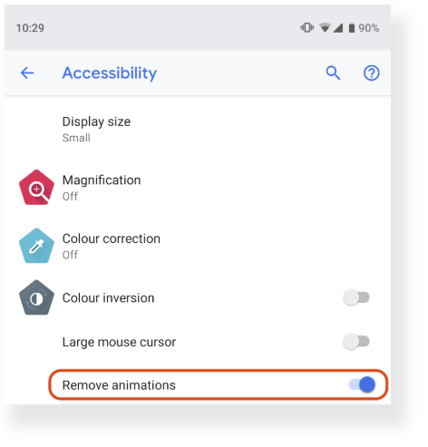
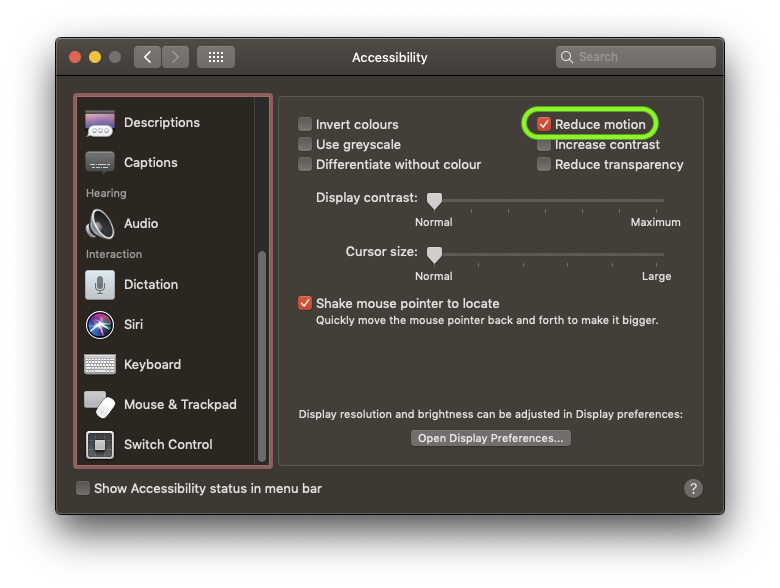

project_path: /web/_project.yaml
book_path: /web/updates/_book.yaml
description: The prefers-reduced-motion media query detects whether the user has requested that the system minimize the amount of animation or motion it uses. This is for users who either require or prefer minimized animations; for example people with vestibular disorders often desire animations to be kept to a minimum.

{# wf_updated_on: 2019-09-11 #}
{# wf_published_on: 2019-03-11 #}
{# wf_tags: media-queries #}
{# wf_featured_image: /web/updates/images/generic/timeline.png #}
{# wf_featured_snippet: The prefers-reduced-motion media query detects whether the user has requested that the system minimize the amount of animation or motion it uses. #}
{# wf_blink_components: Blink>Animation #}

# Move Ya! Or maybe, don't, if the user prefers-reduced-motion! {: .page-title}



<div class="clearfix"></div>

**tl;dr:** Not everyone likes decorative animations or transitions, and some users outright
experience motion sickness when faced with parallax scrolling, zooming effects, etc.
Chrome 74 supports a user preference media query `prefers-reduced-motion`
that lets you design a motion-reduced variant of your site for users who have expressed this
preference.

## Too much motion in real life and on the web

The other day, I was ice skating with my kids. It was a lovely day, the sun was shining, and the ice
rink was crammed with people ⛸. The only issue with that: I don't cope with crowds well. With so
many moving targets, I fail to focus on anything, and end up lost and with a feeling of complete
visual overload, almost like staring at an anthill 🐜.

<figure>
  
  <figcaption><strong>Figure 1:</strong> Visual overload in real life.</figcaption>
</figure>

Occasionally, the same can happen on the web: with flashing ads, fancy parallax effects, surprising
reveal animations, autoplaying videos, etc., *the web sometimes can honestly be quite
overwhelming*… Happily, unlike in real life, there is a solution to that. The CSS media query
`prefers-reduced-motion` lets developers create a variant of a page for users who, well, prefer
reduced motion. This can comprise anything from refraining from having autoplaying videos to
disabling certain purely decorative effects, to completely redesigning a page for certain users.

Before I dive into the feature, let's take one step back and think of what animations are used for
on the web. If you want, you can also skip the background information and
[jump right into the technical details](#working_with_the_media_query) below.

## Animation on the web

Animation is oftentimes used to provide *feedback* to the user, for example, to let them know that
an action was received and is being processed. More concretely, on a shopping website, a product
could be animated to "fly" into a virtual shopping cart, depicted as an icon in the top-right corner
of the site.

Another use case involves using motion to
[hack user perception](https://medium.com/dev-channel/hacking-user-perception-to-make-your-websites-and-apps-feel-faster-922636b620e3)
by using a mixture of skeleton screens, contextual metadata, and low quality image previews to
occupy a lot of the user's time and make the whole experience *feel faster*.
The idea is to give context to the user of what's coming and meanwhile load in things as quickly as
possible.

Finally, there are *decorative* effects like animated gradients, parallax scrolling,
background videos, and several others.
While many users enjoy such animations, some users dislike
them because they feel distracted or slowed down by them. In the worst case, users may even suffer
from motion sickness as if it were a real life experience, so for these users reducing animations is
a *medical necessity*.

## Motion-triggered vestibular spectrum disorder

Some users experience distraction or nausea from animated content. For example, if scrolling a page
causes elements to move other than the essential movement associated with scrolling—as with parallax
scrolling, where backgrounds move at a different rate to foregrounds—it can trigger vestibular
disorders. Vestibular (inner ear) disorder reactions include dizziness, nausea and headaches.  The
[impact of animation on people with vestibular disorders](https://www.w3.org/WAI/WCAG21/Understanding/animation-from-interactions.html)
can be quite severe. Triggered reactions include nausea, migraine headaches, and potentially needing
bed rest to recover.

## Remove motion on operating systems

Operating systems like Android, iOS, macOS, or Windows in their accessibility settings have allowed
users for a long time to reduce motion wherever possible. The screenshots below show Android Pie's
"remove animations" preference and macOS Mojave's "reduce motion" preference that, when checked,
cause the particular operating systems to not use decorative effects like app launching animations.
Applications themselves can and should honor this setting, too, and remove all unnecessary
animations.

<figure>
  
  
  <figcaption>
    <strong>Figure 2:</strong> Prefers reduced motion settings in Android and macOS.
  </figcaption>
</figure>

## Remove motion on the web

[Media Queries Level&nbsp;5](https://drafts.csswg.org/mediaqueries-5/)
brings this user preference to the web as well. Media queries allow authors to test and query values
or features of the user agent or display device independent of the document being rendered.
The media query
[`prefers-reduced-motion`](https://drafts.csswg.org/mediaqueries-5/#prefers-reduced-motion)
is used to detect if the user has set an operating system preference to minimize the amount of
animation or motion it uses. It can take two possible values:

- `no-preference`: Indicates that the user has made no preference in the underlying operating system.
  This keyword value evaluates as `false` in the boolean context.
- `reduce`: Indicates that the user has set an operating system preference indicating that
  interfaces should minimize movement or animation, preferably to the point where all non-essential
  movement is removed.

## Working with the media query

Note: `prefers-reduced-motion` is available as of Chrome 74. For other browsers, let me
refer you to the [Can&nbsp;I&nbsp;use](https://caniuse.com/#feat=prefers-reduced-motion) tables.

As all media queries, `prefers-reduced-motion` can be checked from a CSS context and from a
JavaScript context.

To illustrate both, let's say I have an important sign-up button that I want the user to click.
I could define an attention-catching "vibrate" animation, but as a good web citizen only play it for
those users who are explicitly OK with animations, but not everyone else, which can be users who
have opted out of animations, or users on browsers that don't understand the media query.

```CSS
/*
  If the user has expressed their preference for
  reduced motion, then don't use animations on buttons.
*/
@media (prefers-reduced-motion: reduce) {
  button {
    animation: none;
  }
}

/*
  If the browser understands the media query and the user
  explicitly hasn't set a preference, then use animations on buttons.
*/
@media (prefers-reduced-motion: no-preference) {
  button {
    /* `vibrate` keyframes are defined elsewhere */
    animation: vibrate 0.3s linear infinite both;
  }
}
```

Note: If you have a lot of animation-related CSS, you can spare your opted-out users from
downloading it by outsourcing all animation-related CSS into a separate stylesheet that you only
load conditionally via the `media` attribute on the `link` element&nbsp;😎:<br>
`<link rel="stylesheet" href="animations.css" media="(prefers-reduced-motion: no-preference)">`

To illustrate how to work with `prefers-reduced-motion` with JavaScript, let's imagine I have
defined a complex animation with the
[Web Animations API](https://developer.mozilla.org/en-US/docs/Web/API/Web_Animations_API). While
CSS rules will be dynamically triggered by the browser when the user preference changes, for
JavaScript animations I have to listen for changes myself, and then manually stop my potentially
in-flight animations (or restart them if the user lets me):

```JavaScript
const mediaQuery = window.matchMedia('(prefers-reduced-motion: reduce)');
mediaQuery.addEventListener('change', () => {
  console.log(mediaQuery.media, mediaQuery.matches);
  // Stop JavaScript-based animations.
});
```

Note: The parentheses around the actual media query are obligatory:<br>
`/* 🚫 Wrong */ window.matchMedia('prefers-reduced-motion: reduce')`<br>
You always have to use this syntax:<br>
`/* ✅ Correct */ window.matchMedia('(prefers-reduced-motion: reduce)')`

## Demo

I have created a little demo based on Rogério Vicente's amazing
[🐈 HTTP status cats](https://http.cat/). First, take a moment to appreciate the joke, it's
hilarious and I'll wait. Now that you're back, let me introduce the
[demo](https://prefers-reduced-motion.glitch.me). When you scroll down, each HTTP status cat
alternatingly appears from either the right or the left side. It's a buttery smooth 60fps animation,
but as outlined above, some users may dislike it or even get motion sick by it, so the demo is
programmed to respect `prefers-reduced-motion`. This even works dynamically, so users can change
their preference on-the-fly, no reload required. If a user prefers reduced motion, the non-necessary
reveal animations are gone, and just the regular scrolling motion is left. The screencast below
shows the demo in action:

<figure>
  <video muted playsinline intrinsicsize="1098x870" controls
    poster="../../videos/2019/03/prefers-reduced-motion/prefers-reduced-motion.png"
  >
    <source src="../../videos/2019/03/prefers-reduced-motion/prefers-reduced-motion.mp4" type="video/mp4">
  </video>
  <figcaption><strong>Figure 3:</strong> Video of the
    <a href="https://prefers-reduced-motion.glitch.me"><code>prefers-reduced-motion</code> demo</a>
    app (test it on Chrome 74 or later).
  </figcaption>
</figure>

## (Bonus) Forcing reduced motion on all websites

Not every site will use `prefers-reduced-motion`, or maybe not consequently enough for your taste.
If you, for whatever reason, want to stop motion on all websites, you actually can. One way to make
this happen is to inject a stylesheet with the following CSS into every web page you visit.
There are several
[browser extensions](https://chrome.google.com/webstore/search/user%20stylesheets?_category=extensions)
out there (use at your own risk!) that allow for this.

```CSS
@media (prefers-reduced-motion: reduce) {
  *,
  *::before,
  *::after {
    animation-duration: 0.001s !important;
    transition-duration: 0.001s !important;
  }
}
```

The way this works is that the CSS above overrides the durations of all animations and transitions
to such a short time that they are not noticeable anymore. As some websites depend on an animation
to be run in order to work correctly (maybe because a certain step depends on the firing of the
[`animationend` event](https://developer.mozilla.org/en-US/docs/Web/API/HTMLElement/animationend_event)),
the more radical `animation: none !important;` approach wouldn't work. Even the above hack is not
guaranteed to succeed on all websites (for example, it can't stop motion that was initiated via the
[Web Animations API](https://developer.mozilla.org/en-US/docs/Web/API/Web_Animations_API)),
so be sure to deactivate it when you notice breakage.

## Conclusions

Respecting user preferences is key for modern websites, and browsers expose more and more features
to enable web developers to do so. The CSS Working Group are currently standardizing more
[user preference media queries](https://drafts.csswg.org/mediaqueries-5/#mf-user-preferences)
like
[`prefers-reduced-transparency`](https://drafts.csswg.org/mediaqueries-5/#prefers-reduced-transparency)
(detects if the user prefers reduced transparency),
[`prefers-contrast`](https://drafts.csswg.org/mediaqueries-5/#prefers-contrast)
(detects if the user has requested the system to increase or decrease the amount of
contrast between adjacent colors),
[`prefers-color-scheme`](https://drafts.csswg.org/mediaqueries-5/#prefers-color-scheme)
(detects if the user prefers a light or
dark color scheme), and
[`inverted-colors`](https://drafts.csswg.org/mediaqueries-5/#inverted)
(detects if the user prefers inverted colors).
👀 Watch this space, we will definitely let you know once they launch in Chrome!

## Related Links

- Latest Editor's Draft of the
[Media Queries Level&nbsp;5](https://drafts.csswg.org/mediaqueries-5/#prefers-reduced-motion) spec.
- `prefers-reduced-motion` on
[Chrome Platform Status](https://www.chromestatus.com/feature/5597964353404928).
- `prefers-reduced-motion` [Chromium bug](http://crbug.com/722548).
- Blink
[Intent to Implement posting](https://groups.google.com/a/chromium.org/forum/#!msg/blink-dev/NZ3c9d4ivA8/BIHFbOj6DAAJ).

## Acknowledgements

Massive shout-out to [Stephen McGruer](https://github.com/stephenmcgruer) who has implemented
`prefers-reduced-motion` in Chrome and—together with
[Rob Dodson](https://twitter.com/rob_dodson)—has also reviewed this article.




