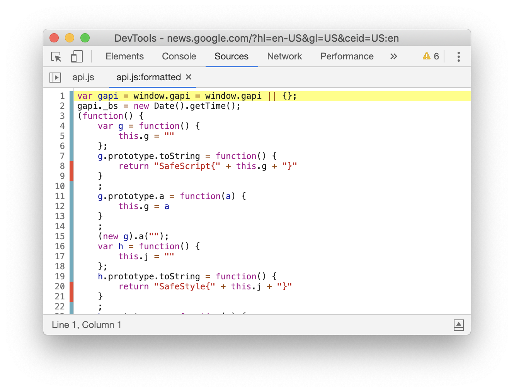

project_path: /web/_project.yaml
book_path: /web/updates/_book.yaml
description: Debug why cookies were blocked, simulate "prefers-color-scheme: dark", code coverage updates, and more.

{# wf_updated_on: 2020-02-21 #}
{# wf_published_on: 2019-10-15 #}
{# wf_tags: chrome79, devtools, devtools-whatsnew #}
{# wf_featured_image: /web/updates/images/generic/chrome-devtools.png #}
{# wf_featured_snippet: Debug why cookies were blocked, simulate "prefers-color-scheme: dark", code coverage updates, and more. #}
{# wf_blink_components: Platform>DevTools #}

# What's New In DevTools (Chrome 79) {: .page-title }



## New features for cookies {: #cookies }

### Debug why a cookie was blocked {: #blockedcookies }

After recording network activity, select a network resource and then navigate to the updated
**Cookies** tab to understand why that resource's request or response cookies were blocked.
See [Changes to the default behavior without SameSite][samesite] to understand
why you might be seeing more blocked cookies in Chrome 76 and later.

[samesite]: https://web.dev/samesite-cookies-explained#changes-to-the-default-behavior-without-samesite

<figure>
  
  <figcaption>
    The <b>Cookies</b> tab.
  </figcaption>
</figure>

* Yellow **Request Cookies** were not sent over the wire. These are hidden
  by default. Click **show filtered out request cookies** to show them.
* Yellow **Response Cookies** were sent over the wire but not stored.
* Hover over **More Information** ![info][info]{:.inline-icon} to learn why a cookie was
  blocked.
* Most of the data in the **Request Cookies** and **Response Cookies** tables comes from
  the resource's HTTP headers. The **Domain**, **Path**, and **Expires/Max-Age** data comes
  from the [Chrome DevTools Protocol](https://chromedevtools.github.io/devtools-protocol/).

[info]: ../../images/2019/10/info.png

{# https://chromium.googlesource.com/chromium/src/+/f82c0c2418170ac32a9764550073bc3c95dce240 #}
{# https://chromium.googlesource.com/chromium/src/+/4f13a2518b054a7e8d218aaf3213de2e1c74ea4e #}
{# https://chromium.googlesource.com/chromium/src/+/8a8d484654bf7cba22df22a9dc072e49bcb73327 #}

Chromium issues [#856777](https://crbug.com/856777), [#993843](https://crbug.com/993843)

### View cookie values {: #cookiepreviews }

Click a row in the [Cookies pane](/web/tools/chrome-devtools/storage/cookies) to view the
value of that cookie.

<figure>
  
  <figcaption>
    Viewing the value of a cookie.
  </figcaption>
</figure>

Note: The main difference between the Cookies tab in the Network panel and the Cookies
pane in the Application panel is that the Cookies pane in the Application panel lets you
edit and delete cookies.

{# https://chromium.googlesource.com/chromium/src/+/2c327126ab78b37dfbcedee2a8a267d2a54dadfc #}

Chromium issue [#462370](https://crbug.com/462370)

## Simulate different prefers-color-scheme and prefers-reduced-motion preferences {: #userpreferences }

The [prefers-color-scheme](https://web.dev/prefers-color-scheme) media query lets you match
your site's style to your user's preferences. For example, if the `prefers-color-scheme: dark`
media query is true, it means that your user has set their operating system to dark mode and
prefers dark mode UIs.

Open the [Command Menu](/web/tools/chrome-devtools/command-menu), run the **Show Rendering**
command, and then set the **Emulate CSS media feature prefers-color-scheme** dropdown to debug
your `prefers-color-scheme: dark` and `prefers-color-scheme: light` styles.

<figure>
  
  <figcaption>
    When <code>prefers-color-scheme: dark</code> is set (middle box) the Styles pane (right box)
    shows the CSS that gets applied when that media query is true and the viewport shows
    the dark mode styles (left box).
  </figcaption>
</figure>

You can also simulate `prefers-reduced-motion: reduce` using the **Emulate CSS media feature
prefers-reduced-motion** dropdown next to the **Emulate CSS media feature prefers-color-scheme**
dropdown.

{# https://chromium.googlesource.com/chromium/src/+/9ca30329b8ee53b2462d72772dc189385b6e2a34 #}

Chromium issue [#1004246](https://crbug.com/1004246)

## Timezone emulation {: #timezone }

The Sensors tab now lets you not only
[override geolocation](/web/tools/chrome-devtools/device-mode/geolocation), but also emulate
arbitrary timezones and test the impact on your web apps. Perhaps surprisingly, this new feature
improves the reliability of geolocation emulation as well: previously, web apps could detect location
spoofing by matching the location against the user's local timezone. Now that geolocation and
timezone emulation are coupled, this category of mismatches is eliminated.

## Code coverage updates {: #coverage }

The [Coverage tab](/web/tools/chrome-devtools/coverage) can help you [find unused JavaScript and
CSS](https://web.dev/remove-unused-code/).

The Coverage tab now uses new colors to represent used and unused code. This color combination
is proven to be more accessible for people with color vision deficiencies. The red bar on the left
represents unused code, and the bluish bar on the right represents used code.

The new coverage **type filter** text box lets you filter for coverage information by its type:
display only JavaScript coverage, only CSS, or display all types of coverage.

<figure>
  
  <figcaption>
    The Coverage tab.
  </figcaption>
</figure>

The Sources panel displays code coverage data when it is available. Clicking the red or bluish
marks next to the line number opens the Coverage tab and highlights the file.

<figure>
  
  <figcaption>
    Coverage data in the Sources panel. Line 8 is an example of unused code.
    Line 11 is an example of used code.
  </figcaption>
</figure>

{# https://chromium.googlesource.com/chromium/src/+/71d06de626d5e15fae7534df8fe0bb1613838aa7 #}
{# https://chromium.googlesource.com/chromium/src/+/59cca2c8f5fcd709360d4ba111fd2a9fca4e78f7 #}

Chromium issues [#1003671](https://crbug.com/1003671), [#1004185](https://crbug.com/1004185)

## Debug why a network resource was requested {: #initiator }

After recording network activity, select a network resource and then navigate to the
**Initiator** tab to understand why the resource was requested. The **Request call stack**
section describes the JavaScript call stack leading up to the network request.

<figure>
  
  <figcaption>
    The <b>Initiator</b> tab.
  </figcaption>
</figure>

Note: You can also access this data by hovering over the **Initiator** column in the Network
Log. We added the **Initiator** tab because it's more accessible.

{# https://chromium.googlesource.com/chromium/src/+/0d0cae574b458c3d4bd7f6f254f74f6f2442b710 #}

Chromium issues [963183](https://crbug.com/963183), [842488](https://crbug.com/842488)

## Console and Sources panels respect indentation preferences again {: #indentation }

For a long time DevTools has had a setting to customize your indentation preference
to 2 spaces, 4 spaces, 8 spaces, or tabs. Recently the setting was essentially useless because
the Console and Sources panels were ignoring the setting. This bug is now fixed.

Go to [**Settings**](/web/tools/chrome-devtools/customize#settings) > **Preferences** >
**Sources** > **Default Indentation** to set your preference.

{# https://chromium.googlesource.com/chromium/src/+/d3be8efb8e3700d72b6a75e1078b54e2b17e8c15 #}

Chromium issue [#977394](https://crbug.com/977394)

## New shortcuts for cursor navigation {: #console }

Press <kbd>Control</kbd>+<kbd>P</kbd> in the Console or Sources panels to move your cursor to
the line above. Press <kbd>Control</kbd>+<kbd>N</kbd> to move your cursor to the line below.

{# https://chromium.googlesource.com/chromium/src/+/0cba9023f762656df94d07f8afc1bc94bf3840f2 #}

Chromium issue [#983874](https://crbug.com/983874)

<<../../_shared/devtools-feedback.md>>

<<../../_shared/canary.md>>

<<../../_shared/discover.md>>


