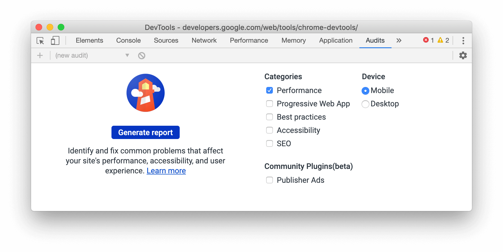

project_path: /web/_project.yaml
book_path: /web/updates/_book.yaml
description: Support for let and class redeclarations in the Console, improved WebAssembly debugging, and more.

{# wf_updated_on: 2020-02-06 #}
{# wf_published_on: 2019-12-05 #}
{# wf_tags: chrome80, devtools, devtools-whatsnew #}
{# wf_featured_image: /web/updates/images/generic/chrome-devtools.png #}
{# wf_featured_snippet: Support for let and class redeclarations in the Console, improved WebAssembly debugging, and more. #}
{# wf_blink_components: Platform>DevTools #}

# What's New In DevTools (Chrome 80) {: .page-title }



  <iframe class="devsite-embedded-youtube-video" data-video-id="2EiPb1opH3g"
          data-autohide="1" data-showinfo="0" frameborder="0" allowfullscreen>
  </iframe>

## Support for `let` and `class` redeclarations in the Console {: #redeclarations }

The Console now supports redeclarations of `let` and `class` statements. The inability to redeclare
was a common annoyance for web developers who use the Console to experiment with new JavaScript
code.

<aside class="warning">
  Redeclaring a <code>let</code> or <code>class</code> statement in a script outside of the
  Console or within a single Console input will still cause a <code>SyntaxError</code>.
</aside>

For example, previously, when redeclaring a local variable with `let`, the Console would throw an error:

<figure>
  
</figure>

Now, the Console allows the redeclaration:

<figure>
  
</figure>

{# https://chromium.googlesource.com/devtools/devtools-frontend/+/53a8548ce03957e7704ae88b780dfa019bf967e0 #}

Chromium issue [#1004193](https://crbug.com/1004193)

## Improved WebAssembly debugging {: #webassembly }

DevTools has started to support the [DWARF Debugging Standard](http://dwarfstd.org/),
which means increased support for stepping over code, setting breakpoints, and resolving stack traces in your
source languages within DevTools.
Check out [Improved WebAssembly debugging in Chrome DevTools](/web/updates/2019/12/webassembly)
for the full story.

<figure>
  
</figure>

## Network panel updates {: #network }

### Request Initiator Chains in the Initiator tab {: #initiators }

You can now view the initiators and dependencies of a network request as a nested list. This
can help you understand why a resource was requested, or what network activity a certain resource
(such as a script) caused.

<figure>
  
</figure>

After [logging network activity in the Network panel](/web/tools/chrome-devtools/network), click
a resource and then go to the **Initiator** tab to view its **Request Initiator Chain**:

* The *inspected resource* is bold. In the screenshot above, `https://web.dev/default-627898b5.js`
  is the inspected resource.
* The resources above the inspected resource are the *initiators*. In the screenshot above,
  `https://web.dev/bootstrap.js` is the initiator of `https://web.dev/default-627898b5.js`.
  In other words, `https://web.dev/bootstrap.js` caused the network request for 
  `https://web.dev/default-627898b5.js`.
* The resources below the inspected resource are the *dependencies*. In the screenshot above,
  `https://web.dev/chunk-f34f99f7.js` is a dependency of `https://web.dev/default-627898b5.js`.
  In other words, `https://web.dev/default-627898b5.js` caused the network request for
  `https://web.dev/chunk-f34f99f7.js`.

<aside class="note">
  Initiator and dependency information can also be accessed by holding <kbd>Shift</kbd> and then
  hovering over network resources. See 
  <a href="/web/tools/chrome-devtools/network/reference#initiators-dependencies">View
  initiators and dependencies</a>.
</aside>

{# https://chromium.googlesource.com/devtools/devtools-frontend/+/df0ca90392989452ad997537308e52a9257f3377 #}

Chromium issue [#842488](https://crbug.com/842488)

### Highlight the selected network request in the Overview {: #overview }

After you click a network resource in order to inspect it, the Network panel now puts a blue border 
around that resource in the **Overview**. This can help you detect if the network request is 
happening earlier or later than expected.

<figure>
  
</figure>

{# https://chromium.googlesource.com/devtools/devtools-frontend/+/3c77a5937675b59056598afd236b22eaeedc679f #}

Chromium issue [#988253](https://crbug.com/988253)

### URL and path columns in the Network panel {: #columns }

Use the new **Path** and **URL** columns in the **Network** panel to see the absolute path
or full URL of each network resource.

<figure>
  
</figure>

Right-click the **Waterfall** table header and select **Path** or **URL** to show the new
columns.

{# https://chromium.googlesource.com/chromium/src/+/923cd866fb089619bbbd971ff16cd7d766c1fb67 #}

Chromium issue [#993366](https://crbug.com/993366)

### Updated User-Agent strings {: #useragents }

DevTools supports setting a custom User-Agent string through the **Network Conditions** tab. 
The User-Agent string affects the `User-Agent` HTTP header attached to network resources, and also 
the value of `navigator.userAgent`.

The predefined User-Agent strings have been updated to reflect modern browser versions.

<figure>
  
</figure>

To access **Network Conditions**, [open the Command Menu](/web/tools/chrome-devtools/command-menu)
and run the `Show Network Conditions` command.

<aside class="note">
  You can also <a href="/web/tools/chrome-devtools/device-mode#viewport">set User-Agent strings in 
  Device Mode</a>.
</aside>

{# https://chromium.googlesource.com/devtools/devtools-frontend/+/f05ffb295a3a4c36f8a5154285f6641a87f1f8b5 #}

Chromium issue [#1029031](https://crbug.com/1029031)

## Audits panel updates {: #audits }

### New configuration UI {: #config }

[throttling]: https://github.com/GoogleChrome/lighthouse/blob/master/docs/throttling.md#devtools-audits-panel-throttling

The configuration UI has a new, responsive design, and the throttling configuration options have
been simplified. See [Audits Panel Throttling][throttling] for more information on the throttling
UI changes.

<figure>
  
</figure>

{# https://chromium.googlesource.com/devtools/devtools-frontend/+/e66080e9a1ff79cba8130169c16ebcd222747510 #}

## Coverage tab updates {: #coverage }

### Per-function or per-block coverage modes {: #modes }

The [Coverage tab](/web/tools/chrome-devtools/coverage) has a new dropdown menu that lets 
you specify whether code coverage
data should be collected **per function** or **per block**. **Per block** coverage is
more detailed but also far more expensive to collect. DevTools uses **per function** coverage
by default now.

<aside class="caution">
  You may see large code coverage differences in HTML files depending on whether you use
  <b>per function</b> or <b>per block</b> mode.
  When using <b>per function</b> mode, inline scripts in HTML files are treated as functions.
  If the script executes at all then DevTools will mark the entire script as used code. Only if
  the script doesn't execute at all will DevTools mark the script as unused code.
</aside>

<figure>
  
</figure>

{# https://chromium.googlesource.com/devtools/devtools-frontend/+/d4f572c25cc6d4e135911d87e0aa3b88b0aba68f #}

### Coverage must now be initiated by a page reload {: #reload }

Toggling code coverage without a page reload has been removed because the coverage data
was unreliable. For example, a function can be reported as unused if its execution 
was a long time ago and V8's garbage collector has cleaned it up.

{# https://chromium.googlesource.com/devtools/devtools-frontend/+/4a1e8c7288534a29a48a35d7cd6477d22e6555d2 #}

Chromium issue [#1004203](https://crbug.com/1004203)

<<../../_shared/devtools-feedback.md>>

<<../../_shared/canary.md>>

<<../../_shared/discover.md>>


