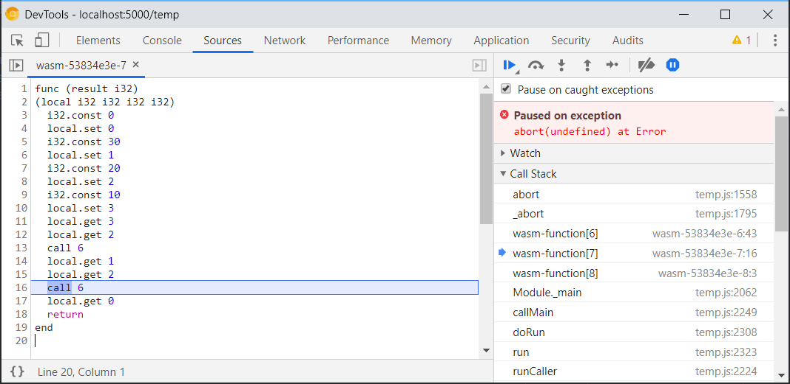
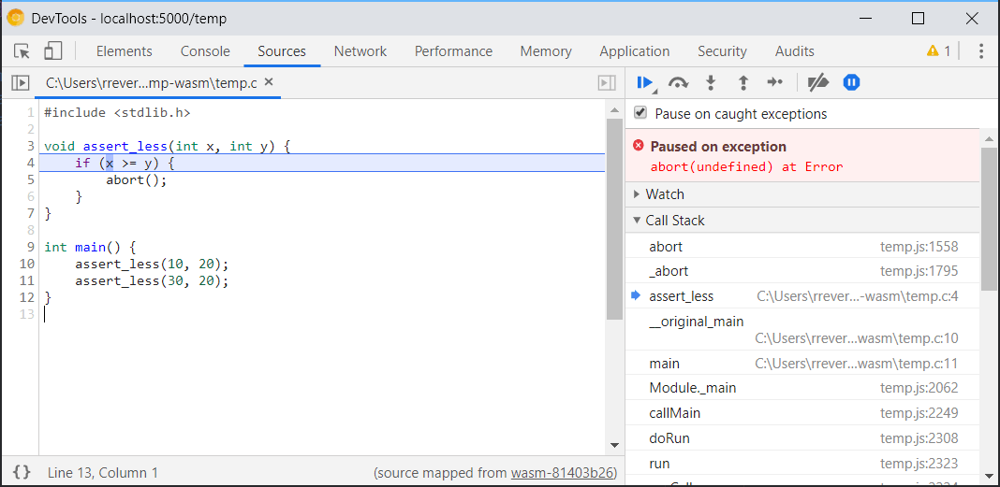
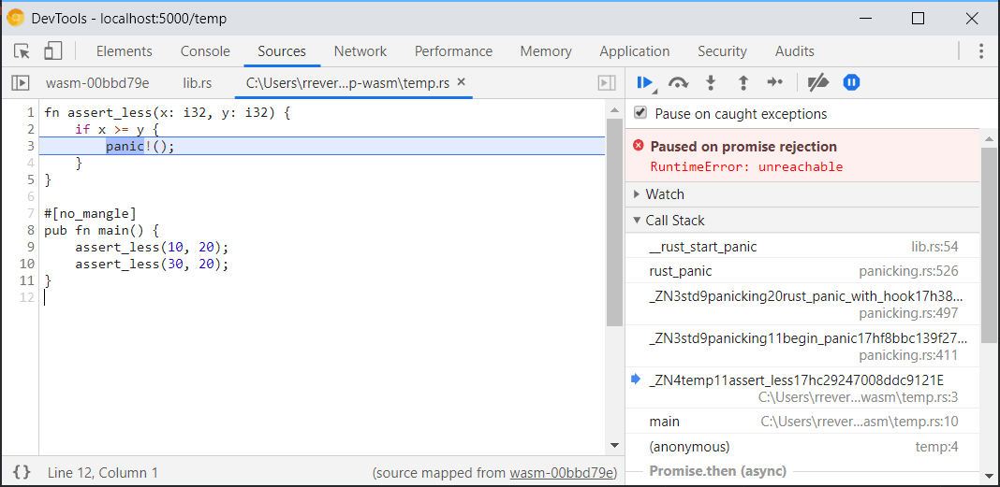

project_path: /web/_project.yaml
book_path: /web/updates/_book.yaml
description: Step over code, set breakpoints, and resolve stack traces in your source languages from within DevTools.

{# wf_updated_on: 2019-12-05 #}
{# wf_published_on: 2019-12-05 #}
{# wf_tags: webassembly #}
{# wf_featured_image: /web/updates/images/generic/chrome-devtools.png #}
{# wf_featured_snippet: Step over code, set breakpoints, and resolve stack traces in your source languages from within DevTools. #}
{# wf_blink_components: Platform>DevTools #}

# Improved WebAssembly debugging in Chrome DevTools {: .page-title }



## Background

Until recently, the only WebAssembly debugging that Chrome DevTools supported was viewing 
raw WebAssembly stack traces, and stepping over individual instructions in a 
disassembled WebAssembly text format.

<figure>
  
</figure>

While this works with any WebAssembly module and helps somewhat with debugging small, isolated functions, it’s not very practical for larger apps where the mapping between the disassembled code and your sources is less obvious.

### A temporary workaround

To work around this problem, Emscripten and DevTools have temporarily adapted the existing 
[source maps](https://www.html5rocks.com/en/tutorials/developertools/sourcemaps/) format to WebAssembly. This allowed mappings
between binary offsets in the compiled module to original locations in source files.

<figure>
  
</figure>

However, source maps were designed for text formats with clear mappings to JavaScript concepts and values, not for binary formats like WebAssembly with arbitrary source languages, type systems, and a linear memory. This made the integration hacky, limited, and not widely supported outside Emscripten.

## Enter DWARF

On the other hand, many native languages already have a common debugging format,
[DWARF](http://dwarfstd.org/), that provides all the necessary information for debuggers to resolve locations, variable names, type layouts, and more.

While there are still some WebAssembly-specific features that need to be added for full compatibility, compilers like Clang and Rust already support emitting DWARF information in WebAssembly modules, which enabled the DevTools team to start using it
directly in DevTools.

As a first step, DevTools now supports native source mapping using this information, so you can start debugging Wasm modules produced by any of these compilers without resorting to the disassembled format or having to use any custom scripts.

Instead, you just need to tell your compiler to include debug info like you normally would on other platforms. For example, in Clang this can be done by passing the `-g` flag during compilation:

    clang -g ...sources… -target wasm32 -o out.wasm

You can use same `-g` flag in Rust:

    rustc -g source.rs --target wasm32-unknown-unknown -o out.wasm

Or, if you’re using Cargo, the debug info will be included by default:

    cargo build --target wasm32-unknown-unknown

This new DevTools integration with DWARF already covers support for stepping over the code, setting breakpoints, and resolving stack traces in your source languages.

<figure>
  
</figure>

## The future

There is still quite a bit of work to do though.
For example, on the tooling side, Emscripten (Binaryen) and wasm-pack (wasm-bindgen) don’t support updating DWARF information on transformations they perform yet. For now, they won’t benefit from this integration. 

And on the Chrome DevTools side, we’ll be evolving integration more over time to ensure a seamless debugging experience, including: 

* Resolving variable names
* Pretty-printing types
* Evaluating expressions in source languages
* …and much more!

Stay tuned for future updates!

