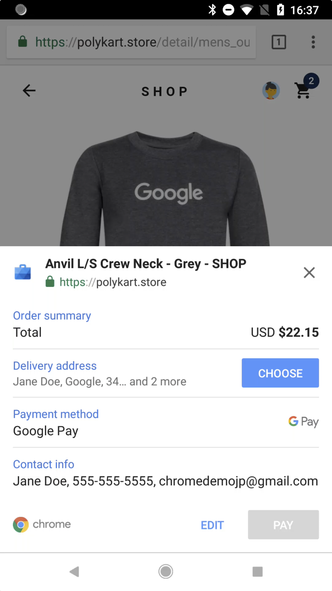
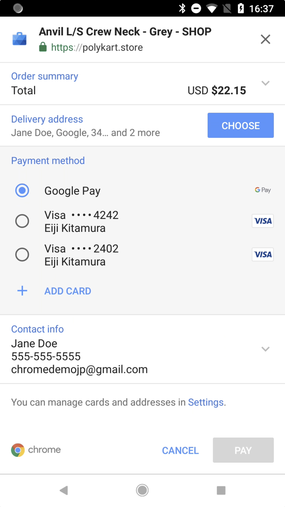
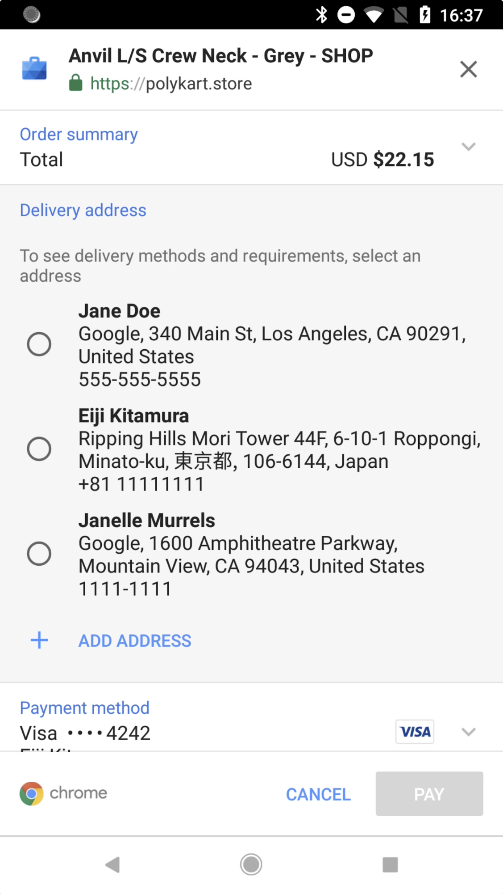
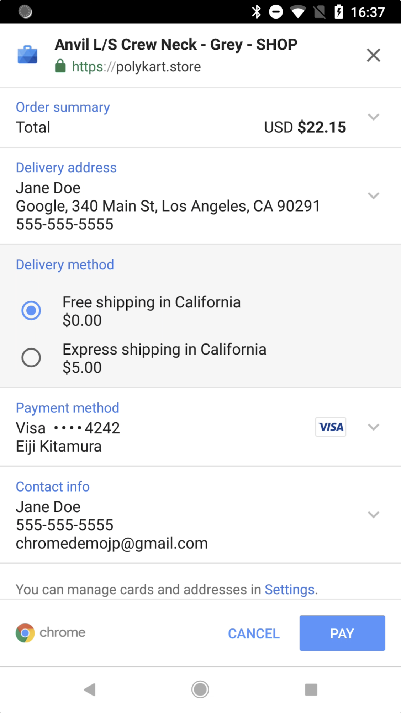
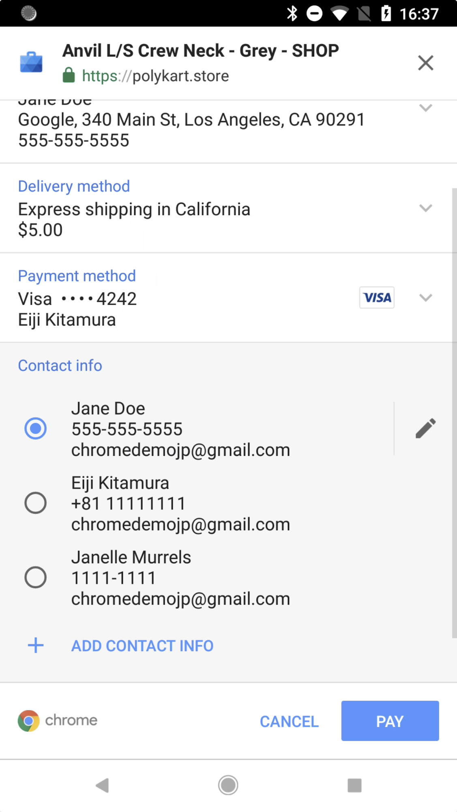
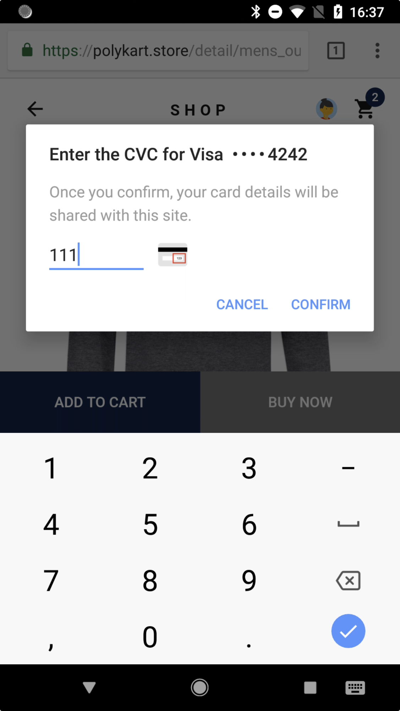

project_path: /web/fundamentals/_project.yaml
book_path: /web/fundamentals/_book.yaml
description: Overview page to the Web Payments doc set.

{# wf_published_on: 2018-06-27 #}
{# wf_updated_on: 2018-06-27 #}
{# wf_blink_components: Blink>Payments #}

# Web Payments / Overview {: .page-title }

_This is an entry page to the entire Web Payments doc set. It gives an overview of what Web 
Payments is and gets viewers interested enough to research it further. We tried to make this 
as high-level as possible to attract decision makers and non-developers._

[ Video embed? ]

## Introduction

Web Payments is a set of emerging web standards that defines features dedicated to transferring 
money on the web. It is meant to be implemented by _merchants_ -- website owners who want to sell 
goods through a browser-based web application -- and invoked by _customers_ -- users who want to 
purchase goods through the app.

The Web Payments standard is quite flexible; it works with various payment systems and is not 
tied to any specific browser, payment method, or payment gateway. This flexibility enables 
development simplicity, deployment consistency, and future compatibility.

## Key Benefits

Before learning how Web Payments works, let's summarize its primary benefits. As you work with 
Web Payments, keep in mind that it is: 

- **Standard and Open:** Web Payments is a set of payment standards for the web platform for 
the first time in its history. Anyone can access and use its features.
- **Simple and Structured:** Web Payments brings an easy and intuitive UX to your customers. It 
takes just a few taps to complete a checkout.
- **Secure and Flexible:** Web Payments provides industry-leading secure payment technology to 
the web. It is flexible enough to accept new payment methods.

## Why Use Web Payments?

With existing payment systems on the web, customers must use a form to enter their payment 
information -- name, card number, address, shipping details, etc. -- and usually must do so at 
every site they buy from. This is a tap-intensive and frustrating process, especially on mobile 
devices, and many users give up and abandon the site before completing their purchase. 

But with the [Payment Request API](https://www.w3.org/TR/payment-request/), which is one of the 
Web Payments specifications, users can successfully shop and purchase with just a few taps. This 
reduces the friction of going through a lengthy and difficult purchase flow and can result in 
higher conversion rates for merchants. 

Web Payments smooths out the process by simplifying both the front-end user interface and the 
back-end payment data manipulation. 

## A Closer Look

Web Payments and the Payment Request UI is flexible and can display a variety of appropriate 
elements.

<table>
  <tr>
   <td>It can show the list of items the user wants to buy, and a list of payment methods to 
     choose from.
   </td>
   <td>
   </td>
  </tr>
  <tr>
   <td>It can display available payment methods, called <em>payment apps</em>, from third parties. 
     Google Pay, for example, is a payment app.
   </td>
   <td>
   </td>
  </tr>
  <tr>
   <td>It can request a shipping address; if the user has previously-stored addresses as autofill 
     information, the choices are shown and entered with a single tap.
   </td>
   <td>
   </td>
  </tr>
  <tr>
   <td>It can display shipping options; for example, a user might choose between free shipping 
     that takes a few days and faster shipping that incurs a fee.
   </td>
   <td>
   </td>
  </tr>
  <tr>
   <td>It can request the payer's contact information, such as name, email address, and phone 
     number -- all of which may also be available from autofill.
   </td>
   <td>
   </td>
  </tr>
  <tr>
   <td>Finally, it can ask the user to authorize payment, depending on the payment method, 
     and complete the purchase.
   </td>
   <td>
   </td>
  </tr>
</table>

## Next Up

Learn about the basics of Web Payments, including how the web payment ecosystem works and 
the anatomy of payment apps in 
[How the Payment Ecosystem Works](https://drive.google.com/a/google.com/open?id=1PwPi_TD3G-kQyz31nW-1A4A5kvoCy7UCz6grk1TMaE8).
