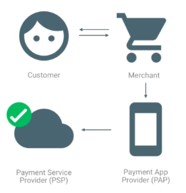

## Web Payments / The Payment Ecosystem

_The goal of this document is to provide a common context of how the payment system works and a high-level picture of the ecosystem. The target audience is developers working on merchants, payment gateways, and related payment industries._

[ Video embed? ]

### The Players

Let's take a high-level look at the general Web Payments workflow. To understand how the Web Payments ecosystem works, we should first get to know the players. There are usually four participants in the process.

- _Customers_ -- users who want to purchase something online
- _Merchants_ -- businesses who have a product to sell
- _Payment Service Providers (PSPs)_ -- third-party companies who actually process payments from customers to merchants
- _Payment Apps_ -- applications that, working with the browser, help customers supply payment information required to complete the transaction

### How the Payment Request Process Works

The typical sequence of events for those players as they create and process a web payment might look like this.

1. A customer visits a merchant's website, finds one or more items they would like to buy, and commits to a purchase.
1. The merchant needs payment information to receive the customer's money, so they use the Payment Request API to collect the information from the customer. A payment app helps the customer provide payment information; this could just be the browser itself providing a raw credit card number, or it could be a third-party payment app like Google Pay, Apple Pay, or Samsung Pay. It can also optionally request the customer's shipping address and contact information.
1. The browser launches (for example) the Google Pay app for the customer to choose a card number to pay with. This step is completely up to the payment app's implementation. If the customer authorizes the payment, Google Pay returns a token (payment credential) to the Payment Request API, which relays it to the merchant site.
1. The merchant site sends the payment credential to a PSP to process the payment and initiate the funds transfer. Usually, verifying the payment on the server side is also required.
1. The PSP processes the payment, securely requesting a funds transfer from the customer's bank or credit card issuer to the merchant, and then returns a success or failure result to the merchant website.
1. The merchant website notifies the customer of the payment result and displays the next step in the process, e.g., shipping the purchased item.

### What are Payment Methods?

Payment methods are processes that can be invoked to process a payment, and can be thought of like plugins for the Payment Request API. Each payment method consists of a required payment method identifier and an optional detail parameter.

There are two types or categories of payment methods, called _Standardized_ and _URL-based_; these are discussed in [Payment Methods](https://docs.google.com/document/d/13hYK7-ddiRpD-VdD05310ZTUxrfUZ3Zj911NofaFc6I/edit?ts=5b075b04#).

### What are Basic Card and Payment Apps?

The basic-card method is just that: support for basic card networks, currently including Visa, Mastercard, and JCB (formerly Japan Credit Bureau). A list of supported networks can be found at [this W3C page](https://www.w3.org/Payments/card-network-ids) (although Web Payments may not yet support all of the networks on the list).

Payment apps are applications provided by third-party _payment app providers_, who play a key role in the web payments ecosystem. These are the apps that implement the payment methods. 

For example, an app can provide a raw (unencrypted) credit card number. The browser has one such app built-in. 

Alternatively, an app can provide tokenized credit card information. For both raw credit card numbers and tokenized credit card information, the merchant initiates the transfer of funds. 

Or, a bank app can transfer money to another bank. In this case, the payment app provider initiates the funds transfer.

### PSP Reliance

PSPs have been, and remain, an important link in the payment processing chain. Implementing Web Payments does not obviate the need for a PSP.

Merchants usually rely on a third-party PSP to perform payment processing, for convenience and expense reasons. This is primarily because most PSPs maintain compliance with the [Payment Card Industry Data Security Standard (PCI DSS)](https://en.wikipedia.org/wiki/Payment_Card_Industry_Data_Security_Standard), an information security standard maintained and administered by the [PCI Security Standards Council](https://www.pcisecuritystandards.org/). 

Because achieving and maintaining strict PCI DSS compliance is expensive and difficult, most merchants find that relying on a compliant PSP avoids going through the certification process themselves. Some large and financially robust companies, however, obtain their own PCI DSS certification specifically to avoid such third-party reliance.

Delegating payment processing to a PCI DSS-compliant PSP, then, both simplifies the merchant site's payment processing requirements and ensures payment information integrity for the customer.

Ask your PSP if you can use the Payment Request API through their SDK; if not, ask them to support it.

#### List of supporting payment gateways

-   [Stripe](https://stripe.com/docs/stripe-js/elements/payment-request-button)
-   [Braintree](https://developers.braintreepayments.com/guides/payment-request/overview)

(Send pull requests if your payment gateway supports Payment Request API but is not listed here.)

### Next Up

Learn about the Payment Request API's fields and methods in [How the Payment Request API Works](https://docs.google.com/document/d/1xlhsGaCB5jEiq0MMWPwg7ve4d6YcswW2_8jg6BWUMTI/edit).
