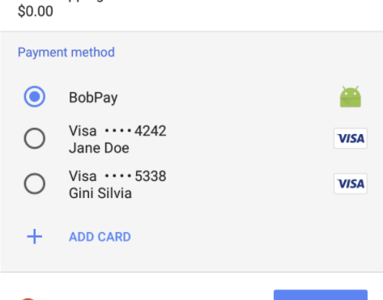

## Web Payments / Payment Methods

_The goal of this document is to provide a high-level overview of payment methods used in Payment Request. The target audience is developers working on merchants, payment gateways, and related payment industries._


### Payment Method Basics

The Payment Request API makes it easy for a browser to pass known credit card details to a merchant. The API can also accept payments through apps that process payments in any way they wish: e-money, bank transfers, bitcoin, etc.

Payment methods are processes that can be invoked to process a payment, and can be thought of like plugins for the Payment Request API. Each payment method consists of a required payment method identifier and an optional detail parameter. 

In the following example we declare two payment methods: the basic cards Visa, Mastercard, and JCB, via basic-card; and an Android app called BobPay built to integrate with the Payment Request API, via `https://bobpay.xyz`.

```javascript
var methodData = [{ 
 supportedMethods: 'basic-card', 
 data: { \
   supportedNetworks: ['visa', 'master', 'jcb'] 
 } 
}, { 
 supportedMethods: 'https://bobpay.xyz' 
}];
```

A merchant can provide these as acceptable payment methods, so when a customer uses the site they see only the cards and apps that are available to them and can select one to use for payment, as shown here. 



### Standardized vs. URL-based Payment Methods

There are two types of payment method identifiers, standardized and URL-based.

#### Standardized

Standardized payment methods are those that are literally standardized in their respective W3C specifications, meaning that all parameters required to fill the `data` property are defined in the specs.

You may already be familiar with the [basic-card method](https://www.w3.org/TR/payment-method-basic-card/); at this time, April 2018, it is the only standardized payment method, and is supported by all browsers that implement the Payment Request API. However, because it returns only raw, untokenized card information, it is safe to say that `basic-card` is not the future of web payments.

There is a [registry of standardized payment methods](https://w3c.github.io/payment-method-id/#registry) in the spec, but there are other standardization candidates under active discussion. 

- [Basic Credit Transfer Payment](http://w3c.github.io/webpayments-methods-credit-transfer-direct-debit/) (basic-credit-transfer): A payment method to transfer money between bank accounts.
- [Tokenized Card Payment](https://w3c.github.io/webpayments/proposals/interledger-payment-method.html) (tokenized-card): A payment method that provides tokenized card information.
- [Interledger Payment Method](https://w3c.github.io/webpayments/proposals/interledger-payment-method.html) (interledger): A payment method that transfers money using [the interledger protocol](https://interledger.org/).
-  [Basic SEPAmail Payment](https://w3c.github.io/webpayments/proposals/sepamail) (sepamail): A payment method that supports payment by SEPAmail Applications such as RUBIS, GEMME, or JADE.

In the example below, basic-card is specified as the `supportedMethods` value and requires that the `data` value be supplied, containing a list of the supported card providers and card types.

```javascript
supportedMethods: 'basic-card',
data: {
  supportedNetworks: ['visa', 'master', 'jcb'],
  supportedTypes: ['credit', 'debit', 'prepaid']
}
```

#### URL-based

URL-based payment methods are those that anyone can define independently, without reliance on W3C standardization. Proprietary payment methods such as Google Pay, Apple Pay, Samsung Pay are good examples. These payment methods are specified using a unique URL identifier such as https://google.com/pay or https://www.alipay.com/webpay. 

The URLs represent a payment method and are usually associated with a particular payment app, but it is not necessarily a one-to-one relationship. It's possible for one payment method to be supported by multiple payment apps, or for one payment app to support multiple payment methods. 

For example, one third-party payment app might support both the basic-card method as well as a specific `https://bobpay.xyz` method. 

Unlike standardized payment methods, URL-based payment methods have no registry. Anyone can develop and provide their own payment apps that support a payment method. This allows the Web Payments concept to develop a huge payment ecosystem.

In the example below, Google Pay is invoked via its URL; any information to be passed to the payment method can be supplied in the optional `data` value.

```javascript
supportedMethods: 'https://google.com/pay',
data: {
  ...
}
```

URL-based payment methods other than Google Pay include Apple Pay and Samsung Pay. If you want to learn more about them, such as their `data` property details, each method has a dedicated specification available. Their landing pages are linked below.


- [Google Pay](https://developers.google.com/pay/api/web/)
- [Apple Pay](https://developer.apple.com/documentation/apple_pay_on_the_web)
- [Samsung Pay](https://developer.samsung.com/internet/android/web-payments-guide)

### Next Up

Learn how to integrate with PSPs, see best practices, and more in the [Merchant Guide](https://docs.google.com/document/d/17s-faFdkDc7DgviDigQR07jI0rh05HV3E2krNrs136Q/edit).
