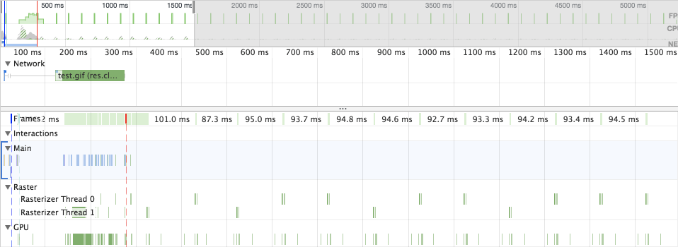

project_path: /web/fundamentals/_project.yaml 
book_path: /web/fundamentals/_book.yaml
description: Tout le monde aime les GIF animés. Ils posent cependant un problème : leur poids, dépassant souvent plusieurs mégaoctets. Dans ce guide, vous apprendrez comment réduire le surpoids causé par les GIF animés en les remplaçant par des sources vidéo MPEG-4 et WebM !

{# wf_updated_on: 2018-10-28 #}
{# wf_published_on: 2018-04-19 #}
{# wf_tags: html5,video,gif,images #}
{# wf_blink_components: Blink>Image,Blink>HTML #}

# Remplacer les GIF animés par des vidéos {: .page-title }



Vous est-il déjà arrivé de voir un GIF animé servi par un service comme Imgur ou
Gfycat, de l'inspecter dans DevTools et de découvrir que le GIF était en réalité
une vidéo ? Il y a une bonne raison à cela. Les GIF animés peuvent être tout
simplement _énormes_. Il n'est pas rare que les GIF d'atteindre plusieurs
mégaoctets, suivant la qualité, le nombre d'images par secondes, et la durée. Si
vous essayez d'améliorer la performance de chargement de votre site et d'aider
les utilisateurs à réduire leur consommation de données, vous découvrirez que le
GIF animé n'est tout simplement pas compatible avec vos objectifs.

<figure>
  
  <figcaption><strong>Figure 1</strong>. Capture de Chrome dev tools montrant un
   GIF de 13,7&nbsp;Mo. C'est plus gros que la plupart des sites !</figcaption>
</figure>
</figure>

Heureusement, il s'agit d'un de ces domaines de la performance web où vous
pouvez, avec relativement peu de travail, réaliser d'énormes gains sans
sacrifier vos contenus. Dans cet article, vous apprendrez ce que font les
plate-formes d'hébergement de GIF pour empêcher leurs coûts en bande passante de
crever le plafond, en convertissant ces GIF géants en fichiers vidéo! Vous
apprendrez ensuite comment proprement inclure ces vidéos dans des pages Web de
manière à ce qu'elles se comportent exactement comme des GIF. Enfin, nous
discuterons un peu des performances de décodage des GIF et des vidéos. Avant
même de vous en rendre compte, vous serez en mesure de nettoyer vos pages
pleines de GIF de plusieurs mégaoctets d'un coup !

## Conversion de GIF animés en vidéo

Il y a des tas de façon de convertir des GIF animés en vidéo mais [`ffmpeg`
(en)](https://www.ffmpeg.org/) est l'outil que nous utiliserons dans ce guide.
Peut-être que `ffmpeg` est déjà installé sur votre machine. Pour vérifier,
ouvrez un terminal en ligne de commande et exécutez la commande `ffmpeg`. S'il
est installé, vous verrez des informations de diagnostic. Si vous recevez une
erreur du type "commande introuvable" ou similaire, vous aurez besoin de
l'installer. Les modalités d'installation de `ffmpeg` [dépendent de votre
plate-forme (en)](https://trac.ffmpeg.org/wiki/CompilationGuide):

1. Sur macOS, [vous pouvez l'installer via Homebrew
(en)](https://trac.ffmpeg.org/wiki/CompilationGuide/macOS#ffmpegthroughHomebrew)
ou [le compiler vous-même
(en)](https://trac.ffmpeg.org/wiki/CompilationGuide/macOS#CompilingFFmpegyourself).
2. Sur Windows, [utilisez Chocolatey
(en)](https://chocolatey.org/packages/ffmpeg).
3. Sur Linux, vérifier que le gestionnaire de paquet mis en avant par votre
distribution (par exemple `apt-get` ou `yum`) dispose d'un paquet.

Note : comme l'un des formats vers lesquels nous allons convertir est [WebM
(en)](https://www.webmproject.org/), assurez-vous que la version de `ffmpeg` que
vous installez a été compilée avec [libvpx
(en)](https://www.webmproject.org/code/).

Une fois `ffmpeg` installé, choisissez un GIF et vous serez paré au décollage.
Pour les besoins de ce guide, j'ai choisi [ce
GIF](https://gif.ski/jazz-chromecast-ultra.gif), qui pèse à peine 14&nbsp;Mo.
Pour commencer, essayons de convertir un GIF en MPEG-4 !

### Convertir un GIF en MPEG-4

À chaque fois que vous intégrez des vidéos sur une page, assurez-vous d'utiliser
MPEG-4 dans la mesure où [MPEG-4 est le format vidéo le mieux supporté
(en)](https://caniuse.com/#feat=mpeg4) par les navigateurs. Pour commencer,
ouvrez une fenêtre de terminal, allez dans le répertoire contenant votre GIF de
test, et essayez cette commande :

```shell
ffmpeg -i input.gif output.mp4
```

Il s'agit de la syntaxe la plus simple pour convertir un GIF en MPEG-4.
L'instruction `-i` identifie les données en entrée et nous explicitons le
fichier de sortie juste après. Cette commande prend notre GIF de test de
14&#8239;034&nbsp;Ko et le transforme en une vidéo MPEG-4, d'une qualité
suffisamment importante, pesant **867&nbsp;Ko**. Un gain de **93,8&nbsp;%**. Pas
mal, mais peut-être vous demandez-vous s'il est possible d'aller encore plus
loin. Dans ce cas, attendez la suite !

Il se trouve que `ffmpeg` est _hautement configurable_ et nous pouvons en tirer
partie pour configurer plus minutieusement la sortie vidéo en utilisant un mode
d'encodage appellé [Constant Rate
Factor](https://trac.ffmpeg.org/wiki/Encode/H.264#crf) (ou CRF). Le CRF est très
utile quand votre première priorité est la qualité de la vidéo.

```shell
ffmpeg -i input.gif -b:v 0 -crf 25 output.mp4
```

Cette commande ressemble vraiment beaucoup à la précédente, mais avec deux
différences importantes : l'instruction `-b:v` devrait _normalement_ [limiter le
bitrate de sortie
(en)](https://trac.ffmpeg.org/wiki/Limiting%20the%20output%20bitrate), mais
quand nous voulons utiliser le mode CRF, elle doit être définie à `0`.
L'instruction `-crf` attends une valeur située entre `0` et `51`. Les valeurs
les plus basses donnent des vidéos de meilleure qualité (mais plus lourdes),
tandis que les valeurs opposées font l'inverse.

Utilisée sur notre GIF de test, cette commande produit une vidéo MPEG-4 pesant
**687&nbsp;Ko**. C'est un gain d'environ **20&nbsp;%** ! Si vous voulez des
fichiers encore plus petits, vous _pourriez_ spécifier une valeur de CRF plus
élevée. Soyez juste conscient·e que plus la valeur est grande, plus la qualité
de la vidéo est dégradée, donc pensez à _toujours_ vérifier ce que produit
l'encodage pour vérifier que le résultat vous convient !

En tout état de cause, ces deux commandes entraînent une réduction _massive_ du
poids par rapport à notre GIF initial, ce qui améliorera considérablement le
temps de chargement initial des pages et réduira la consommation de données.
Alors certes, la qualité visuelle de la vidéo est _un peu_ moins bonne que celle
du GIF, mais le gain en poids le vaut bien :

<figure>
  
  <figcaption><strong>Figure 2</strong>. Comparaison visuelle d'un GIF animé et 
  de son équivalent MPEG-4 encodé avec un CRF de 25.</figcaption>
</figure>

Même si l'illustration ci-dessus ne remplace pas une comparaison visuelle
complète, le MPEG-4 semble tout-à-fait convenir comme remplacement du GIF animé.
Rappelons également que vos utilisateurs n'auront probablement pas le GIF
d'origine comme point de comparaison. Restez fidèle aux impératifs de qualité de
votre projet, mais soyez toujours prêts à faire des compromis de performance
quand c'est approprié.

Bien que le MPEG-4 soit très largement supporté par les navigateurs et un très
bon remplaçant pour les GIF animé, nous pouvons aller _un cran_ plus loin en
générant une source WebM additionnelle. Lisez la suite pour en savoir plus !

### Convertir un GIF en WebM

[Alors que le format MPEG-4 existe sous une forme ou une autre depuis au moins
1999](https://fr.wikipedia.org/wiki/MPEG-4#Les_parties) et continue de subir des
évolutions, WebM est relativement nouveau, [ayant été lancé initialement en 2010
(en)](https://github.com/webmproject/libvpx/releases/tag/v0.9.0). Le [support de
WebM par les navigateurs (en)](https://caniuse.com/#feat=webm) n'est pas aussi
large, mais reste plutôt bon. Et comme [l'élément
`<video>`](https://developer.mozilla.org/fr/docs/Web/HTML/Element/Video) vous
permet de spécifier [plusieurs éléments
`<source>`](https://developer.mozilla.org/fr/docs/Web/HTML/Element/Video#Notes_d'utilisation),
vous pouvez indiquer une source WebM par défaut, que de nombreux navigateurs
pourront utiliser, tout en proposant une source alternative MPEG-4 que les
autres navigateurs pourront interpréter.

Essayez de convertir notre GIF de test en WebM avec `ffmpeg` en utilisant cette
commande :

```shell
ffmpeg -i input.gif -c vp9 -b:v 0 -crf 41 output.webm
```

Vous noterez que cette méthode est _globalement_ similaire à la conversion GIF
vers MPEG-4 utilisant le mode CRF, mais il y a deux différences notables :

1. Avec l'instruction `-c`, nous précison que nous voulons utiliser le codec
`vp9`, successeur du `vp8`, utilisé pour l'encodage WebM. Si jamais cela ne
fonctionne pas, remplacez `vp9` par `vp8`.
2. Comme les valeurs CRF ne sont pas
vraiment équivalentes dans tous les formats, nous devons ajuster la nôtre pour
que la sortie vidéo WebM soit de même qualité que notre MP4. Une valeur `-crf`
de `41` est utilisée dans cet exemple por obtenir une qualité visuelle
identique, tout en produisant un fichier plus petit.

Dans cet exemple, la version WebM pèse **611&nbsp;Ko**, **66&nbsp;Ko plus
petite** que le MPEG-4 que nous avions produit, pour une qualité visuelle
quasiment identique.

<figure>  <figcaption><strong>Figure 3</strong>. Comparaison visuelle d'une vidéo
MPEG-4 encodée avec un CRF de 25 et d'une vidéo WebM encodée avec un CRF de
41.</figcaption> </figure>

À cause de la manière dont les codecs VP8 et VP9 encodent une vidéo, les
artefacts de compression WebM qui peuvent affecter la qualité du résultat seront
différents de ceux qui affectent MPEG-4. Comme toujours, vérifiez ce qui est
produit par l'encodage et expérimentez avec les instructions (si vous avez le
temps) pour trouver le réglage qui correspond le mieux à votre application.

Note : si vous aimez bricoler, songez à essayer [un encodage à deux passes
(en)](https://trac.ffmpeg.org/wiki/Encode/VP9#twopass) pour voir si les
résultats vous plaisent davantage !

Maintenant que vous savez convertir des GIF en MPEG-4 et WebM, apprenons à
remplacer les éléments `` servant ces GIF par des `<video>`!

## Remplacer les éléments `` servant des GIF par des `<video>`

Malheureusement, l'utilisation d'une vidéo comme remplacement d'un GIF animé
n'est pas _aussi simple_ que de définir une URL d'image dans un élément ``.
Utiliser `<video>` est un peu plus complexe, mais pas tant que ça. Dans la suite
de cet article, nous détaillerons chaque étape mais si vous voulez visualiser
directement le code, regardez [cette démo
CodePen](https://codepen.io/malchata/pen/MVYmWZ).

### Obtenir le bon comportement

Les GIF animés ont trois particularités:

1. ils se lancent automatiquement ;
2. ils se répètent indéfiniment (la plupart du temps, mais il est possible 
3. d'empêcher la répétition) ;
4. ils sont silencieux.

Le seul vrai avantage des GIF animés par rapport aux vidéos est que nous n'avons
pas à expliciter ces trois particularités quand nous les insérons dans la page.
Ils se comportent directement comme nous voulons qu'ils se comportent. Par
contre, quand on utilise des vidéos à la place des GIF animés, il est nécessaire
de préciser à l'élément `<video>` de se lancer automatiquement, de répéter la
vidéo indéfiniment et de rester silencieux. Commençons par écrire le code d'un
élément `<video>` qui respecte ces contraintes :

```html
<video autoplay loop muted playsinline></video>
```

Les attributs de cet exemple sont assez intuitifs. Un élément `<video>`
utilisant ces attributs se lancera automatiquement, jouera la vidéo
indéfiniment, sans aucun son et <i lang="en">inline</i> (c'est-à-dire, pas en
plein écran). En d'autres mots, toutes les caractéristiques d'un GIF animé.

Note : si vous ne recherchez pas à imiter parfaitement le comportement d'un GIF
animé, vous _pouvez_ adopter une approche plus prudente, laissant aux
utilisateurs·trices le choix de lancer la vidéo, plutôt que de la jouer
automatiquement. Pour cela, contentez-vous d'enlever l'attribut `autoplay` et
envisagez de mettre en place une image de remplacement via [l'attribut
`poster`](https://developer.mozilla.org/fr/docs/Web/HTML/Element/Video#attr-poster).
Ajoutez également [l'attribut `controls`
attribute](https://developer.mozilla.org/fr/docs/Web/HTML/Element/Video#attr-controls)
pour permettre à l'utilisateur de contrôler la vidéo et ajoutez [l'attribut
`preload`](https://developer.mozilla.org/fr/docs/Web/HTML/Element/Video#attr-preload)
pour définir la manière dont le navigateur précharge le contenu de la vidéo.

Sachez que nous utilisons ces attributs pour émuler le comportement des GIF
animés, mais pas uniquement. Certains de ces attributs sont requis pour
permettre à la lecture automatique de démarrer. C'est par exemple le cas de
[l'attribute `muted` qui _doit_ être présent
(en)](/web/updates/2016/07/autoplay) pour que les vidéos démarrent
automatiquement, même si elle ne contiennent pas de piste audio. [Sur iOS,
l'attribut `playsinline` est également un prérequis à la lecture automatique
(en)](https://webkit.org/blog/6784/new-video-policies-for-ios/).

### Définir vos `<source>`

Tout ce qui nous reste à faire est de définir nos sources vidéos. L'élément
`<video>` a besoin d'un ou plusieurs éléments enfants `<source>` pointant vers
des fichiers vidéos parmi lesquels le navigateur peut faire son choix, en
fonction des formats qu'il supporte :

```html
<video autoplay loop muted playsinline>
  <source src="oneDoesNotSimply.webm" type="video/webm">
  <source src="oneDoesNotSimply.mp4" type="video/mp4">
</video>
```

Note : les navigateurs ne se posent pas la question de savoir quelle `<source>`
est optimale, donc l'ordre dans lequel vous les proposez compte. Par exemple, si
vous proposez une vidéo MPEG-4 en premier alors que le navigateur supporte WebM,
le navigateur ignorera la `<source>` WebM et utilisera le MPEG-4 à la place. Si
vous souhaitez que votre `<source>` WebM soit utilisée en priorité, _proposez-la
en premier !_

Maintenant que nous savons comment convertir nos GIF en vidéos et comment
utiliser ces vidéos comme des GIf, voyons comment ces solutions se comportent en
terme de performance, dans les navigateurs.

## Performance comparée des vidéos et des GIF animés

Même si des ressources de petites tailles sont toujours préférables, la taille
de fichier ne fait pas tout. Nous devons aussi comprendre comment un média se
comporte _après_ avoir été téléchargé, parce que ces fichiers ont besoin d'être
décodés avant de pouvoir être lus.

Les GIF (et d'autre formats d'images animées) ne sont pas pas optimaux car ils
doivent être décodés trame après trame, ce qui créé de la redondance. En effet,
chaque trame d'un GIF n'est jamais qu'une nouvelle image. Regardons à quoi cela
ressemble dans l'onglet "Performance" de Chrome DevTools en nous intéressant à
une page contenant uniquement un élément `` pointant vers un GIF animé :

<figure>
  
  <figcaption><strong>Figure 4</strong>. L'onglet "Performance" de Chrome 
  DevTools montrant l'activité du navigateur tandis qu'un GIF animé est lu.
  </figcaption>
</figure>

Comme vous pouvez le voir dans l'illustration ci-dessus, des décodages d'image
se produisent sur le processus de transformation matricielle dès qu'une nouvelle
trame du GIF est décodée. Jetons maintenant un œil à un tableau de comparaison
du coût total de CPU entre un GIF animé, une vidéo MPEG-4 et une vidéo WebM :

| Format | temps CPU           |
| ------ | ------------------- |
| GIF    | 2&#8239;668&nbsp;ms |
| MPEG-4 | 1&#8239;994&nbsp;ms |
| WebM   | 2&#8239;330&nbsp;ms |

Ces chiffres ont été collectés grâce à l'outil de traçage de Chrome (enregistrez
vos propres traces sur `chrome://tracing`) sur une période d'environ 6,5
secondes pour chaque format. Comme vous pouvez le voir, le GIF animé est le
format consommant le plus de temps CPU. Les vidéos en consomment moins,
notamment le MPEG-4. C'est bon, ça ! Ça veut dire que les vidéos utilisent
globalement moins de CPU que les GIF animés, ce qui est une amélioration de
performance appréciable, qui va au-dela de la réduction de la taille du fichier.

Il est important de mentionner, cependant, que certains processeurs et cartes
graphiques offrent une accélération matérielle pour l'encodage et le décodage de
vidéos (par exemple, [Quick Sync Video
(en)](https://en.wikipedia.org/wiki/Intel_Quick_Sync_Video) sur les processeurs
Intel). De nombreux processeurs encodent et décodent le MPEG-4, mais seuls les
processeurs les plus récents supportent les codecs WebM (comme VP8 et VP9) et
proposent une accélération matérielle de l'encodage et du décodage. Une
processeur Kaby Lake (Intel) a été utilisé pendant ces tests, ce qui veut dire
qu'ils ont bénéficié d'une accélération matérielle du décodage vidéo.

## Les potentiels pièges

Vous en savez assez sur les avantages d'utiliser la vidéo au lieu du GIF animé,
mais je m'en voudrais de ne pas souligner certains potentiels pièges. Je vous en
présente deux pour que vous y réfléchissiez.

### L'intégration d'une vidéo n'est pas aussi pratique que celle d'un GIF

Rien n'est plus pratique que de caser un GIF dans un élément `` et de
passer à autre chose. C'est une recette simple qui _marche à tous les coups_, et
c'est important pour l'expérience développeur.

Néanmoins, _votre_ expérience de développeur n'est pas la seule qui compte. Les
utilisateurs comptent aussi. Mais, bonnes nouvelles, [utiliser une video dans un
élément
``](https://cloudinary.com/blog/evolution_of_img_gif_without_the_gif) _est_
techniquement possible dans Safari, donc on peut dire qu'une solution simple
permettant d'utiliser des vidéos en remplacement des GIF animés est peut-être en
cours de généralisation. C'est juste une approche sur laquelle vous ne pouvez
pas compter aujourd'hui sur _tous_ les navigateurs.

### L'encodage de vos propres vidéos peut prendre du temps

En tant que développeurs, nous voulons gagner du temps. Cependant, lorsqu'il
s'agit d'un sujet aussi subjectif que la notion de qualité des médias, il peut
être difficile de mettre au point un processus automatisé qui donne les
meilleurs résultats à tous les coups.

La solution la plus sûre est d'analyser chaque vidéo générée par l'encodeur et
de s'assurer, vidéo par vidéo, que les résultats sont à la hauteur. S'il s'agit
peut-être d'une solution envisageable sur un projet avec peu de resources mais
pour des projets de plus grande envergure, avec de nombreuses vidéos, vous aurez
plutôt intérêt à opter pour une stratégie d'encodage plus conservatrice, qui
privilégie la qualité au détriment des gains sur la taille des fichiers. Le
bonne nouvelle, c'est que cette stratégie donnera quand même d'excellents
résultats, améliorant considérablement les performances de chargement et la
consommation de données pour _tous_ les utilisaters, comparée à l'utilisation de
GIF animés.

J'ajouterais que la conversion de vos GIF en vidéo prendra du temps, du temps
que vous n'avez peut-être pas. Dans ce cas, vous pouvez enviager un service
d'hébergement de média dans le _Cloud_ tel que
[Cloudinary](https://cloudinary.com/), qui s'occupera de ça pour vous. Consultez
[cet article du blog de
Cloudinary](https://cloudinary.com/blog/reduce_size_of_animated_gifs_automatically_convert_to_webm_and_mp4),
qui explique comment leur service peut transcoder un GIF en vidéo à votre place.

### Mode Économiseur de Données

Sur Chrome pour Android, la lecture automatique de la vidéo peut être interdite
lorsque [l'Économiseur de Données
(en)](https://support.google.com/chrome/answer/2392284) est activé, même si vous
suivez à la lettre les instructions de ce guide. Si vous êtes un développeur
web, et que vous avez du mal à comprendre pourquoi les vidéos ne sont pas jouées
automatiquement sur votre Android, désactivez l'Économiseur de Données pour voir
si cela résout votre problème.

Pour anticiper ce cas particulier, envisagez de définir l'attribut `poster` de
sorte que l'espace occupé par l'élément `<video>` soit rempli avec un contenu
qui a du sens quand l'Économiseur de Données est activé (ou, plus généralement,
dans tous les scénarios où la lecture automatique pourrait être interdite). Une
autre approche pourrait être de définir l'attribut `controls` de manière
conditionnelle, en fonction de la présence dans la requête HTTP de l'en-tête
[`Save-Data`
(en)](/web/fundamentals/performance/optimizing-content-efficiency/save-data/),
que l'Économiseur de Données envoit lorsqu'il est activé.

## Conclusion

Lorsque vous utilisez une vidéo au lieu d'un GIF animé, vous rendez un grand
service à vos utilisateurs en réduisant la quantité de données que vous leur
envoyez, ainsi que l'utilisation des ressources système. L'élimination des GIF
animés vaut la peine d'être sérieusement envisagée, surtout s'ils occupent une
place importante dans votre contenu. À une époque où la performance est plus
importante que jamais, mais où de nombreuses stratégies d'amélioration de la
performance exigent un investissement en temps considérable, la transition de
vos GIF vers la vidéo est un effort proportionnellement faible par rapport à
l'amélioration massive qu'elle peut apporter sur la performance de chargement.

## Lectures complémentaires

Nous ne sommes pas les premiers à préconiser l'utilisation de vidéos au lieu de
GIF animés, et nous ne serons pas les derniers. Pour des études de cas et
d'autres perspectives sur ce sujet, vous pouvez consulter les articles suivants
:

- [Imgur Revamps GIFs for Faster Speeds and Higher Quality with GIFV
  (en)](https://lifehacker.com/imgur-revamps-gifs-for-faster-speeds-and-higher-quality-1644494212)
- [Introducing GIFV (en)](https://blog.imgur.com/2014/10/09/introducing-gifv/)
- [GIF Revolution (en)](https://telegram.org/blog/gif-revolution)
- [Those GIFs on Twitter Aren't Actually GIFs
  (en)](https://mashable.com/2014/06/20/twitter-gifs-mp4/#Mtz26DX1BZqG)

_Je remercie particulièrement [François
Beaufort](/web/resources/contributors/beaufortfrancois), [Patrick
Hulce](/web/resources/contributors/patrickhulce), Dean Hume, [Paul
Irish](/web/resources/contributors/paulirish), [Addy
Osmani](/web/resources/contributors/addyosmani), et [Jeff
Posnick](/web/resources/contributors/jeffposnick) pour leur retours précieux,
qui ont significativement améliorer la qualité de cet article._


Traduit par : 