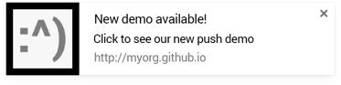
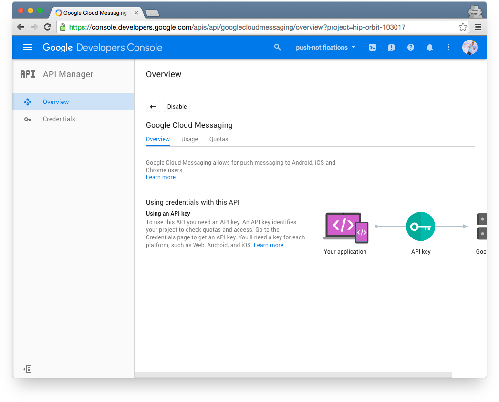
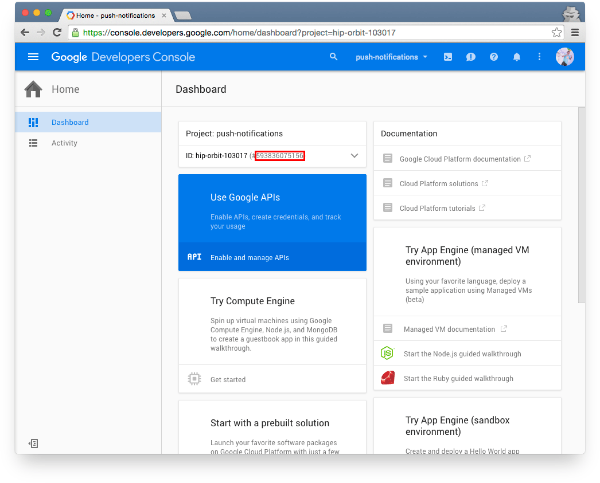

project_path: /web/_project.yaml
book_path: /web/fundamentals/_book.yaml
description: 이 코드 랩에서 어떻게 웹 어플리케이션에 푸쉬 서비스를 추가하는지 배울 것입니다. 이를 통해 당신은 사용자를 브레이킹 뉴스와 새로운 컨텐츠에 대한 정보로 재유치를 할 수 있을 것입니다.

{# wf_updated_on: 2015-09-27 #}
{# wf_published_on: 2000-01-01 #}

# 당신의 첫 번째 푸쉬 노티피케이션 웹 앱 {: .page-title }



이 코드 랩에서 어떻게 웹 어플리케이션에 푸쉬 서비스를 추가하는지 배울 것입니다.

이를 통해 당신은 사용자를 브레이킹 뉴스와 새로운 컨텐츠에 대한 정보로 재유치를 할 수 있을 것입니다.

서비스워커에 대한 기본적인 지식도 배우게 됩니다.

### 어떤 것을 배울까요?

* 서비스워커 기본: 설치 및 이벤트 처리
* Google Cloud Messaging (GCM) 계정 설정 방법
* 웹 메니페스트 추가하는 방법
* 웹 클라이언트에 공지를 보내기 위한 GCM 요청 기술
* 공지 표시
* 공지 클릭 처리

### 어떤 것이 필요한가요?

* 크롬 42 버전 또는 이상
* [git](https://git-scm.com/)과 [Chrome DevTools](/web/tools/chrome-devtools)에 대한 기본적인 이해
* [Promises](http://www.html5rocks.com/en/tutorials/es6/promises/)의 경험, [service worker](http://www.html5rocks.com/en/tutorials/service-worker/introduction/) 경험도 있으면 좋음
* 샘플 코드
* 텍스트 에디터
* command line tools를 돌리기 위한 터미널 창
* 파이썬 또는 간단한 로컬 웹 서버 (아래 참고)

## 샘플코드 다운받기

아래 링크를 이용하여 모든 샘플코드를 컴퓨터에 다운로드 받을 수 있습니다:

[Download Zip file](https://github.com/GoogleChrome/push-notifications/archive/master.zip)

...아니면 커맨드 라인에서 GitHub 리포지터리를 클론합니다:

    $ git clone git@github.com:GoogleChrome/push-notifications.git
    

위 단계를 거치면 **_push-notifications_** 디렉토리를 생성하는데, 각 단계에서 필요한 코드들을 포함하고 있습니다.

**_app_** 디렉토리 밑에 당신의 코드를 추가합니다. 이번 codelab에서 추가하신 코드를 참조하는 법을 배울 것입니다.

## 로컬 웹 서버 실행하기

**로컬호스트에서 웹 서버 실행하기**

이번 코드랩을 통과하기 위해서는 로컬 웹 서버를 실행해야 합니다.
아마 이미 구축해놓은 웹 서버가 있을 수도 있지만, 없다면 터미널 창을 열어보세요.
이전 스텝에서 다운로드 받았던 **_push-notifications_** 디렉토리로 이동하고,
아래 파이썬 명령어를 입력하여 서버를 실행합니다:

    $ python -m SimpleHTTPServer
    

이렇게 하면 HTTP 기본 포트에다가 웹 서버를 실행합니다.
브라우저에서 [localhost](http://localhost)로 이동하여 **_push-notifications_** 디렉토리의 최상위 레벨에는 어떤게 있는지 확인합니다.

**_app_** 디렉토리에 있는 작업물을 보기 위해서는, [localhost/app](http://localhost/app) 를 입력합니다.
각 단계에서 제공하는 완성된 소스를 보려면 [localhost/completed](http://localhost/completed) 로 이동합니다.

파이썬이 설치되어 있지 않으면 [여기](https://www.python.org/downloads/) 에서 다운받으세요.
서버를 시작하는데 문제가 있으면 SimpleHTTPServer가 선택한 포트를 사용하는 다른 서비스가 있는지 [체크](https://www.google.com/search?q=what+is+using+port) 하세요.

이번 코드랩에 포함된 커맨드 라인 예제들은 모두 bash shell 을 사용합니다.

윈도우 사용자는 커맨드 프롬트 창에서 MS-DOS 커맨드를 사용하면 됩니다:
대안으로는 Cygwin 환경을 쓰는 방법도 있습니다.

[XAMPP](https://www.apachefriends.org/index.html) 또는 [MAMP](https://www.mamp.info/en/) 같은 웹 서버 스택을 이용하는 방법도 있습니다.

## 서비스워커로 걸음마 떼기

이번 단계의 완성된 코드본은 completed/step3 디렉토리에 있습니다.

### 1. index.html 생성하기

_app_ 디렉토리에서 _index.html_ 파일을 생성하고 아래와 같은 코드를 추가합니다:

    <!DOCTYPE html>
    <html>
    <head>
      <title>Push Notification codelab</title>
    </head>
    <body>
      <h1>Push Notification codelab</h1>
      
This page must be accessed using HTTPS or via localhost.

      
    </body>
    </html>
    

크롬 브라우저에서 로컬호스트 URL로 _index.html_  을 접근합니다: URL은 다음 형태와 같아야 합니다. _http://localhost/push-notifications/app/index.html_

### 2. 서비스워커 추가하기

_app_ 디렉토리에서 _sw.js_ 파일을 생성합니다. 코드는 이후 단계에서 추가합니다.

서비스워커를 사용해보지 않았더라도 걱정하지마세요. 이 코드랩을 수행하기 위해서 그렇게 자세히 알 필요는 없습니다. *서비스워커는 네트워크 요청을 가로채거나, 푸쉬 메시지 또는 다른 작업들을 처리하기 위해 백그라운드에서 돌아가는 스크립트* 입니다. 만약 더 자세히 알고 싶으시다면, HTML5 Rocks 의 [Introduction to Service Worker](http://www.html5rocks.com/en/tutorials/service-worker/introduction/) 를 참고하시기 바랍니다.

푸쉬 메시지를 수신했을 때, 브라우저는 백그라운드에서 서비스워커를 실행하여 새로운 웹 페이지를 열지 않고 푸쉬 메시지를 처리합니다.

### 3. 서비스워커 등록 및 설치하기

이번 단계에서는 _index.html_ 파일에 참조되어 있는 _main.js_ 파일을 생성합니다.
이렇게 하여 서비스워커를 차례로 접근할 수 있습니다. _app_ 디렉토리에 _js_ 디렉토리를 새로 생성하고 _main.js_ 이름의 파일을 추가합니다. _main.js_ 코드 내용은 다음과 같습니다.

    if ('serviceWorker' in navigator) {
     console.log('Service Worker is supported');
     navigator.serviceWorker.register('sw.js').then(function(reg) {
       console.log(':^)', reg);
       // TODO
     }).catch(function(err) {
       console.log(':^(', err);
     });
    }
    

이 코드는 브라우저가 서비스워커를 지원하는지 확인한 후, _sw.js_ 에서 생성한 서비스워커를 등록하고 설치합니다 - 아직 특별한 동작은 하지 않습니다.

### 4. localhost 에서 돌려보기

로컬호스트에서 _index.html_ 파일을 접근하고 크롬 개발자툴을 열어 콘솔창을 확인합니다.
확인 결과는 다음과 같습니다:

### 5. serviceworker-internals 체험하기

_chrome://serviceworker-internals_ 페이지에서는 서비스워커 동작을 확인하고 진단해 볼 수 있습니다:

### 6. 서비스워커에 이벤트 리스너 등록하기

_sw.js_ 에 아래 코드를 추가합니다:

    console.log('Started', self);
    self.addEventListener('install', function(event) {
      self.skipWaiting();
      console.log('Installed', event);
    });
    self.addEventListener('activate', function(event) {
      console.log('Activated', event);
    });
    self.addEventListener('push', function(event) {
      console.log('Push message received', event);
      // TODO
    });
    

서비스워커에서는 `self`는 `ServiceWorkerGlobalScope` 객체를 의미합니다: 서비스워커 자신을 의미하기도 합니다.

**중요한 팁!**

기본적으로 오래된 서비스워커는 이를 사용하는 탭들이 닫히거나 언로딩 될 때까지 실행 상태로 남아있습니다. 새로운 서비스워커는 `waiting` 상태가 됩니다.

위 코드와 같이 `skipWaiting()` 가 호출되면, 서비스워커는 대기 상태를 건너뛰고, 즉시 활성화 됩니다.

디버깅하기 수월하시죠?!

_chrome://serviceworker-internals_ 에서 **Inspect** 버튼을 클릭하면 아래와 같은 화면이 나옵니다.

**경고**: 만약 설치하는 동안 서비스워커 코드를 파싱할 때 에러가 발생하면, 설치가 되지 않고 에러가 던져집니다. 이는 코드를 변경할 때, 서비스워커가 미스테리하게 업데이트가 되지 않음을 초래할 수 있습니다. 변경할 때는 언제나 확인하고 유효성을 점검하세요!

## 구글 개발자 콘솔에서 프로젝트 생성하기

웹앱의 푸쉬 알림은 메시지를 처리하기 위한 백엔드 서비스가 필요합니다. 크롬은 현재 이를 위해 [Google Cloud Messaging](https://developers.google.com/cloud-messaging/) 을 사용하고 있지만, 결국 크롬과 GCM 이 목표하는 바는 [Web Push Protocol](https://datatracker.ietf.org/doc/draft-ietf-webpush-protocol/) 을 지원하는 것입니다.

다른 브라우저들은 다른 서비스들을 사용할 수 있습니다.

이 단계에서는 구글 개발자 콘솔에서 프로젝트를 설정합니다.

**단계가 조금 많아 지루해보일 수 있지만, 프로젝트를 설정하기는 정말 쉬울것입니다.**

### 1. 프로젝트 생성하기

[Google Developers Console](https://console.developers.google.com)에서 새로운 프로젝트를 생성합니다.

### 2. 프로젝트에서 사용할 API 선택하기

**Use Google APIs** 에서 **Enable and manage APIs** 을 선택합니다:

**Google APIs** 목록에서 **Google Cloud Messaging** 를 선택합니다:

 API가 성공적으로 추가되었으면 아래 페이지를 확인할 수 있습니다:

### 3. 증명서 획득하기

**API Manager** 메뉴에서 **Credentials** 을 선택하고, **Create credentials** 드랍다운 버튼을 클릭한 후 **API key** 을 선택합니다.

**Browser key** 버튼을 클릭합니다:

해당 키에 아무 이름이나 지정합니다. HTTP referrers 를 빈칸으로 놓고 **Create** 버튼을 선택합니다.

**API key** 는 나중에 필요하기 때문에 저장해놓습니다:

홈 페이지에서 **Project Number** 를 얻어 나중에 사용합니다:

축하합니다!

이제 Google Cloud Messaging project 를 성공적으로 생성하였습니다.

## 매니페스트 추가하기

이 단계의 완성된 버전은 completed/step5 디렉토리에 들어 있습니다.

메니페스트 파일은 푸쉬 알람 구성정보를 비롯한 웹 정보들이 포함된 JSON 파일입니다.

## 1. 메니페스트 파일 생성하기

_app_ 디렉토리의 가장 상위레벨에서, _manifest.json_ 이름의 파일을 생성하세요. (원하면 파일 이름을 변경해도 됩니다)

아래 코드들을 포함하세요. _gcm\_sender\_id_ 값은 이전 단계에서 저장한 Project Number 여야 합니다.

    {
      "name": "Push Notifications codelab",
      "gcm_sender_id": "593836075156"
    }

웹 메니페스트 파일 옵션에는 *앱 아이콘 설정* 과 *모바일 홈 스크린에 추가* 등의 유용한 기능들이 있습니다.

더 자세한 정보는 다음의 Web Fundamental 기사를 참고하세요. [Installable Web Apps](/web/updates/2014/11/Support-for-installable-web-apps-with-webapp-manifest-in-chrome-38-for-Android)

## 2. 브라우저에 웹 앱에서 사용할 매니페스트 파일 위치 알리기

이전 단계에서 생성한 _index.html_ 의 head 요소에 아래의 내용을 추가합니다:

    <link rel="manifest" href="manifest.json">
    
## Subscribe to Push Notifications

A completed version of this step is in the completed/step6 directory.

### 1. Add subscription code

Replace the TODO comment in the _main.js_ file you created earlier so that it looks like this:

    if ('serviceWorker' in navigator) {
        console.log('Service Worker is supported');
        navigator.serviceWorker.register('sw.js').then(function(reg) {
            console.log(':^)', reg);
            reg.pushManager.subscribe({
                userVisibleOnly: true
            }).then(function(sub) {
                console.log('endpoint:', sub.endpoint);
            });
        }).catch(function(error) {
            console.log(':^(', error);
        });
    }
    

This code uses the `ServiceWorkerRegistration` object's `pushManager` to subscribe to  messages for the gcm\_sender\_id you added to the manifest.

You must pass a `{userVisibleOnly: true}` argument to the subscribe() method. This tells the browser that a notification will always be shown when a push message is received. Currently it's mandatory to show a notification.

### 2. Try it out from localhost

Open _index.html_ from localhost and open Chrome DevTools to check the console.

You should see something like this:

**Important**: Chrome currently does not support the Push API in Incognito Mode.
If you want to reset push notification permissions preferences at any time,
click the page icon to the left of the URL:

### 3. Get the subscription ID

From Chrome DevTools, right-click the `endpoint` value and select **Copy Link Address** to copy the value, which should look like this:

_https://android.googleapis.com/gcm/send/**APA91bGdUldXgd4Eu9MD0qNmGd0K6fu0UvhhNGL9FipYzisrRWbc-qsXpKbxocgSXm7lQuaEOwsJcEWWadNYTyqN8OTMrvNA94shns\_BfgFH14wmYw67KZGHsAg74sm1\_H7MF2qoyRCwr6AsbTf5n7Cgp7ZqsBZwl8IXGovAuknubr5gaJWBnDc**_

Make a note of the subscription ID, which is the last part of the URL,
highlighted here in bold.

You'll use this value later to tell Google Cloud Messaging where to send
messages.

## Send a request from the command line for GCM to push a message

As you saw earlier, Chrome uses Google Cloud Messaging (GCM) for push
messaging.

To get GCM to push a notification to your web client, you need to send GCM a
request that includes the following:

* The **public API key** that you created earlier, which looks like this: 
   
  _AIzaSyAc2e8MeZHA5NfhPANea01wnyeQD7uVY0c_ 
   
  GCM will match this with the Project Number you got from the Google Developer
  Console to use as the `gcm_sender_id` value in the manifest.

* An appropriate **Content-Type header**, such as `application/json`.

* An array of **subscription IDs**, each of which corresponds to an individual
  client app. That's the last part of the subscription endpoint URL, and looks
  like this:  
   
  _APA91bHMaA-R0eZrPisZCGfwwd7z1EzL7P7Q7cyocVkxBU3nXWed1cQYCYvF
  glMHIJ40kn-jZENQ62UFgg5QnEcqwB5dFZ-AmNZjATO8QObGp0p1S6Rq2tcCu
  UibjnyaS0UF1gIM1mPeM25MdZdNVLG3dM6ZSfxV8itpihroEN5ANj9A26RU2Uw_

For a production site or app, you would normally set up a service to interact
with GCM from your server. (There is some sample code for doing just that in
[Push Notifications on the Open
Web](/web/updates/2015/03/push-notifications-on-the-open-web).) For this codelab, you can send requests from your terminal or from an app running in the browser.

You can send a request to GCM using the cURL utility.

If you haven't used cURL before, you may find the following helpful:

* [Getting Started guide](http://ethanmick.com/getting-started-with-curl)
* [Reference documentation](http://curl.haxx.se/docs/manpage.html)

The cURL command to send a request to GCM to issue a push message looks like
this:
_curl --header "Authorization: key=**&lt;PUBLIC\_API\_KEY&gt;**" --header "Content-Type: application/json" https://android.googleapis.com/gcm/send -d "{\"registration\_ids\":[\"**&lt;SUBSCRIPTION\_ID&gt;**\"]}"_

 Let's see that in action...

### 1. Make a request to GCM

From your terminal, run the cURL command below — but make sure to use your
own API key and subscription ID, which you created earlier:

    curl --header "Authorization: key=XXXXXXXXXXXX" --header "Content-Type: application/json" https://android.googleapis.com/gcm/send -d "{\"registration_ids\":[\"fs...Tw:APA...SzXha\"]}"
    

### 2. Check the response

If it all worked out, you will see a response like this in your terminal:

If there are authorization errors, check the Authorization key value. If the response shows an invalid registration error, check the subscription ID you used.

### 3. Check diagnostics

Take a look at _chrome://serviceworker-internals_. You should see something
like this:

Try requesting a notification for two different endpoints by opening your app in Chrome Canary as well as Chrome.

Make sure to put escaped quotes around each subscription ID.

### 4. Try changing window focus

Try closing or moving focus away from the browser tab that's running your
app. You should see a notification like this:

**Important**: Each client that subscribes to push messaging will have its own subscription ID. If you're sending requests to GCM for notifications, remember to include subscription IDs for all the clients you want to send messages to! If you build each step of this codelab separately, each step will represent a different endpoint and therefore have a different subscription ID.
project_path: /web/_project.yaml
book_path: /web/fundamentals/_book.yaml
description: Another way to make a request to GCM to send a notification is via XHR (also known as Ajax). In this step, you work out for yourself how to do that.

## Send a push notification request using XHR (Ajax)

Another way to make a request to GCM to send a notification is via XHR.

We leave this as an exercise for the reader!

**Hint**: You may want to take a look at the demo at [simple-push-demo.appspot.com](https://simple-push-demo.appspot.com).

## Show a notification

A completed version of this step is in the completed/step9 directory.

In this step you will add code to your service worker's push handler to show a
notification.

### 1. Add showNotification() code

Update _sw.js_ to look like this, replacing the _TODO_ comment:

    console.log('Started', self);
    self.addEventListener('install', function(event) {
      self.skipWaiting();
      console.log('Installed', event);
    });
    self.addEventListener('activate', function(event) {
      console.log('Activated', event);
    });
    self.addEventListener('push', function(event) {
      console.log('Push message', event);
      var title = 'Push message';
      event.waitUntil(
        self.registration.showNotification(title, {
          body: 'The Message',
          icon: 'images/icon.png',
          tag: 'my-tag'
        }));
    });
    // TODO
    

The `event.waitUntil()` method takes a promise and extends the lifetime of the event handler until, in this case, the promise returned by `showNotification()` is resolved.

One notification will be shown for each tag value: if a new push message is received, the old notification will be replaced. To show multiple notifications, use a different tag value for each showNotification() call, or no tag at all.

### 2. Make a request to GCM to send a notification

Run the cURL command or the XHR request from the previous steps.

You should see a notification like this:

## Handle notification clicks

A completed version of this step is in the completed/step10 directory.

In this step you will add code to enable an action (such as navigating to a web page) when a user clicks a notification.

Add the following code to _sw.js_, replacing the _TODO_ comment from step
6:

    self.addEventListener('notificationclick', function(event) {
        console.log('Notification click: tag ', event.notification.tag);
        event.notification.close();
        var url = 'https://youtu.be/gYMkEMCHtJ4';
        event.waitUntil(
            clients.matchAll({
                type: 'window'
            })
            .then(function(windowClients) {
                for (var i = 0; i < windowClients.length; i++) {
                    var client = windowClients[i];
                    if (client.url === url && 'focus' in client) {
                        return client.focus();
                    }
                }
                if (clients.openWindow) {
                    return clients.openWindow(url);
                }
            })
        );
    });
    

This code listens for a notification click, then opens a web page — in this example, a YouTube video.

This code checks all window clients for this service worker: if the requested URL is already open in a tab, focus on it — otherwise open a new tab for it.

**NOTE**: Android [doesn't close the notification](https://crbug.com/463146) when you click it.

That's why we need `event.notification.close();`.

## Unsubscribe from notifications

A completed version of this step is in the completed/step11 directory.

**ENOUGH WITH THE MESSAGES ALREADY :^)!**

How can you enable your users to unsubscribe and resubscribe?

Simple: a client unsubscribes from notifications by calling the `unsubscribe()`
method of the `PushSubscription` object.

In a production implementation you will also need to to remove subscription data for an unsubscribed client from your server, to avoid sending notifications that won't be received.

### 1. Add a Subscribe/Unsubscribe button to your app

In the _index.html_ file you created earlier, add a button so the code looks like this:

    <!DOCTYPE html>
    <html>
    <head>
      <title>Push Notification codelab</title>
      <link rel="manifest" href="manifest.json">
    </head>
    <body>
      <h1>Push Notification codelab</h1>
      
This page must be accessed using HTTPS or via localhost.

      <button disabled>Subscribe</button>
      
    </body>
    </html>
    

### 2. Add subscribe/unsubscribe functionality to _main.js_

Adjust _main.js_ so the code looks like this:

    var reg;
    var sub;
    var isSubscribed = false;
    var subscribeButton = document.querySelector('button');
    if ('serviceWorker' in navigator) {
      console.log('Service Worker is supported');
      navigator.serviceWorker.register('sw.js').then(function() {
        return navigator.serviceWorker.ready;
      }).then(function(serviceWorkerRegistration) {
        reg = serviceWorkerRegistration;
        subscribeButton.disabled = false;
        console.log('Service Worker is ready :^)', reg);
      }).catch(function(error) {
        console.log('Service Worker Error :^(', error);
      });
    }
    subscribeButton.addEventListener('click', function() {
      if (isSubscribed) {
        unsubscribe();
      } else {
        subscribe();
      }
    });
    function subscribe() {
      reg.pushManager.subscribe({userVisibleOnly: true}).
      then(function(pushSubscription){
        sub = pushSubscription;
        console.log('Subscribed! Endpoint:', sub.endpoint);
        subscribeButton.textContent = 'Unsubscribe';
        isSubscribed = true;
      });
    }
    function unsubscribe() {
      sub.unsubscribe().then(function(event) {
        subscribeButton.textContent = 'Subscribe';
        console.log('Unsubscribed!', event);
        isSubscribed = false;
      }).catch(function(error) {
        console.log('Error unsubscribing', error);
        subscribeButton.textContent = 'Subscribe';
      });
    }
    

In this code, you set the value of the ServiceWorkerRegistration object reg when the service worker installs, which is then used in the subscribe() function to subscribe to push messaging.

The `subscribe()` function creates the `PushSubscription` object **sub** which can be used by the `unsubscribe()` function.

Remember: the client gets a new registration ID every time it re-subscribes, so you will need to adjust requests to GCM accordingly.

## Congratulations

Pat yourself on the back. You built a web app that enables Push Notifications!

Success: Be sure to check out <a href="/web/fundamentals/engage-and-retain/push-notifications/">Push Notification</a> for best practices and more details on how to use Web Push Notifications.

### Frequently Asked Questions

* **My service worker didn't update!** 
Are you sure? Check the source tab in _chrome://serviceworker-internals_. If it
really didn't update, restart Chrome.

* **I tried everything, but my service worker's still not updating :^|** 
Did you check and validate your code? If your service worker code can't be
parsed, it won't install.

* **My request to GCM is failing** 
Check the project on [console.developers.google.com](https://console.developers.google.com/). Make sure that the _gcm\_sender\_id_ matches the Project Number and the Authorization
key value matches the API key. Make sure you're looking at the right project!

* **The request to GCM is working, but no push event is fired** 
Check the subscription ID from the console for _main.js_. Is the subscription
ID in the array of IDs for your request correctly? Make sure you you have the
messaging API enabled on
[console.developers.google.com](https://console.developers.google.com/).

* **I'm getting errors I don't understand** 
Try using Chrome Canary: this often gives more informative error messages about
service worker woes.

* **I'm not seeing console logs for events in my service worker** 
You'll only get installed and activated events the first time you use the
service worker or when the code is changed. The started event will only be fired
once for each service worker session.

* **What about Firefox?** 
[As of Firefox
42](https://groups.google.com/forum/#!topic/mozilla.dev.platform/BL6TrHN73dY) the Push API is turned on by default.

### What we've covered

* Install a service worker and handle events
* Set up a Google Cloud Messaging (GCM) account
* Add a web manifest
* Enable a service worker to handle push message events
* Send a request to GCM via cURL or XHR
* Display notifications
* Handle notification clicks

### Next Steps

* Service worker codelab (if you haven't already done it!)

### Dive Deeper

* [Web Push Notification Documentation](/web/fundamentals/engage-and-retain/push-notifications/)
* [Using VAPID and the Web Push Protocol](/web/updates/2016/07/web-push-interop-wins)
* [Google Cloud Messaging Documentation](https://developers.google.com/cloud-messaging/)
* [Android Material Design Notifications Guidelines](https://www.google.com/design/spec/patterns/notifications.html)

Translated By: 

