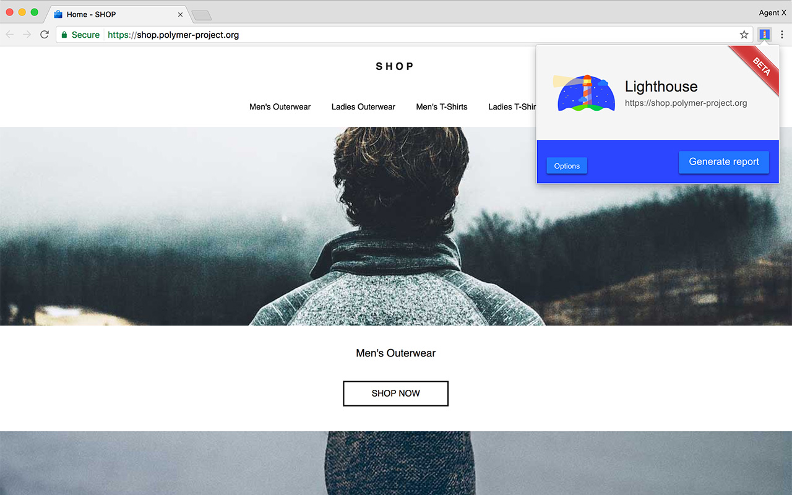
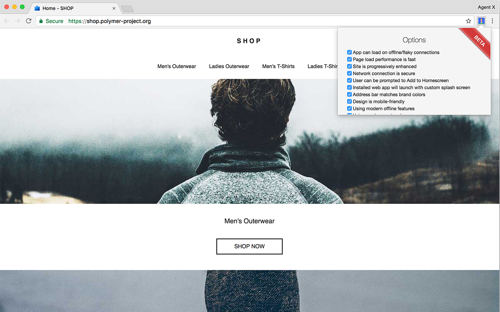
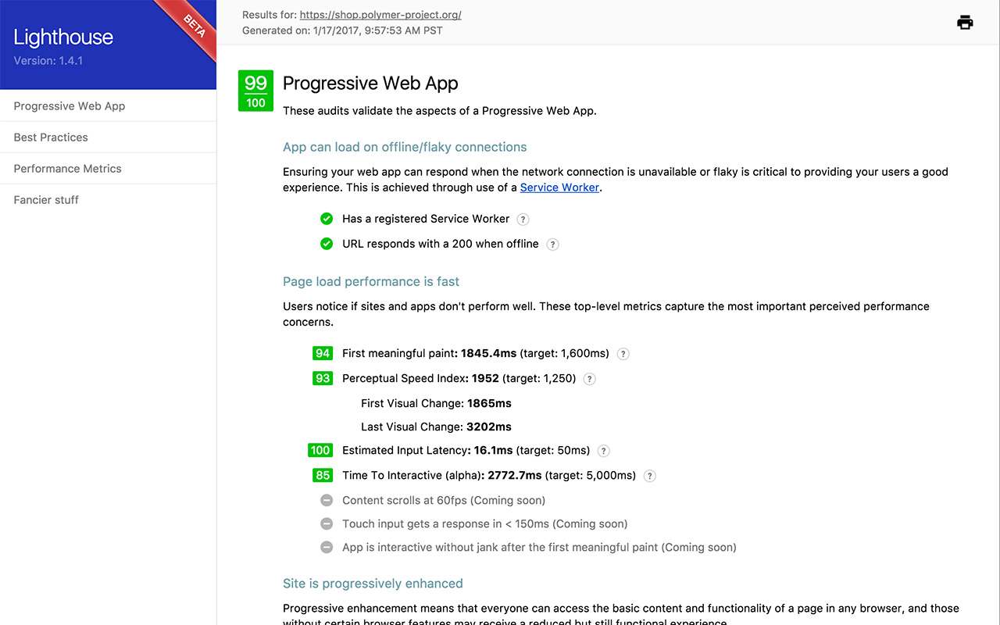
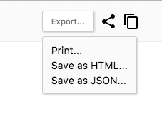

project_path: /web/tools/_project.yaml
book_path: /web/tools/_book.yaml
description: Learn how to set up Lighthouse to audit and improve your web apps.

{# wf_updated_on: 2017-10-06 #}
{# wf_published_on: 2016-09-27 #}

# Lighthouse {: .page-title }

Lighthouse는 웹 앱의 품질을 개선하는
[오픈 소스](https://github.com/GoogleChrome/lighthouse) 자동화 도구입니다.

Lighthouse는 Chrome 확장프로그램, 커맨드 라인에서, 노드 모듈에서 프로그램으로도 사용할 수 있습니다.
Lighthouse에 확인할 URL을 지정하고, 페이지에 대한 테스트를 실행한 다음, 페이지에 대한 보고서를 생성합니다.
여기에서 실패한 테스트는 앱을 개선하기 위해 할 수 있는 것에 대한 지표로 사용할 수 있습니다.

  <a class="button button-primary lighthouse-install gc-analytics-event"
     data-category="lighthouse" data-action="install" data-label="blipmdconlkpinefehnmjammfjpmpbjk"
     href="https://chrome.google.com/webstore/detail/lighthouse/blipmdconlkpinefehnmjammfjpmpbjk"
     title="Install Lighthouse Chrome Extension" target="_blank">
    file_download
    Lighthouse 설치
  </a>
  <a class="button button-primary gc-analytics-event"
     data-category="ligthhouse" data-action="bug"
     href="https://github.com/GoogleChrome/lighthouse/issues/new/choose"
     title="File an issue or feature request" target="_blank">
    bug_report
    이슈 찾기
  </a>

Note: Lighthouse는 현재 [홈스크린에 추가](/web/fundamentals/app-install-banners)나 오프라인 지원 같은,
프로그레시브 웹 앱 기능에 중점을 둡니다. 그러나 프로젝트의 가장 중요한 목표는 웹 앱 품질의 모든 측면에 대한 end-to-end 테스트를 제공하는 겁니다.

## Lighthouse 설정하기

Lighthouse는 Chrome 확장프로그램, 커맨드 라인 도구로 실행할 수 있습니다.
Chrome 확장프로그램은 리포트를 읽는데 더 유저에 친숙한 인터페이스를 제공합니다.
커맨드 라인 도구는 Lighthouse를 지속적 통합 시스템에 넣을 수 있습니다.

### Chrome 확장프로그램 설치하기

Chrome 확장프로그램은 아래 순서대로 설치합니다:

1. 54 버전 이상 Google Chrome을 설치합니다.
- Chrome 웹스토어에서 <a class="gc-analytics-event"
     data-category="crx-install" data-label="lighthouse-install-button"
     href="https://chrome.google.com/webstore/detail/lighthouse/blipmdconlkpinefehnmjammfjpmpbjk"
     title="Install Lighthouse Chrome Extension" target="_blank">
    file_download
    Lighthouse Chrome 확장프로그램</a>을 설치합니다.

### 노드 커맨드 라인 도구 설치

노드 모듈은 아래 순서대로 설치합니다:

1. 5 버전 이상의 [노드](https://nodejs.org)를 설치합니다.
- Lighthouse를 글로벌 모듈로 설치합니다.

        npm install -g lighthouse

그리고서, 심사할 페이지 URL과 함께 Lighthouse를 실행시킵니다.

    lighthouse https://airhorner.com/

사용가능한 옵션은 `--help` 플래그로 확인 가능합니다.

    lighthouse --help

Note: Lighthouse는 프로그래밍 방식의 노드 모듈로도 사용할 수 있습니다. Lighthouse를 호출하여 사용자 정의 보고서를 작성하고, 
사용자만의 심사를 돌리고, Mocha 테스트와 통합하는 방법은, [예제][example]를 참고하십시오.

## 시작하기

### Chrome 확장프로그램

심사하고자 하는 페이지로 갑니다.

Chrome 툴바에서 Lighthouse 아이콘()을 클릭합니다. 메뉴에 나타납니다.

특정 부분만 심사하고 싶다면, **Options** 버튼을 클릭하고 심사하지 않을 항목을 비활성화 하십시오.
스크롤을 내리고 **OK**를 눌러 변경사항을 확인하십시오.

현재 열려있는 페이지에 대한 Lighthouse의 테스트를 실행하려면 **Generate report** 버튼을 클릭하십시오.

심사가 끝나면 Lighthouse는 새 탭을 열어 페이지 결과에 대한 보고서를 보여줍니다.

## 온라인 보고서 뷰어

[Lighthouse 뷰어](https://googlechrome.github.io/lighthouse/viewer/)는 온라인으로 보고서를 보고 공유하는 유용한 방법입니다.

보고서를 보는 몇가지 방법이 있습니다:

1. 보고서의 HTML 버전을 볼 때 보고서의 상단 오른쪽 코너에 있는 "Open in viewer" 버튼을 클릭하십시오.
2. Lighthouse 실행 json 출력을 앱으로 드래그 앤 드롭하거나 클릭하여 보고서 파일을 업로드합니다. 
만약 CLI 유저라면 Lighthouse를 `--output=json` 플래그와 함께 실행하여 뷰어에서 열 수 있는 JSON 파일을 생성할 수 있습니다.
3. 뷰어의 URL에 `?gist=GISTID` 파라미터를 추가하세요.
4. Lighthouse json 보고서가 포함된 [Github gist](https://gist.github.com/) URL을 복사하세요.

{: .attempt-right}

뷰어를 사용하여 보고서를 다른 사람과 공유할 수 있습니다.
오른쪽 상단의 공유 버튼을 클릭하고 Github에 로그인하여 보고서를 공유할 수 있습니다.
보고서는 계정에 시크릿 gist로 저장되므로 나중에 쉽게 보고서를 삭제하거나 업데이트할 수 있습니다.
Github를 데이터 스토리지로 사용한다는 건 무료 버전 컨트롤을 의미합니다.

## 기여하기

Lighthouse는 오픈소스이며 [기여를 환영합니다](https://github.com/GoogleChrome/lighthouse/blob/master/CONTRIBUTING.md).
저장소의 [이슈 트래커](https://github.com/GoogleChrome/lighthouse/issues)를 확인하여 수정할 수 있는 버그를 찾거나, 심사를 만들거나 개선할 수 있습니다.
이슈 트래커는 심사 메트릭스, 새로운 심사를 위한 아이디어, Lighthouse와 관련한 기타 사항을 논의하기에 좋은 장소입니다.

[example]: https://github.com/justinribeiro/lighthouse-mocha-example/blob/master/test/lighthouse-tests.js
