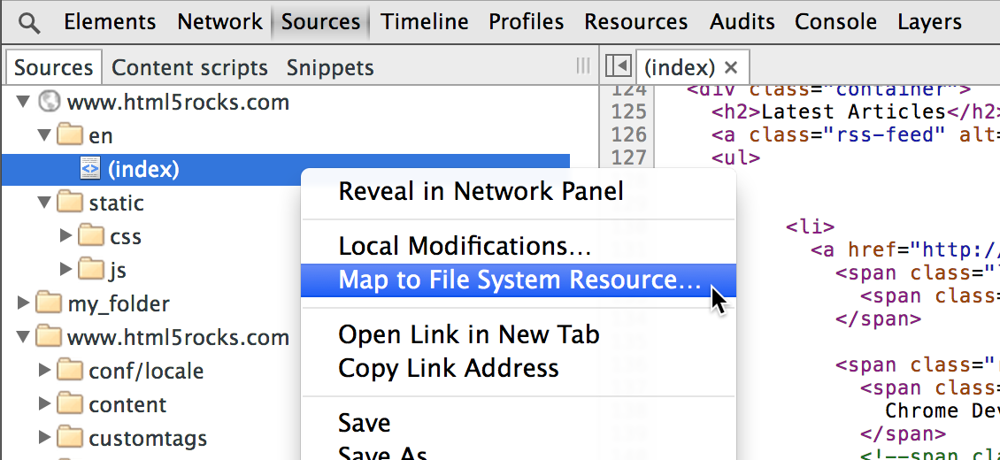

project_path: /web/tools/_project.yaml
book_path: /web/tools/_book.yaml
description: Chrome DevTools에서 지속적 작성을 설정하면 변경 내용을 즉시 확인하고 그러한 변경 내용을 디스크에 저장할 수 있습니다.

{# wf_updated_on: 2015-07-30 #}
{# wf_published_on: 2015-07-08 #}

# DevTools 작업 영역을 사용하여 지속성 설정 {: .page-title }





Chrome DevTools에서 지속적 작성을 설정하면 변경 내용을 즉시 확인하고 그러한 변경 내용을 디스크에 저장할 수 있습니다.

Chrome DevTools를 사용하면 웹 페이지에서 요소와 스타일을 
변경하고 변경 내용을 즉시 확인할 수 있습니다. 
기본적으로 브라우저를 새로 고치면, 변경 내용을 외부 편집기에 수동으로 
복사하여 붙여넣지 않은 이상 변경 내용은 사라집니다.

작업 영역을 사용하면 Chrome DevTools를 종료하지 않고도 
변경 내용을 디스크에 지속할 수 있습니다. 
로컬 웹 서버에서 제공한 리소스를 디스크의 파일에 매핑하고 
해당 파일에 적용된 변경 내용을 제공 중인 것처럼 바로 볼 수 있습니다.

### TL;DR {: .hide-from-toc }
- 변경 내용을 수동으로 로컬 파일에 복사하지 마세요. 작업 영역을 사용하여 DevTools에서 변경한 내용을 로컬 리소스에서 지속하세요.
- 로컬 파일을 브라우저에 스테이지하세요. 파일을 URL로 매핑할 수도 있습니다.
- 지속적 작업 영역이 설정되고 나면 Elements 패널에서 적용한 스타일 변경 내용이 자동으로 지속됩니다. DOM 변경은 지속되지 않습니다. 대신 Sources 패널에서 요소 변경을 지속할 수 있습니다.

## 작업 영역에 로컬 소스 파일 추가

로컬 폴더의 소스 파일을 Sources 패널에서 편집할 수 있게 하려면:

1. 왼쪽의 패널을 마우스 오른쪽 버튼으로 클릭합니다. 
2. **Add Folder to Workspace**를 선택합니다. 
3. 매핑하고자 하는 로컬 폴더의 위치를 선택합니다. 
4. **Allow**를 클릭하여 Chrome에 해당 폴더에 대한 액세스 권한을 부여합니다. 

일반적으로 로컬 폴더에는 서버에서 사이트를 채우는 데 사용되었던 사이트의 원본 소스 파일이 포함되어 있습니다. 그러한 원본 파일을 작업 영역을 통해 변경하지 않으려면, 폴더의 사본을 만들어 이를 원본 대신 작업 영역 폴더로 지정하면 됩니다.

## 지속된 변경 내용 스테이지

로컬 폴더는 이미 작업 영역에 복사했지만 
브라우저는 여전히 네트워크 폴더 콘텐츠를 제공하고 있습니다. 
브라우저에서 지속적인 변경 내용을 자동으로 스테이지하려면 
폴더 내에 있는 로컬 파일을 다음 URL로 매핑합니다.

1. 소스 왼쪽 패널에서 파일을 마우스 오른쪽 버튼으로 클릭하거나 Control 키를 누른 채 클릭합니다. 
2. **Map to File System Resource**를 선택합니다. 
3. 지속적 작업 영역에서 로컬 파일을 선택합니다. 
4. Chrome에서 해당 페이지를 새로 고칩니다.

그 다음부터는, 
Chrome이 매핑된 URL을 로드하고 
네트워크 콘텐츠 대신 
작업 영역 콘텐츠를 표시합니다. 
이렇게 하면 Chrome과 외부 편집기 사이를 반복해서 전환하지 않아도 
로컬 파일에서 직접 작업할 수 있습니다.

## 제한 사항

작업 영역은 매우 강력한 도구이지만, 여러분이 알아야 하는 몇 가지 제한 사항이 있습니다.

* Elements 패널에서 적용한 스타일 변경만 적용될 뿐 DOM을 변경한 내용은 지속되지 않습니다.

* 외부 CSS 파일에서 정의한 스타일만 저장할 수 있습니다. `element.style` 또는 인라인 스타일에 적용한 변경 내용은 지속되지 않습니다. (인라인 스타일이 있는 경우, Sources 패널에서 변경하면 됩니다.)

* Elements 패널에서 적용한 스타일 변경은 명확히 저장하지 않아도 즉시 지속됩니다(
<kbd class="kbd">Ctrl</kbd> + <kbd class="kbd">S</kbd> 또는 <kbd class="kbd">Cmd</kbd> + <kbd class="kbd">S</kbd>(Mac)를 누르면 됨). 이는 로컬 파일에 매핑된 CSS 리소스가 있는 경우로 한정됩니다.

* 파일을 로컬 서버 대신 원격 서버로부터 매핑하는 경우, 페이지를 새로 고치면 Chrome이 해당 페이지를 원격 서버에서 다시 로드합니다. 변경 내용은 디스크에서 여전히 지속되며, 작업 영역에서 편집을 계속하는 경우 다시 적용됩니다.

* 브라우저에서 매핑된 파일의 전체 경로를 사용해야 합니다. 스테이지된 버전을 확인하려면 색인 파일도 URL에 .html을 포함해야 합니다.

## 로컬 파일 관리

기존 파일을 편집하는 것 외에도 
작업 영역에 사용 중인 로컬 매핑된 디렉토리에 
파일을 추가하거나 삭제할 수도 있습니다.

### 파일 추가

파일을 추가하려면:

1. 왼쪽 Sources 창에서 폴더를 마우스 오른쪽 버튼으로 클릭합니다. 
2. **New File**을 선택합니다. 
3. 새 파일의 이름을 확장자까지 포함하여 입력하고(예: `newscripts.js`) **Enter** 키를 누릅니다. 그러면 파일이 로컬 폴더에 추가됩니다.

### 파일 삭제

파일을 삭제하려면:

1. 왼쪽 Sources 창에서 파일을 마우스 오른쪽 버튼으로 클릭합니다. 
2. **Delete**를 선택하고 **Yes**를 클릭하여 확인합니다.

### 파일 백업

파일에 중대한 변경을 적용하기 전에 
원본을 백업용으로 복제해두면 유용합니다.

파일을 복제하려면:

1. 왼쪽 Sources 창에서 파일을 마우스 오른쪽 버튼으로 클릭합니다. 
2. **Make a Copy...**를 선택합니다. 
3. 파일 이름을 확장자까지 포함하여 입력하고(예: `mystyles-org.css`) **Enter** 키를 누릅니다.

### 새로고침

작업 영역에서 파일을 직접 만들거나 삭제한 경우, 
Sources 디렉토리가 자동으로 새로 고쳐지면서 파일 변경 내용을 표시합니다. 
언제든지 새로 고침을 강제 적용하려면 폴더를 마우스 오른쪽 버튼으로 클릭하고 **Refresh**를 선택하면 됩니다.

이 기능은 외부 편집기에서도 동시에 열려 있는 파일을 변경한 다음 변경 내용이 DevTools에 표시되도록 하려는 경우에도 유용합니다. 대개 DevTools가 그러한 변경을 자동으로 잡아내지만, 확실히 해두고 싶다면 위에 설명된 것처럼 폴더를 새로 고치기만 하면 됩니다.

### 파일 또는 텍스트 검색

DevTools에서 로드된 파일을 검색하려면 
<kbd class="kbd">Ctrl</kbd> + <kbd class="kbd">O</kbd> 또는 <kbd class="kbd">Cmd</kbd> + <kbd class="kbd">O</kbd>(Mac)를
눌러 검색 대화상자를 엽니다. 
작업 영역에서도 이렇게 할 수 있지만, 
원격으로 로드된 파일과 
Workspace 폴더에 있는 로컬 파일 양쪽으로 검색이 확장됩니다.

여러 파일에 걸쳐 문자열을 검색하려면:

1. 검색 창을 엽니다. **Show Drawer** 버튼{:.inline}을 클릭한 다음 **Search**를 클릭하거나 
<kbd class="kbd">Ctrl</kbd> + <kbd class="kbd">Shift</kbd> + <kbd class="kbd">F</kbd> 또는 <kbd class="kbd">Cmd</kbd> + <kbd class="kbd">Opt</kbd> + <kbd class="kbd">F</kbd>(Mac)를 누릅니다. 
2. 검색 필드에 문자열을 입력한 다음 **Enter** 키를 누릅니다. 
3. 문자열이 정규 식이거나 대/소문자를 구분하지 않는 경우, 적절한 확인란을 클릭합니다.

검색 결과가 콘솔 창에 표시되고, 파일 이름을 기준으로 나열되고, 각 파일에서 일치하는 항목 수가 표시됩니다. 주어진 파일에 대한 결과를 확장하거나 축소하려면 **Expand**{:.inline} 및 **Collapse**{:.inline} 화살표를 사용합니다.

{# wf_devsite_translation #}
