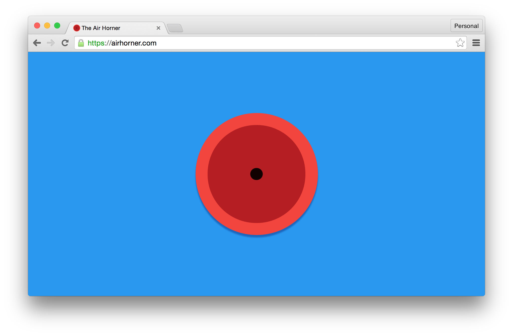
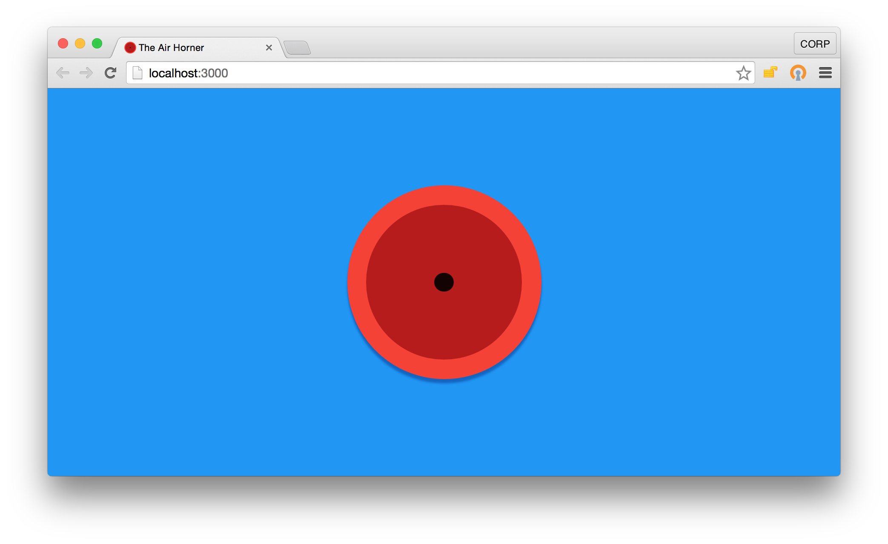
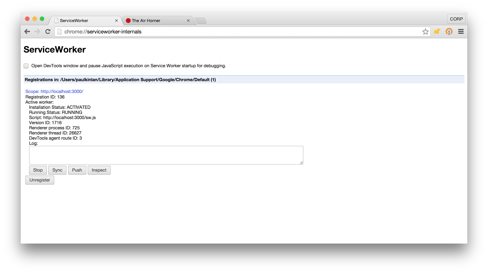
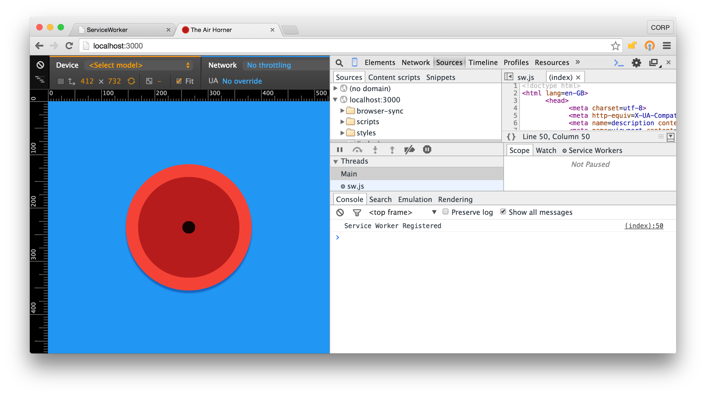
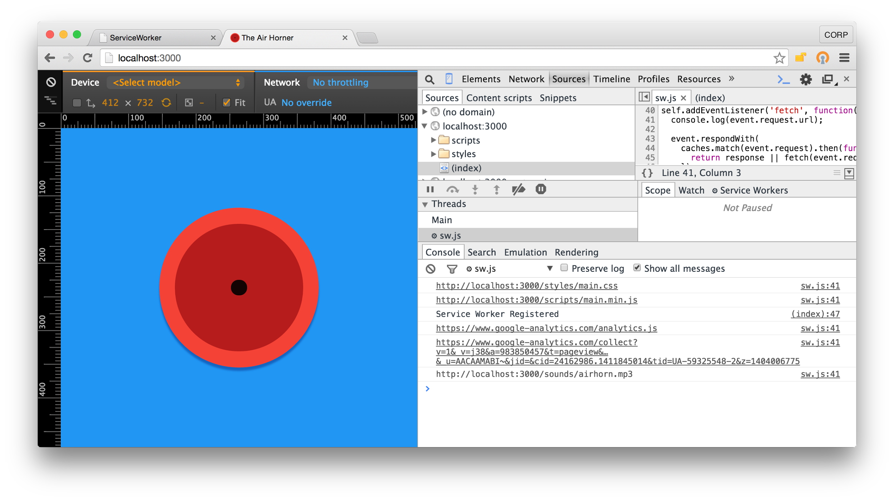

project_path: /web/_project.yaml
book_path: /web/fundamentals/_book.yaml
description: Service workers 是运行在后台的脚本，它为 web 应用开启了一扇们，可以使用到通常只有原生应用才有的离线功能。学习如何将 service worker 集成入现有的应用中，使其能够离线工作。

{# wf_updated_on: 2016-09-09 #}
{# wf_published_on: 2000-01-01 #}

# 你的第一个离线 web 应用 {: .page-title }



在本次代码实验中，你将会学到如何将一个 service worker 集成入现有的应用中，让它能够离线工作。

这个应用叫做 [Air
Horner](https://airhorner.com)。它是 Web Audio API 来播放并操作汽笛声，它可能是现在市场上最好的汽笛应用了（起码在本次代码实验的作者看来是这样）。它是一个很简单的应用但是可以用来演示 service worker 的用法。

一个 Service workers 是一段运行在浏览器后台的脚本，从 web 页面上分离出去提供了一些不需要 web 页面和用户交互的功能。在未来它还会包含消息推送（现在已经能够进行消息推送了，译者注）、后台同步和基于地理位置的一些功能，但它具备的第一个特性就是能够截获网络请求并对网络请求进行处理，包含对网络请求的响应进行可编程控制的缓存。

这之所以是一个激动人心的 API 是因为它能够让应用支持离线体验，让开发者能够对最终的体验具有完全的控制权。

### 你将会学到什么

* 如何给现存应用添加基本的 service worker 功能
* 对 service worker 的生命周期有一个简单的了解
* 一些简单的离线缓存策略

### 你需要什么

* Chrome 44 或更高版本
* 对 [Promises](http://www.html5rocks.com/en/tutorials/es6/promises/){: .external } 的基本理解
* 简单的编码能力
* 一个文本编辑器
* Python 或者一个简单的本地 web 服务器

## 获取示例代码

你可以将所有的示例代码下载到你的电脑上。

[下载 Zip 文件](https://github.com/GoogleChrome/airhorn/archive/master.zip)

...或者通过命令行从 Github 上克隆

    $ git clone git@github.com:GoogleChrome/airhorn.git
    $ git clone https://github.com/GoogleChrome/airhorn.git
    

这个仓库有一个主要的文件夹叫做 "app"。这个文件夹下包含了所有在本项目中需要用到的的静态资源（html, css 和 JavaScript)。

## 运行示例代码 

首先，让我们看看最后完成后的应用是什么样的。跟着下面的介绍来构建和启动这个 Airhorn 应用。

通过将分支切换至 master 分支上来确保你在正确的分支。

    $ git checkout master
    

你可以使用你最喜欢的 HTTP 服务器或者使用 Python 来运行本应用。下面命令使用 Python 在本地的 3000 端口上启动一个 Web 服务器。

    $ cd app
    $ python -m SimpleHTTPServer 3000

在 Chrome 中打开本项目你将会看到：

## 测试应用

确保你的扬声器是打开的，然后点击喇叭，它应该就会发出声音。

现在关掉服务器（在命令行下按下 Ctrl+C）。这可以模拟离线的场景。重新加载页面。页面应该能够完整地重新呈现，且功能都完全可用。

  

为什么它能离线使用的原因就是我们本次代码实验要谈论的基本内容：service worker 支持离线的功能。

现在我们将要移除掉所有的离线支持，你会学到如何将 service worker 添加至你的应用后台让它来支持应用的离线使用。

## 构建起步代码

回到命令行，并将分支从 `master` 切换至 `code-lab`：

    git checkout code-lab
    

这会移除所有支持离线功能的资源，因此你可以在接下来的教程中将这些功能添加回来。

另外，在此之前你需要注销掉 service worker。在 Chrome 中你可以通过访问 `chrome://serviceworker-internals/` 并点击应用的 URL 下方的 **Unregister** 按钮来完成注销。

### 为应用注册一个 Service Worker

让应用支持离线的第一步是注册一个 service worker，它是一段可以在不打开网页不需要用户交互允许在后台运行的脚本。

这需要以下简单两步：
1. 创建一个 JavaScript 文件作为 service worker。
1. 告诉浏览器将这个 JavaScript 文件注册为 service worker。

首先，创建一个空白的文件 `sw.js`，并将它放置在 `/app` 目录下（这个目录是应用的根目录）。放在根目录的原因是在目录结构中的位置决定了 service worker 的作用范围。如果它没有存在于正确的目录下，Service Worker 就不能让应用支持离线（这意味着你不能将它放在 script 目录下）。

现在在 `/app` 目录下打开 `index.html` 并将下列代码加至其中：

    
    

上面这段代码检查浏览器是否支持 service worker，如果支持就调用注册方法并返回一个 Promise 对象。注册完成后浏览器将会 resolve Promise 并调用传入 `.then()` 的函数。（注意：这是异步过程）

在本地启动一个服务器并查看该项目有什么变化：

    $ cd app
    $ python -m SimpleHTTPServer 3000
    

在 Chrome 中打开 `chrome://serviceworker-internals/`。这里会显示所有已经注册的 service workers，并允许你在安装之前打开 Chrome DevTools（开发者工具）。如果你想调试 service worker 的安装过程，这将会非常有用。

  

加载 web 应用，打开 Chrome DevTools，如果安装成功你将会看到 "Service Worker Registered" 的 log 信息。这是将 service worker 集成入你的应用的第一步。这个时候还不能离线工作，但是我们正在努力。

### 高频问答

**为什么要把 service worker 放在根目录？我为什么不能将它放在 `/scripts` 目录下？**

为了安全，一个 service worker 只能控制与它相同目录或者相同目录下子目录中的页面。这意味着如果你将 service worker 放在 scripts 目录下，它只会作用于 `/scripts` 目录，以及 scripts 中的子目录（比如：`/scripts/test/`)。你的应用应该不会只存在于那么。

## 按装应用资源

在 service worker 注册后，在用户首次访问时一个 "install" 事件将被触发。在这个事件处理函数中，你应该缓存下你的应用需要的所有资源。

首先添加一个针对 Cache 的补丁（本项目中已经包含了）。因为 Cache API 还没有被完全支持，所以其他浏览器可能需要这个补丁程序（Chrome 已经很好地支持了）。

    importScripts('/cache-polyfill.js');
    

现在来添加 `install` 事件的监听函数。

    self.addEventListener('install', function(e) {
      e.waitUntil();
    });
    

然后在事件处理函数中，打开 `caches` 对象。这个对象会在之后被用到，它用来保证我们请求的所有资源能够从缓存从缓存中返回。

    self.addEventListener('install', function(e) {
      e.waitUntil(
        caches.open('airhorner').then(function(cache) {})
      );
    });
    

现在，`caches` 对象已经打开了，你需要向其中添加一些资源。`caches` 对象有一个方法叫做 `addAll`。addAll 接收一个 url 的列表作为参数，它会自动地从服务器上加载它们，并将他们添加到缓存中。

    self.addEventListener('install', function(e) {
     e.waitUntil(
       caches.open('airhorner').then(function(cache) {
         return cache.addAll([
           '/',
           '/index.html',
           '/index.html?homescreen=1',
           '/?homescreen=1',
           '/styles/main.css',
           '/scripts/main.min.js',
           '/sounds/airhorn.mp3'
         ]);
       })
     );
    });
    

如果这些文件中的任意一个不存在或者下载失败，那么整个操作都会失败。一个好的应用会处理这种情况。

### 高频问答

* 这个补丁程序在哪儿?
    * [https://github.com/coonsta/cache-polyfill](https://github.com/coonsta/cache-polyfill)
* 为什么需要补丁?
    * 目前 Chrome 和其他 browsers 还没有完全支持 addAll 方法 (**注意:** Chrome 46 会兼容)
* 为什么你添加了 ?homescreen=1
    * 添加了查询字段的 URL 会认为是另外一个资源，它也需要被缓存。

## 截获 web 页面的网络请求 

service worker 的一个独特的属性是它能够截获从 web 页面发出的网络请求。service worker 可以控制并决定如何来处理这些请求。这给了我们能够从缓存中加载资源的能力。

第一步是添加一个 `fetch` 事件的处理函数。这个事件会在页面每次发起请求的时候被触发。

将下列代码添加至你的 `sw.js` 中，这会打印出它控制范围下所有页面的请求信息。

    self.addEventListener('fetch', function(event) {
     console.log(event.request.url);
    });
    

现在打开 service worker 的 Chrome 开发者工具，你将会看很多的请求。

现在我们知道，我们可以知晓应用的所有请求，我们需要决定如何来处理这些请求。默认情况下，让一个你不采取任何措施，请求会被发送至网络，然后响应会被返回给发起请求的页面。

为了让我们的应用可以离线工作，我们需要从缓存中获取数据（如果它存在于缓存中）。

从添加一个 `event.respondWith()` 方法入手，这个方法告诉浏览器如何处理后续可能到达的请求。需要在其中添加一些操作它才能够工作。

    self.addEventListener('fetch', function(event) {
     console.log(event.request.url);
    
     event.respondWith( );
    });
    

向下面这样将 `caches.match(event.request)` 添加进入。这个方法接收 fetch 事件中的网络请求，然后检查在当前缓存中是否存在该网络请求对应的资源（通过匹配请求的 URL）。

    self.addEventListener('fetch', function(event) {
     console.log(event.request.url);
     event.respondWith(
       caches.match(event.request).then(function(response) { })
     );
    });
    

这个 `match` 方法返回一个 Promise 对象，即使在缓存中没有找到请求的文件。这意味着我们有机会决定该如何做。在我们这个简单的示例中，若在缓存中找到了请求的资源就返回，如果没有就发起网络请求，并将结果返回回去。

    self.addEventListener('fetch', function(event) {
     console.log(event.request.url);
     event.respondWith(
       caches.match(event.request).then(function(response) {
         return response || fetch(event.request);
       })
     );
    });
    

这是一个很简单的案例，还存在很多很可能的情况。比如，你可以增量缓存所有之前没有被缓存过的资源，在之后这些请求就都能从缓存中返回了。

## 祝贺你

让小喇叭响起来。现在你已经有了一个可以离线工作的 web 应用。如果一切都正确无误，你应该可以在 `chrome://serviceworker-internals/` 里面看到你的  service worker 的调试日志。

关掉步骤 5 中打开的 Python 服务器（在命令行按下 **Ctrl C** 来关闭服务器），然后刷新页面，这个时候你服务器已经没有在工作了，如果应用还能加载出来，说明 service worker 在正常工作。

### 我们学到了什么

* 如何给现存应用添加基本的 service worker 功能
* 对 service worker 的生命周期有一个简单的了解
* 一些简单的离线缓存策略

### 再出发

* 使用 Polymer Elements 让创建离线应用更加容易
* 探索更多 [高级缓存技巧](https://jakearchibald.com/2014/offline-cookbook/)

### 关注他们

* [Jake Archibald](https://twitter.com/jaffathecake)
* [Alex Russell](https://twitter.com/slightlylate)
* [Matt Gaunt](https://twitter.com/gauntface)
* [Paul Kinlan](https://twitter.com/Paul_Kinlan)

### 学习更多

* [service worker 介绍](http://www.html5rocks.com/en/tutorials/service-worker/introduction/)

Translated By: 

