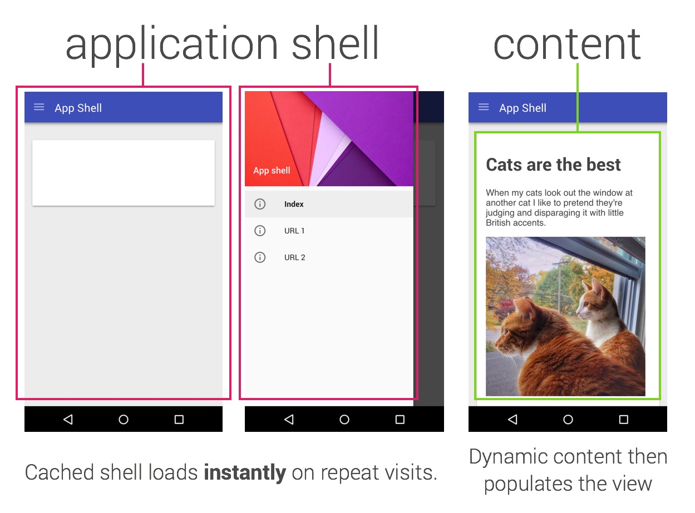

project_path: /web/_project.yaml
book_path: /web/fundamentals/_book.yaml
description: Progressive Web Apps 是结合了 web 和 原生应用中最好功能的一种体验。在这个指南的引导下，你将会建立你自己的 Progressive Web Apps。你也会学到建立 Progressive Web App 的基础，包括 app shell 模式, 如何使用 service worker 来缓存 App Shell 和你应用中的关键数据等等。

{# wf_updated_on: 2016-09-08 #}
{# wf_published_on: 2000-01-01 #}

# 你的首个 Progressive Web App {: .page-title }



<a href="/web/progressive-web-apps">Progressive Web Apps </a>是结合了 web 和 原生应用中最好功能的一种体验。对于首次访问的用户它是非常有利的, 用户可以直接在浏览器中进行访问，不需要安装应用。随着时间的推移当用户渐渐地和应用建立了联系，它将变得越来越强大。它能够快速地加载，即使在比较糟糕的网络环境下，能够推送相关消息, 也可以像原生应用那样添加至主屏，能够有全屏浏览的体验。

## 什么是 Progressive Web App?

Progressive Web Apps 是:

* **渐进增强** - 能够让每一位用户使用，无论用户使用什么浏览器，因为它是始终以渐进增强为原则。
* **响应式用户界面** - 适应任何环境：桌面电脑，智能手机，笔记本电脑，或者其他设备。
* **不依赖网络连接** - 通过 service workers 可以在离线或者网速极差的环境下工作。
* **类原生应用** - 有像原生应用般的交互和导航给用户原生应用般的体验，因为它是建立在 app shell model 上的。
* **持续更新** - 受益于 service worker 的更新进程，应用能够始终保持更新。
* **安全** - 通过 HTTPS 来提供服务来防止网络窥探，保证内容不被篡改。
* **可发现** - 得益于 W3C manifests 元数据和 service worker 的登记，让搜索引擎能够找到 web 应用。
* **再次访问** - 通过消息推送等特性让用户再次访问变得容易。
* **可安装** - 允许用户保留对他们有用的应用在主屏幕上，不需要通过应用商店。
* **可连接性** - 通过 URL 可以轻松分享应用，不用复杂的安装即可运行。

这引导指南将会引导你完成你自己的 Progressive Web App，包括设计时需要考虑的因素，也包括实现细节，以确保你的应用程序符合 Progressive Web App 的关键原则。

Note: 在寻找更多信息? 观看 Alex Russell 在 2015 年 Chrome 开发者大会上关于 <a href='https://www.youtube.com/watch?v=MyQ8mtR9WxI'>Progressive Web Apps</a> 的演讲

## 我们将要做什么？

  
  

    <a href="https://weather-pwa-sample.firebaseapp.com/final/">尝试</a>
  

在这指南引导， 你将会使用Progressive Web App的技巧来建立一个天气预报的web app。

让我们考虑Progressive Web App的特性：

* <b>渐进增强</b> - 我们将会使用渐进增强的特性。
* <b>响应用户界面</b> - 我们将确保这应用程序能适合任何设备。
* <b>不依赖网络连接</b> -我们将会用 Service Worker 缓存 app shell。
* <b>类原生应用</b> - 我们将会使用原生应用的交互方式来添加城市以及更新天气。
* <b>持续更新</b> - 我们将会用 Service Worker 来缓存最新的内容。
* <b>安全通信</b> - 我们将会把网页发布在一个支持 HTTPS 的主机服务。
* <b>可发现于可安装</b> - 我们将添加一个 manifest 以让搜索器找到我们的应用程序。
* <b>可连接性</b> - 这就是网络!</li>

## 你将会学到

* 如何使用 "app shell" 的方法来设计和构建应用程序。
* 如何让你的应用程序能够离线工作。
* 如何存储数据以在离线时使用。

## 你需要

* Chrome 47 或以上
* HTML，CSS 和 JavaScript 的知识

这份引导指南的重点是 Progressive Web Apps。其中有些概念的只是简单的解释
而有些则是只提供示例代码（例如 CSS 和其他不相关的 Javascipt ），你只需复制和粘贴即可。

## 基于应用外壳的架构

应用的壳是应用的用户界面所需的最基本的 HTML、CSS 和 JavaScript，也是一个用来确保应用有好多性能的组件。它的首次加载将会非常快，加载后立刻被缓存下来。这意味着应用的外壳不需要每次使用时都被下载，而是只加载需要的数据。

应用外壳的结构分为应用的核心基础组件和承载数据的 UI。所有的 UI 和基础组件都使用一个 service worker 缓存在本地，因此在后续的加载中 Progressive Web App 仅需要加载需要的数据，而不是加载所有的内容。

<figure>
  
</figure>

换句话说，应用的壳相当于那些发布到应用商店的原生应用中打包的代码。它是让你的应用能够运行的核心组件，只是没有包含数据。

### 为什么使用基于应用外壳的结构?

使用基于应用外壳的结构允许你专注于速度，给你的 Progressive Web App 和原生应用相似的属性：快速的加载和灵活的更新，所有这些都不需要用到应用商店。

### 设计应用外壳

第一步是设计核心组件

问问自己：

* 需要立刻显示什么在屏幕上？
* 我们的应用需要那些关键的 UI 组件？
* 应用外壳需要那些资源？比如图片，JavaScript，样式表等等。

我们将要创建一个天气应用作为我们的第一个 Progressive Web App 。它的核心组件包括：

* 包含标题的头部，包括添加/刷新 按钮
* 放置天气预报卡片的容器
* 天气预报卡片的模板
* 一个用来添加城市的对话框
* 一个加载指示器

在设计一个更加复杂的应用时，内容不需要在首次全部加载，可以在之后按需加载，然后缓存下来供下次使用。比如，我们能够延迟加载添加城市的对话框，直到完成对首屏的渲染且有一些空闲的时间。

## 实现应用外壳

任何项目都可以有多种起步方式，通常我们推荐使用 Web Starter Kit。但是，这里为了保持我们的项目
足够简单并专注于 Progressive Web Apps，我们提供了你所需的全部资源。

### 下载示例代码

你可以[下载本 progressive web app 引导指南需要的所有代码](pwa-weather.zip)，指南中每一步
需要的资源你都能够在这个 ZIP 文件中找到。

### 为应用外壳编写 HTML 代码

为了保证我们的起步代码尽可能清晰，我们将会开始于一个新的 `index.html` 文件并添加在
[构建应用外壳](step-01)中谈论过的核心组件的代码

请记住，核心组件包括：

* 包含标题的头部，以及头部的 添加/刷新 按钮
* 放置天气预报卡片的容器
* 天气预报卡片的模板
* 一个用来添加城市的对话框
* 一个加载指示器

    <!DOCTYPE html>
    <html>
    <head>
      <meta charset="utf-8">
      <meta http-equiv="X-UA-Compatible" content="IE=edge">
      <meta name="viewport" content="width=device-width, initial-scale=1.0">
      <title>Weather App</title>
      <!-- Insert link to styles.css here -->
    </head>
    <body>
      <header class="header">
        <h1 class="header__title">Weather App</h1>
        <button id="butRefresh" class="headerButton"></button>
        <button id="butAdd" class="headerButton"></button>
      </header>
    
      <main class="main" hidden>
        <!-- Insert forecast-card.html here -->
      </main>
    
      

        <!-- Insert add-new-city-dialog.html here -->
      

    
      

        <svg viewBox="0 0 32 32" width="32" height="32">
          <circle id="spinner" cx="16" cy="16" r="14" fill="none"></circle>
        </svg>
      

    
      <!-- Insert link to app.js here -->
    </body>
    </html>
    

需要注意的是默认情况下 `main` 是隐藏（`hidden`） 的，而加载指示器是显示出来的。这是为了保证
用户能在页面加载后立刻看到加载器，给用户一个清晰的指示，表明页面正在加载。

接下来，让我们添加天气预报卡片和新增城市的对话框。为了节省时间，这些已经在 `resources` 目录下
提供了，因此你只需将其复制粘贴至相应位置即可。

### 给核心 UI 组件添加样式

是时候来添加一些样式了。作为我们的构建和部署过程的一部分，我们将希望能够将样式内联在 HTML 文档
中，但现在，让我们先将其放在单独的 CSS 文件中。

在 `index.html` 文件中，替换 `<!-- Insert link to styles here -->` 为以下代码：

    <link rel="stylesheet" type="text/css" href="styles/inline.css">
    

为了节省时间，我们已经为你创建了
[样式表](https://weather-pwa-sample.firebaseapp.com/styles/inline.css)。花费几分钟
看看搞明白它然后做出一些修改，让样式更加符合你的心意。

Note: 将每个图标分为单独的文件而不是使用 sprite 图，这看起来似乎有些低效，但我们 会将它们作为应用外壳的一部分对他们进行缓存，确保它们始终可用，且不需要进行网络请求。

### 测试并做出一些调整

现在是时候来测试一下效果了，看看它长什么样并做出一些修改让它变成你想要的效果。请确保从 `main`
容器上移除 `hidden` 属性后再测试天气预报卡片的渲染效果，并为卡片添加一些假数据。

Note: 我么将会提供 HTML 和 CSS 代码来节省你的时间，同时保证你起步于一个稳固的基础。 在下一节，你将有机会自己写这些代码

这个应用现在应该是响应式的了，但是并不完美。试着添加一些额外的样式来让它在各个设备上都能表现的很
好。因此，考虑一下你能为此做些什么。

### 添加关键的 JavaScript 启动代码

现在我们的 UI 已经准备好了，是时候来添加一些代码让它工作起来了。像搭建应用外壳的时候那样，注意
考虑哪些代码是为了保持用户体验必须提供的，哪些可以延后加载。

在启动代码中，我们将包括：

* 一个 `app` 对象包含一些和应用效果的关键信息。
* 为头部的按钮（`add`/`refresh`）和添加城市的对话框中的按钮（`add`/`cancel`）添加事件监听
函数。
* 一个添加或者更新天气预报卡片的方法（`app.updateForecastCard`）。
* 一个从 Firebase 公开的天气 API 上获取数据的方法(`app.getForecast`)。
* 一个迭代当前所有卡片并调用 `app.getForecast` 获取最新天气预报数据的方法 (`app.updateForecasts`).
* 一些假数据 (`fakeForecast`) 让你能够快速地测试渲染效果。

添加 JavaScript 代码

1. 从 `resources/step3` 目录下将 `app.js` 拷贝至 `scripts` 文件夹并重命名为 `app.js`
2. 在 `index.html` 中，添加一个连接，来加载新创建的 `app.js`。 
   ``

### 测试

现在，你已经添加了核心的 HTML、CSS 和 JavaScript，是时候测试一下应用了。这个时候它能做的可能
还不多，但要确保在控制台没有报错信息。

为了看看假的天气信息的渲染效果，将下面这行代码添加至你的 `app.js` 中：

`app.updateForecastCard(fakeForecast);`

<a href="https://weather-pwa-sample.firebaseapp.com/step-04/" >试一试</a>

## 从快速的首次加载开始

Progressive Web Apps 应该能够快速启动并且立即可用。目前，我们的天气应用能够快速启动，但是还
不能使用，因为还没有数据。我们能够发起一个 AJAX 请求来获取数据，但是额外的请求会让初次加载时间
变长。取而代之的方法是，在初次加载时提供真实的数据。

### 插入天气预报信息

在本实例中，我们将会静态地插入天气预报信息，但是在一个投入生产环境的应用中，最新的天气预报数据会
由服务器根据用户的 IP 位置信息插入。

将下面数据添加到立即调用函数表达式里：

 
    var initialWeatherForecast = {  
      key: 'newyork',  
      label: 'New York, NY',  
      currently: {  
        time: 1453489481,  
        summary: 'Clear',  
        icon: 'partly-cloudy-day',  
        temperature: 52.74,  
        apparentTemperature: 74.34,  
        precipProbability: 0.20,  
        humidity: 0.77,  
        windBearing: 125,  
        windSpeed: 1.52  
      },  
      daily: {  
        data: [  
          {icon: 'clear-day', temperatureMax: 55, temperatureMin: 34},  
          {icon: 'rain', temperatureMax: 55, temperatureMin: 34},  
          {icon: 'snow', temperatureMax: 55, temperatureMin: 34},  
          {icon: 'sleet', temperatureMax: 55, temperatureMin: 34},  
          {icon: 'fog', temperatureMax: 55, temperatureMin: 34},  
          {icon: 'wind', temperatureMax: 55, temperatureMin: 34},  
          {icon: 'partly-cloudy-day', temperatureMax: 55, temperatureMin: 34}  
        ]  
      }  
    };

接下来，移除我们之前创建的用于测试的 `fakeForecast`，因为我们再也用不到它了。

### 区分首次运行

但我们如何知道什么时候该展示这些信息，那些数据需要存入缓存供下次使用？当用户下次使用的时候，他们
所在城市可能已经发生了变动，所以我们需要加载目前所在城市的信息，而不是之前的城市。

用户首选项（比如用户订阅的城市列表），这类数据应该使用 indexDB 或者其他快速的存储方式存放在本地。
为了尽可能简化，这里我们使用 `localStorage` 进行存储，在生产环境下这并不是理想的选择，因为它是
阻塞型同步的存储机制，在某些设备上可能很缓慢。

Note: 为了更好的性能, 可以使用这个 <code>localStorage</code> 的实现： <a href='https://www.npmjs.com/package/idb'>idb</a>

首先，让我们在 `app.js` 中添加用来存储用户首选项的代码：

    // 将城市裂变存入 localStorage, 注意下面关于 localStorage 的说明
    app.saveSelectedCities = function() {
      var selectedCities = JSON.stringify(app.selectedCities);
      // 注意: 注意下面关于 localStorage 的说明
      localStorage.selectedCities = selectedCities;
    };
    

接下来，添加一些启动代码来检查用户是否已经订阅了某些城市，并渲染它们，或者使用插入的天气数据来渲
染。将下面这些代码添加入 `app.js`：

    /****************************************************************************   
     *
     * 用来启动应用的代码
     *
     * 注意: 为了简化入门指南, 我们使用了 localStorage。
     *   localStorage 是一个同步的 API，有严重的性能问题。它不应该被用于生产环节的应用中！
     *   应该考虑使用, IDB (https://www.npmjs.com/package/idb) 或者
     *   SimpleDB (https://gist.github.com/inexorabletash/c8069c042b734519680c)
     *
     ****************************************************************************/
    
    app.selectedCities = localStorage.selectedCities;
    if (app.selectedCities) {
      app.selectedCities = JSON.parse(app.selectedCities);
      app.selectedCities.forEach(function(city) {
        app.getForecast(city.key, city.label);
      });
    } else {
      app.updateForecastCard(initialWeatherForecast);
      app.selectedCities = [
        {key: initialWeatherForecast.key, label: initialWeatherForecast.label}
      ];
      app.saveSelectedCities();
    }
    

最后哦，不要忘了在用户添加了新城市后将其存储起来，为此可以在 `butAddCity` 事件的处理函数中
添加 `app.saveSelectedCities();` 。

### 测试

* 在首次允许时，你的应用应该立刻向用户展示 `initialWeatherForecast` 中的天气数据。
* 添加一个新城市确保会展示两个卡片。
* 刷新浏览器并验证应用是否加载了天气预报并展示了最新的信息。

<a href="https://weather-pwa-sample.firebaseapp.com/step-05/" >试一试</a>

## 使用 Service Workers 来预缓存应用外壳 {: .page-title }

Progressive Web Apps 是快速且可安装的，这意味着它能在在线、离线、断断续续或者缓慢的网络环境
下使用。为了实现这个目标，我们需要使用一个 service worker 来缓存应用外壳，以保证它能始终迅速
可用且可靠。

如果你对 service workers 不熟悉，你可以通过阅读 [介绍 Service
Workers](http://www.html5rocks.com/en/tutorials/service-worker/introduction/) 来
了解关于它能做什么，它的生命周期是如何工作的等等知识。

service workers 提供的是一种应该被理解为渐进增强的特性，这些特性仅仅作用于支持
 service workers 的浏览器。比如，使用 service workers 你可以缓存应用外壳和你的应用所需的
 数据，所以这些数据在离线的环境下依然可以获得。如果浏览器不支持 service workers ，支持离线的
 代码没有工作，用户也能得到一个基本的用户体验。使用特性检测来渐渐增强有一些小的开销，它不会在老
 旧的不支持 service workers 的浏览器中产生破坏性影响。

Note: Service worker 只能在通过 HTTPS 加载的页面里使用 (为了方便测试 <code>https://localhost</code> 或同等地址也能工作)。 你可以从这里了解到这样的限制的合理性 <a href='http://www.chromium.org/Home/chromium-security/prefer-secure-origins-for-powerful-new-features'>Prefer Secure Origins For Powerful New Features</a>。

### 注册 service worker

为了让应用离线工作，要做的第一件事是注册一个 service worker，一段允许在后台运行的脚本，不需要
用户打开 web 页面，也不需要其他交互。

这只需要简单两步：

1. 创建一个 JavaScript 文件作为 service worker
1. 告诉浏览器注册这个 JavaScript 文件为 service worker

第一步，在你的应用根目录下创建一个空文件叫做 `service-worker.js` 。这个 `service-worker.js`
 文件必须放在跟目录，因为 service workers 的作用范围是根据其在目录结构中的位置决定的。

接下来，我们需要检查浏览器是否支持 service workers，如果支持，就注册 service worker，将下面
代码添加至 `app.js`中。

    if('serviceWorker' in navigator) {  
      navigator.serviceWorker  
               .register('/service-worker.js')  
               .then(function() { console.log('Service Worker Registered'); });  
    }
    

### 缓存站点的资源

当 service worker 被注册以后，当用户首次访问页面的时候一个 `install` 事件会被触发。在这个
事件的回调函数中，我们能够缓存所有的应用需要再次用到的资源。

Note: 使用了 <b>must NOT</b> 标记的代码一定不要用于生产环境，它们仅仅包含基本的功能且很容易让你的 app shell 永远得不到更新。务必注意下面关于如何避免这些陷阱的讨论，学会如何避免它们

当 service worker 被激活后，它应该打开缓存对象并将应用外壳需要的资源存储进去。将下面这些代码
加入你的 `service-worker.js` ：

    var cacheName = 'weatherPWA-step-5-1';  
    var filesToCache = [];
    
    self.addEventListener('install', function(e) {  
      console.log('[ServiceWorker] Install');  
      e.waitUntil(  
        caches.open(cacheName).then(function(cache) {  
          console.log('[ServiceWorker] Caching app shell');  
          return cache.addAll(filesToCache);  
        })  
      );  
    });
    

首先，我们需要提供一个缓存的名字并利用 `cache.open()`打开 cache 对象。提供的缓存名允许我们给
缓存的文件添加版本，或者将数据分开，以至于我们能够轻松地升级数据而不影响其他的缓存。

一旦缓存被打开，我们可以调用 `cache.addAll()` 并传入一个 url 列表，然后加载这些资源并将响应
添加至缓存。不幸的是 `cache.addAll()` 是原子操作，如果某个文件缓存失败了，那么整个缓存就会失败！

确保在每次修改了 service worker 后修改 `cacheName`，这能确保你永远能够从缓存中获得到最新
版本的文件。过一段时间清理一下缓存删除掉没用的数据也是很重要的。添加一个叫做 `activate` 的事件
处理函数，在该事件处理函数中你可以获得到所有的缓存名，并删除掉没有的缓存。

    self.addEventListener('activate', function(e) {  
      console.log('[ServiceWorker] Activate');  
      e.waitUntil(  
        caches.keys().then(function(keyList) {  
          return Promise.all(keyList.map(function(key) {  
            console.log('[ServiceWorker] Removing old cache', key);  
            if (key !== cacheName) {  
              return caches.delete(key);  
            }  
          }));  
        })  
      );  
    });
    

最后，让我们更新一下 app shell 需要的缓存的文件列表。在这个数组中，我们需要包括所有我们的应用
需要的文件，其中包括图片、JavaScript以及样式表等等。

    var filesToCache = [  
      '/',  
      '/index.html',  
      '/scripts/app.js',  
      '/styles/inline.css',  
      '/images/clear.png',  
      '/images/cloudy-scattered-showers.png',  
      '/images/cloudy.png',  
      '/images/fog.png',  
      '/images/ic_add_white_24px.svg',  
      '/images/ic_refresh_white_24px.svg',  
      '/images/partly-cloudy.png',  
      '/images/rain.png',  
      '/images/scattered-showers.png',  
      '/images/sleet.png',  
      '/images/snow.png',  
      '/images/thunderstorm.png',  
      '/images/wind.png'  
    ];
    

Note: 一定要保证你包括了所有的文件名，比如我们应用入口是 <code>index.html</code> 但是也会使用 <code>/</code> 来请求它，这个时候服务器会使用 <code>index.html</code> 作为响应。你可以在 <code>fetch</code> 方法中处理这种场景，但这可能又会引入其他复杂的问题。

我么的应用目前还不能离线工作。我们缓存了 app shell 的组件，但是我们仍然需要从本地缓存中加载它们。

### 从缓存中加载 app sheel

Service workers 可以截获 Progressive Web App 发起的请求并从缓存中返回响应。这意味着我们能够
决定如何来处理这些请求，以及决定哪些网络响应能够成为我们的缓存。

比如：

    self.addEventListener('fetch', function(event) {  
      // Do something interesting with the fetch here  
    });
    

让我们来从缓存中加载 app shell。将下面代码加入 `service-worker.js` 中：

    self.addEventListener('fetch', function(e) {  
      console.log('[ServiceWorker] Fetch', e.request.url);  
      e.respondWith(  
        caches.match(e.request).then(function(response) {  
          return response || fetch(e.request);  
        })  
      );  
    });
    

从内至外，`caches.match()` 从网络请求触发的 `fetch` 事件中得到请求内容，并判断请求的资源是
否存在于缓存中。然后以缓存中的内容作为响应，或者使用 fetch 函数来加载资源（如果缓存中没有该资源）。
`response` 最后通过 `e.respondWith()` 返回给 web 页面。

Note: 如果你没有在控制台里看到 <code>[ServiceWorker]</code> ，请确认你是否修改了 <code>cacheName</code> 并重新加载了页面。如果仍没有效果，可以参考下面关于调试 service workers 的提示

### 当心边缘问题

之前提到过，这段代码 **一定不要用在生产环境下** ，因为有很多没有处理的边界情况。

#### 缓存依赖于每次修改内容后更新缓存名称

比如缓存方法需要你在每次改变内容后更新缓存的名字。否则，缓存不会被更新，旧的内容会一直被缓存返回。
所以，请确保每次修改你的项目后更新缓存名称。

#### 每次修改后所有资源都需要被重新下载

另一个缺点是当一个文件被修改后，整个缓存都需要被重新下载。这意味着即使你修改了一个简单的拼写错误
也会让整个缓存重新下载。这不太高效。

#### 浏览器的缓存可能阻碍  service worker 的缓存的更新

另外一个重要的警告。首次安装时请求的资源是直接经由 HTTPS 的，这个时候浏览器不会返回缓存的资源，
除此之外，浏览器可能返回旧的缓存资源，这导致 service worker 的缓存不会得到 更新。

#### 在生产环境中当下 cache-first 策略

我们的应用使用了优先缓存的策略，这导致所有后续请求都会从缓存中返回而不询问网络。优先缓存的策略是
很容易实现的，但也会为未来带来诸多挑战。一旦主页和注册的 service worker 被缓存下来，将会很难
去修改 service worker 的配置（因为配置依赖于它的位置），你会发现你部署的站点很难被升级。

#### 我该如何避免这些边缘问题

我们该如何避免这些边缘问题呢？ 使用一个库，比如
[sw-precache](https://github.com/GoogleChrome/sw-precache), 它对资源何时过期提供了
精细的控制，能够确保请求直接经由网络，并且帮你处理了所有棘手的问题。

### 实时测试 service workers 提示

调试 service workers 是一件有调整性的事情，当涉及到缓存后，当你期望缓存更新，但实际上它并没有
的时候，事情更是变得像一场恶梦。在 service worker 典型的生命周期和你的代码之间，你很快就会受挫。
但幸运的是，这里有一些工具可以让你的生活更加简单。

一大堆提示：

* 一旦 service worker 被注销（unregistered）。它会继续作用直到浏览器关闭。
* 如果你的应用打开了多个窗口，新的 service worker 不会工作，直到所有的窗口都进行了刷新，使用了
新的 service worker。
* 注销一个 service worker 不会清空缓存，所以如果缓存名没有修改，你可能继续获得到旧的数据。
* 如果一个 service worker 已经存在，而且另外一个新的 service worker 已经注册了，这个新的
service worker 不会接管控制权，知道该页面重新刷新后，除非你使用[立刻控制](https://github.com/GoogleChrome/samples/tree/gh-pages/service-worker/immediate-control)的方式。

#### 你的新朋友: chrome://serviceworker-internals

Chrome 的 Service Worker Internals 页面 (`chrome://serviceworker-internals`) 能帮你
节约宝贵的生命，允许你很容易地停止并注销已经存在的 service workers 以及刷新。你还可以使用这个
页面来启动 Developer Tools 观察到 service worker 的执行情况，看到 console 的输出等等。

### 亲自尝试

* 打开 Chrome DevTools 并点击 resource 选项卡，确认 service worker 被正确地注册以及资源
被恰当的缓存。
* 试着修改 `cacheName` 并确认缓存正确地更新了。

<a href="https://weather-pwa-sample.firebaseapp.com/step-06/" >试一试</a>

## 使用 Service Workers 来缓存应用数据

选择一个正确的缓存策略是很重要的，并且这取决于你应用中使用的数据的类型。比如像天气信息、股票信息等对实时性要求较高的数据，应该时常被刷新，但是用户的头像或者文字内容应该以较低的频率进行更新。

**先使用缓存后使用请求结果** 的策略对于我们的应用是非常理想的选择。应用从缓存中获取数据，并立刻显示在屏幕上，然后在网络请求返回后再更新页面。如果使用 **先请求网络后缓存** 的策略，用户可能不会等到数据从网络上加载回来便离开了应用。

**先使用缓存后使用请求结果** 意味着我们需要发起两个异步的请求，一个从请求缓存，另一个请求网络。我们应用中的网络请求不需要进行修改，但我们需要修改一下 service worker 的代码来缓存网络请求的响应并返回响应内容。

通常情况下，应该立刻返回缓存的数据，提供应用能够使用的最新信息。然后当网络请求返回后应用应该使用最新加载的数据来更新。

### 截获网络请求并缓存响应结果

我么需要修改 service worker 来截获对天气 API 的请求，然后缓存请求的结果，以便于以后使用。**先使用缓存后使用请求结果** 的策略中，我们希望请求的响应是真实的数据源，并始终提供给我们最新的数据。如果它不能做到，那也没什么，因为我们已经从缓存中给应用提供了最新的数据。

在 service worker 中，我们添加一个 `dataCacheName` 变量，以至于我们能够将应用数据和应用外壳资源分开。当应用外壳更新了，应用外壳的缓存就没用了，但是应用的数据不会受影响，并时刻保持能用。记住，如果将来你的数据格式改变了，你需要一种能够让应用外壳和应用数据能后保持同步的方法。

将下面代码添加至你的 `service-worker.js` 中：

    var dataCacheName = 'weatherData-v1';
    

接下来，我么需要修改 `fetch` 事件的回调函数，添加一些代码来将请求数据 API 的请求和其他请求区分开来。

    self.addEventListener('fetch', function(e) {  
      console.log('[ServiceWorker] Fetch', e.request.url);  
      var dataUrl = 'https://publicdata-weather.firebaseio.com/';  
      if (e.request.url.indexOf(dataUrl) === 0) {  
        // Put data handler code here  
      } else {  
        e.respondWith(  
          caches.match(e.request).then(function(response) {  
            return response || fetch(e.request);  
          })  
        );  
      }  
    });

这段代码对请求进行拦截，判断请求的 URL 的开头是否为该天气 API，如果是，我们使用 `fetch` 来发起请求。一旦有响应返回，我们的代码就打开缓存并将响应存入缓存，然后将响应返回给原请求。

接下来，使用下面代码替换 `// Put data handler code here`

    e.respondWith(  
      fetch(e.request)  
        .then(function(response) {  
          return caches.open(dataCacheName).then(function(cache) {  
            cache.put(e.request.url, response.clone());  
            console.log('[ServiceWorker] Fetched&Cached Data');  
            return response;  
          });  
        })  
    );
    

我们的应用目前还不能离线工作。我们已经实现了从缓存中返回应用外壳，但即使我们缓存了数据，依旧需要依赖网络。

### 发起请求

之前提到过，应用需要发起两个异步请求，一个从请求缓存，另一个请求网络。应用需要使用 `window` 上的 `caches` 对象，并从中取到最新的数据。这是一个关于渐进增强 _极佳_ 的例子，因为 `caches` 对象可能并不是在任何浏览器上都存在的，且就算它不存在，网络请求依旧能够工作，只是没有使用缓存而已。

为了实现该功能，我们需要：

1. 检查 `cahces` 对象是否存在在全局 `window` 对象上。
1. 向缓存发起请求
    1. 如果向服务器发起的请求还没有返回结果，使用缓存中返回的数据更新应用。

1. 向服务器发起请求
    1. 保存响应结果便于在之后使用
    1. 使用从服务器上返回的最新数据更新应用

首先，让我们添加一个标志位用来处理 XHR 的响应比 cache 还快的这种很少出现的情况。在 `app` 对象上添加一个  `hasRequestPending:false`。

接下来，我们需要检查 `caches` 对象是否存在，若存在，就向它请求最新的数据。将下面这段代码添加至 `app.getForecast` 方法中。

    if ('caches' in window) {  
      caches.match(url).then(function(response) {  
        if (response) {  
          response.json().then(function(json) {  
            // Only update if the XHR is still pending, otherwise the XHR  
            // has already returned and provided the latest data.  
            if (app.hasRequestPending) {  
              console.log('updated from cache');  
              json.key = key;  
              json.label = label;  
              app.updateForecastCard(json);  
            }  
          });  
        }  
      });  
    }
    

最后，我们需要更新 `app.hasRequestPending` 标志位。在创建 XHR 对象之前，添加 `app.hasRequestPending = true;`，在 XHR 的响应回调中在 `app.updateForecastCard(response)` 之前将 `app.hasRequestPending` 设置为 false。

我们的天气应用现在发起了两个异步请求，一个从缓存中，另一个经由 XHR。如果有数据存在于缓存中，它将会很快地（几十毫秒）被返回并更新显示天气的卡片，通常这个时候 XHR 的请求还没有返回来。之后当 XHR 的请求响应了以后，显示天气的卡片将会使用直接从天气 API 中请求的最新数据来更新。

如果因为某些原因，XHR 的响应快于 cache 的响应，`hasRequestPending` 标志位会阻止缓存中数据覆盖从网路上请求的数据。

### 亲自尝试

* 在控制台中，每次刷新后你应该可以看到两个事件，一个表示你从 cache 中获得了什么数据，另一个是从网络上加载了什么。
* 现在应用应该能够离线工作了。尝试关闭里本地启动的服务器，并切断网络，然后刷新页面。应用外壳和数据应该都能从缓存中加载出来。

<a href="https://weather-pwa-sample.firebaseapp.com/step-07/" >试一试</a>

## 支持集成入原生应用

没有人喜欢在手机的键盘上输入一长串的 URL，有了添加至主屏幕的功能，你的用户可以选择添加一个图标在他们的屏幕上，就像从应用商店安装一个原生应用那样。而且这儿添加一个图标是更加容易的。

### Web 应用安装横幅和添加至主屏

web 应用安装横幅给你能够让用户快速地将 web 应用添加至他们的主屏的能力，让他们能够很容易地再次进入你的应用。添加应用安装横幅是很简单的，Chrome 处理了几乎所有事情，我么只需要简单地包含一个应用程序清单（manifest）来说明你的应用的一些细节。

Chrome 使用了一系列标准包括对 service worker 的使用，加密连接状态以及用户的访问频率决定了什么时候展示这个横幅。除此之外，用户可以手动地通过 Chrome 中 “添加至主屏” 这个菜单按钮来添加。

#### 使用 manifest.json 文件来声明一个应用程序清单

web 应用程序清单是一个简单的 JSON 文件，它给你了控制你的应用如何出现在用户期待出现的地方（比如用户手机主屏幕），这直接影响到用户能启动什么，以及更重要的，用户如何启动它。

使用 web 应用程序清单，你的应用可以：

* 能够真实存在于用户主屏幕上
* 在 Android 上能够全屏启动，不显示地址栏
* 控制屏幕方向已获得最佳效果
* 定义启动画面，为你的站点定义主题
* 追踪你的应用是从主屏幕还是 URL 启动的

    {
      "name": "Weather",
      "short_name": "Weather",
      "icons": [{
        "src": "images/icons/icon-128x128.png",
          "sizes": "128x128",
          "type": "image/png"
        }, {
          "src": "images/icons/icon-144x144.png",
          "sizes": "144x144",
          "type": "image/png"
        }, {
          "src": "images/icons/icon-152x152.png",
          "sizes": "152x152",
          "type": "image/png"
        }, {
          "src": "images/icons/icon-192x192.png",
          "sizes": "192x192",
          "type": "image/png"
        }, {
          "src": "images/icons/icon-256x256.png",
          "sizes": "256x256",
          "type": "image/png"
        }],
      "start_url": "/index.html",
      "display": "standalone",
      "background_color": "#3E4EB8",
      "theme_color": "#2F3BA2"
    }
    

追踪你的应用是从哪儿启动的最简单方式是在 `start_url` 参数后面添加一个查询字符串，然后使用工具来分析查询字段。如果你使用这个方法，记得要更新应用外壳缓存的文件，确保含有查询字段的文件被缓存。

#### 告诉浏览器你的程序清单文件

将这段代码添加至你的 `index.html` 的 `<head>` 部分：
`<link rel="manifest" href="/manifest.json">`

#### 最佳实践

* 将程序清单的链接添加至你站点的所有页面上，这样在用户第一次访问的时候它能够被 Chrome 正确检索到，且不管用户从哪个页面访问的。
* 如果同时提供了 `name` 和 `short_name`，`short_name` 是 Chrome 的首选。
* 为不同分辨率的屏幕提供不同的 icon。Chrome 会尝试使用最接近 48dp 的图标，比如在 2x 屏上使用 96px 的，在 3x屏上使用 144px 的。
* 记得要包含一个适合在启动画面上显示的图标，另外别忘了设置 `background_color`。

扩展阅读：[使用应用安装横幅](/web/fundamentals/engage-and-retain/simplified-app-installs/)

### iOS Safari 的添加至主屏幕元素

在 `index.html` 中，将下面代码添加至 `<head>` 中：

    <!-- Add to home screen for Safari on iOS -->
    <meta name="apple-mobile-web-app-capable" content="yes">
    <meta name="apple-mobile-web-app-status-bar-style" content="black">
    <meta name="apple-mobile-web-app-title" content="Weather App">
    <link rel="apple-touch-icon" href="images/icons/icon-152x152.png">
    

### Windows 上的贴片图标

在 `index.html` 中，将下面代码添加至 `<head>` 中：

    <meta name="msapplication-TileImage" content="images/icons/icon-144x144.png">
    <meta name="msapplication-TileColor" content="#2F3BA2">
    

### 亲自尝试

* 尝试将应用在你的 Android Chrome 上添加至首屏，并确认启动画面上使用了正确的图标。
* 检查一下 Safari 和 Internet Explorer 确认图标正确地出现了。

<a href="https://weather-pwa-sample.firebaseapp.com/final/" >试一试</a>

## 部署在安全的主机上并开始庆祝吧

最后一步是将我们的天气应用部署在一个支撑 HTTPs 的服务器上。如果你目前还没有一个这样的主机，那么最简单（且免费）的方法绝对是使用我们的静态资源部署服务 Firebase。它非常容易使用，通过 HTTPs 来提供服务且在全球 CDN 中。

### 可优化的地方：压缩并内联 CSS 样式

还有一些你需要考虑的事情，压缩关键的 CSS 样式并将其内联在 `index.html` 中。[Page Speed Insights](/speed) 建议以上内容要在 15k 以内。

看看当所有内容都内联后，首次加载资源有多大。

**扩展阅读:** [PageSpeed Insight
Rules](/speed/docs/insights/rules)

### 部署到 Firebase

如果你首次使用 Firebase，那么你需要使用你的 Google 账号登录 Firebase 并安装一些工具。

1. 使用你的 Google 账号登录 Firebase [https://firebase.google.com/](https://firebase.google.com/)
1. 通过 npm 安装 Firebase 工具 : 
   `npm install -g firebase-tools`

你的账号被创建且已经登录后，你就可以开始部署了！

1. 创建一个新的应用，在这儿：[https://console.firebase.google.com/](https://console.firebase.google.com/)
1. 如果你最近没有登录过 Firebase 工具，请更新你的证书: 
   `firebase login`
1. 初始化你的应用，并提供你完成了应用的目录位置： 
   `firebase init`
1. 最后，将应用部署至 Firebase: 
   `firebase deploy`
1. 祝贺你。你完成了，你的应用将会部署在： 
   `https://YOUR-FIREBASE-APP.firebaseapp.com`

**扩展阅读:** [Firebase Hosting
Guide](https://firebase.google.com/docs/hosting/)

### 亲自尝试

* 试着将应用添加至你的主屏幕，然后断开网络连接，看看它是否能在离线的情况下很好的工作。

<a href="https://weather-pwa-sample.firebaseapp.com/final/" >试一试</a>

Translated By: 


