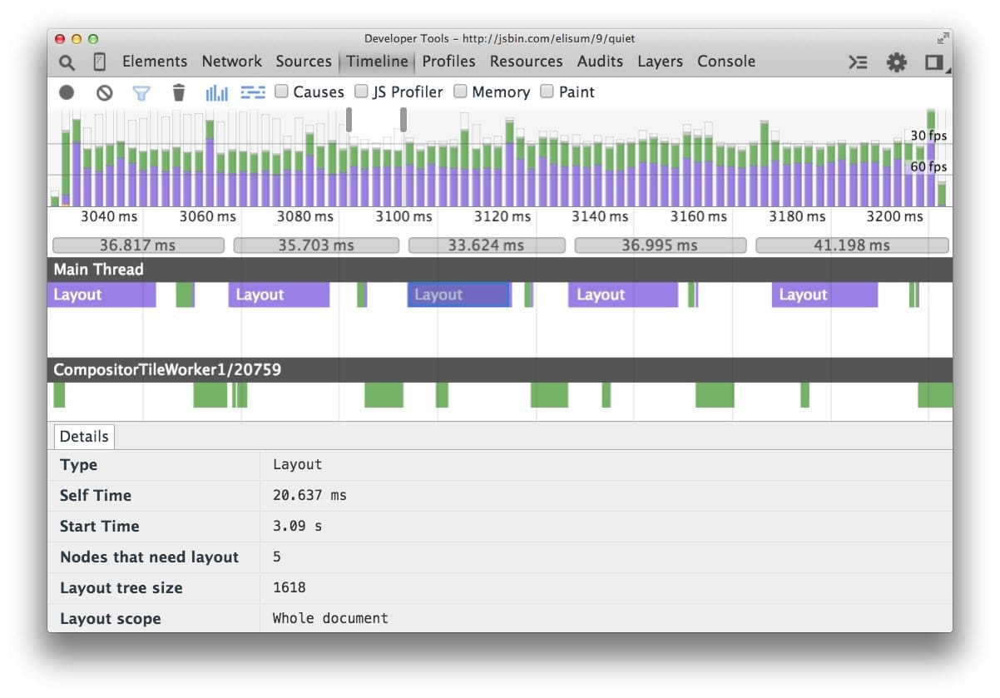
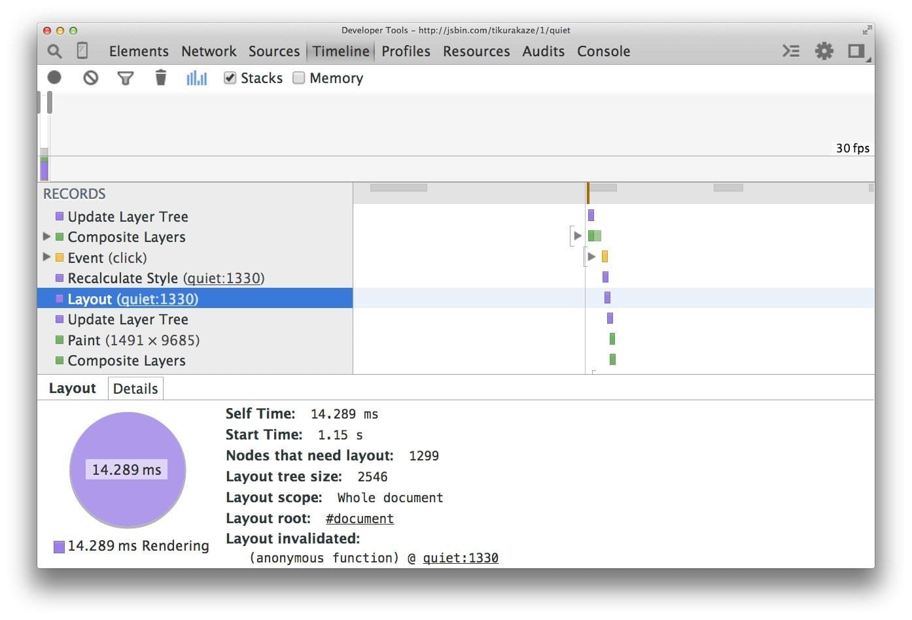
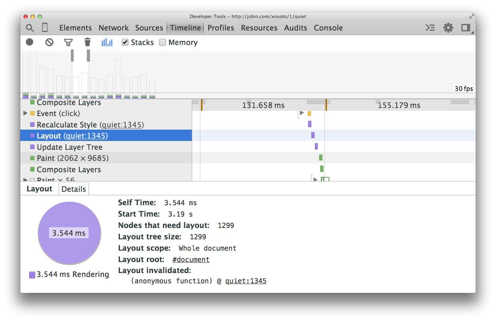

project_path: /web/_project.yaml
book_path: /web/fundamentals/_book.yaml
description:布局是浏览器计算各元素几何信息的过程：元素的大小以及在页面中的位置。根据所用的 CSS、元素的内容或父级元素，每个元素都将有显式或隐含的大小信息。此过程在 Chrome 中称为布局 (Layout)。

# 避免大型、复杂的布局和布局抖动 {: .page-title }

{# wf_updated_on: 2015-03-20 #}
{# wf_published_on: 2015-03-20 #}



布局是浏览器计算各元素几何信息的过程：元素的大小以及在页面中的位置。
根据所用的 CSS、元素的内容或父级元素，每个元素都将有显式或隐含的大小信息。此过程在 Chrome、Opera、Safari 和 Internet Explorer 中称为布局 (Layout)。
在 Firefox 中称为自动重排 (Reflow)，但实际上其过程是一样的。

与样式计算相似，布局开销的直接考虑因素如下：

1. 需要布局的元素数量。
2. 这些布局的复杂性。

### TL;DR {: .hide-from-toc }

* 布局的作用范围一般为整个文档。
* DOM 元素的数量将影响性能；应尽可能避免触发布局。
* 评估布局模型的性能；新版 Flexbox 一般比旧版 Flexbox 或基于浮动的布局模型更快。
* 避免强制同步布局和布局抖动；先读取样式值，然后进行样式更改。

## 尽可能避免布局操作

当您更改样式时，浏览器会检查任何更改是否需要计算布局，以及是否需要更新渲染树。对“几何属性”（如宽度、高度、左侧或顶部）的更改都需要布局计算。

    .box {
      width: 20px;
      height: 20px;
    }

    /**
     * Changing width and height
     * triggers layout.
     */
    .box--expanded {
      width: 200px;
      height: 350px;
    }

**布局几乎总是作用到整个文档。** 如果有大量元素，将需要很长时间来算出所有元素的位置和尺寸。

如果无法避免布局，关键还是要使用 Chrome DevTools 来查看布局要花多长时间，并确定布局是否为造成瓶颈的原因。首先，打开 DevTools，选择“Timeline”标签，点击“record”按钮，然后与您的网站交互。当您停止记录时，将看到网站表现情况的详细分析：

在仔细研究上例中的框架时，我们看到超过 20 毫秒用在布局上，当我们在动画中设置 16 毫秒来获取屏幕上的框架时，此布局时间太长。您还可以看到，DevTools 将说明树的大小（本例中为 1618 个元素）以及需要布局的节点数。

Note: 想要一个有关哪些 CSS 属性会触发布局、绘制或合成的确切列表？请查看 [CSS 触发器](https://csstriggers.com)。

## 使用 flexbox 而不是较早的布局模型

网页有各种布局模型，一些模式比其他模式受到更广泛的支持。最早的 CSS 布局模型使我们能够在屏幕上对元素进行相对、绝对定位或通过浮动元素定位。

下面的屏幕截图显示了在 1,300 个框上使用浮动的布局开销。当然，这是一个人为的例子，因为大多数应用将使用各种手段来定位元素。

如果我们更新此示例以使用 Flexbox（Web 平台的新模型），则出现不同的情况：

现在，对于相同数量的元素和相同的视觉外观，布局的时间要少得多（本例中为分别 3.5 毫秒和 14 毫秒）。务必记住，对于某些情况，可能无法选择 Flexbox，因为它[没有浮动那么受支持](http://caniuse.com/#search=flexbox)，但是在可能的情况下，至少应研究布局模型对网站性能的影响，并且采用最大程度减少网页执行开销的模型。

在任何情况下，不管是否选择 Flexbox，都应当在应用的高压力点期间**尝试完全避免触发布局**！

## 避免强制同步布局

将一帧送到屏幕会采用如下顺序：

首先 JavaScript 运行，然后计算样式，然后布局。但是，可以使用 JavaScript 强制浏览器提前执行布局。这被称为**强制同步布局**。

要记住的第一件事是，在 JavaScript 运行时，来自上一帧的所有旧布局值是已知的，并且可供您查询。因此，如果（例如）您要在帧的开头写出一个元素（让我们称其为“框”）的高度，可能编写一些如下代码：

    // Schedule our function to run at the start of the frame.
    requestAnimationFrame(logBoxHeight);

    function logBoxHeight() {
      // Gets the height of the box in pixels and logs it out.
      console.log(box.offsetHeight);
    }

如果在请求此框的高度之前，已更改其样式，就会出现问题：

    function logBoxHeight() {

      box.classList.add('super-big');

      // Gets the height of the box in pixels
      // and logs it out.
      console.log(box.offsetHeight);
    }

现在，为了回答高度问题，浏览器必须先应用样式更改（由于增加了 `super-big` 类），然后运行布局。这时它才能返回正确的高度。这是不必要的，并且可能是开销很大的工作。

因此，始终应先批量读取样式并执行（浏览器可以使用上一帧的布局值），然后执行任何写操作：

正确完成时，以上函数应为：

    function logBoxHeight() {
      // Gets the height of the box in pixels
      // and logs it out.
      console.log(box.offsetHeight);

      box.classList.add('super-big');
    }

大部分情况下，并不需要应用样式然后查询值；使用上一帧的值就足够了。与浏览器同步（或比其提前）运行样式计算和布局可能成为瓶颈，并且您一般不想做这种设计。

## 避免布局抖动
有一种方式会使强制同步布局甚至更糟：接二连三地执行大量这种布局。看看这个代码：

    function resizeAllParagraphsToMatchBlockWidth() {

      // Puts the browser into a read-write-read-write cycle.
      for (var i = 0; i < paragraphs.length; i++) {
        paragraphs[i].style.width = box.offsetWidth + 'px';
      }
    }

此代码循环处理一组段落，并设置每个段落的宽度以匹配一个称为“box”的元素的宽度。这看起来没有害处，但问题是循环的每次迭代读取一个样式值 (`box.offsetWidth`)，然后立即使用此值来更新段落的宽度 (`paragraphs[i].style.width`)。在循环的下次迭代时，浏览器必须考虑样式已更改这一事实，因为 `offsetWidth` 是上次请求的（在上一次迭代中），因此它必须应用样式更改，然后运行布局。每次迭代都将出现此问题！

此示例的修正方法还是先读取值，然后写入值：

    // Read.
    var width = box.offsetWidth;

    function resizeAllParagraphsToMatchBlockWidth() {
      for (var i = 0; i < paragraphs.length; i++) {
        // Now write.
        paragraphs[i].style.width = width + 'px';
      }
    }

如果要保证安全，应当查看 [FastDOM](https://github.com/wilsonpage/fastdom)，它会自动为您批处理读取和写入，应当能防止您意外触发强制同步布局或布局抖动。

{# wf_devsite_translation #}
