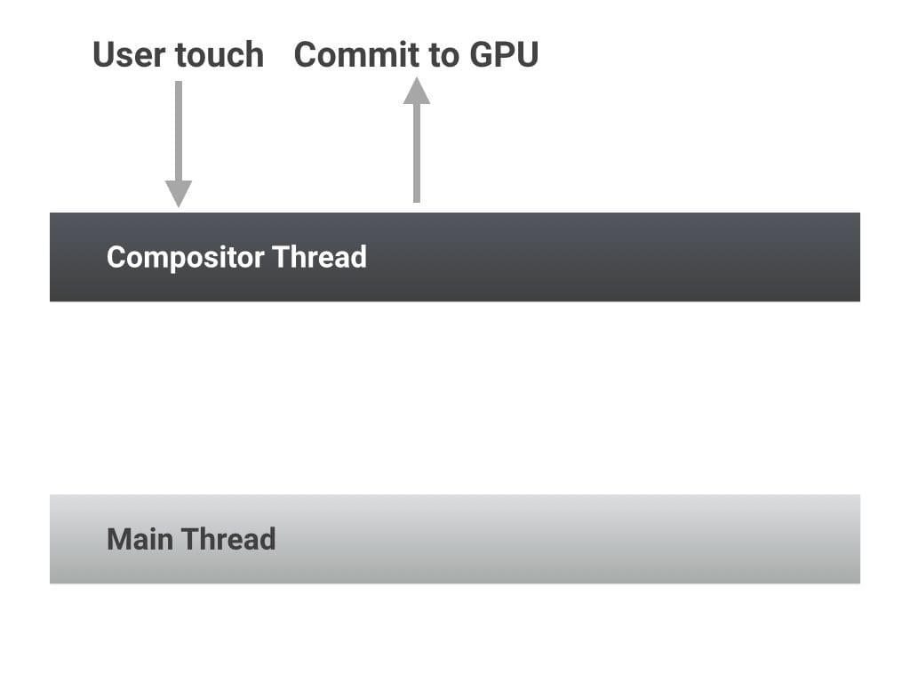
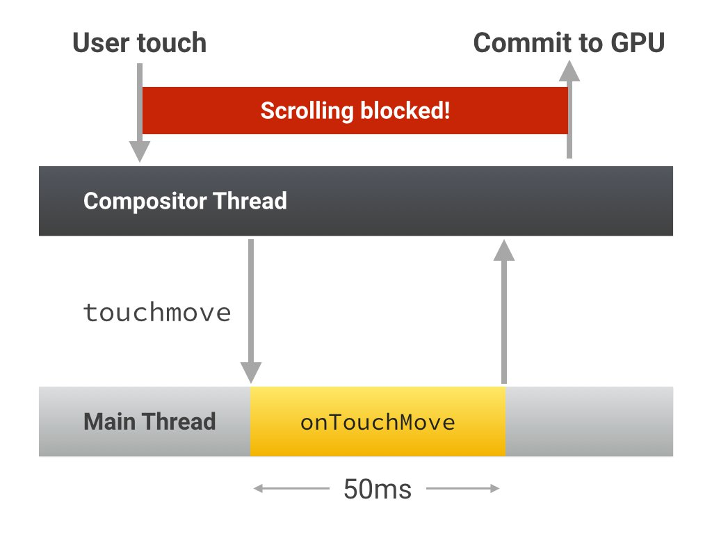
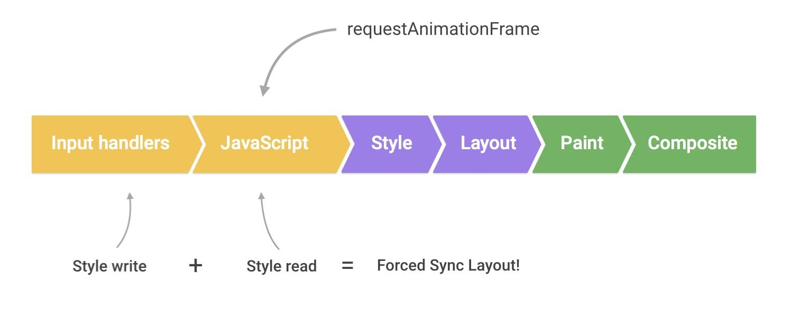

project_path: /web/_project.yaml
book_path: /web/fundamentals/_book.yaml
description:输入处理程序可能是应用出现性能问题的原因，因为它们可能阻止帧完成，并且可能导致额外（且不必要）的布局工作。

{# wf_updated_on: 2015-10-06 #}
{# wf_published_on: 2015-03-20 #}

# 使输入处理程序去除抖动 {: .page-title }



输入处理程序可能是应用出现性能问题的原因，因为它们可能阻止帧完成，并且可能导致额外（且不必要）的布局工作。

### TL;DR {: .hide-from-toc }

* 避免长时间运行输入处理程序；它们可能阻止滚动。
* 不要在输入处理程序中进行样式更改。
* 使处理程序去除抖动；存储事件值并在下一个 requestAnimationFrame 回调中处理样式更改。

##  避免长时间运行输入处理程序

在最快的情况下，当用户与页面交互时，页面的合成器线程可以获取用户的触摸输入并直接使内容移动。这不需要主线程执行任务，主线程执行的是 JavaScript、布局、样式或绘制。

但是，如果您附加一个输入处理程序，例如 `touchstart`、`touchmove` 或 `touchend`，则合成器线程必须等待此处理程序执行完成，因为您可能选择调用 `preventDefault()` 并且会阻止触摸滚动发生。即使没有调用 `preventDefault()`，合成器也必须等待，这样用户滚动会被阻止，这就可能导致卡顿和漏掉帧。

总之，要确保您运行的任何输入处理程序应快速执行，并且允许合成器执行其工作。

##  避免在输入处理程序中更改样式

与滚动和触摸的处理程序相似，输入处理程序被安排在紧接任何 `requestAnimationFrame` 回调之前运行。

如果在这些处理程序之一内进行视觉更改，则在 `requestAnimationFrame` 开始时，将有样式更改等待处理。如果按照“[避免大型、复杂的布局和布局抖动](avoid-large-complex-layouts-and-layout-thrashing)”的建议，在 requestAnimationFrame 回调开始时就读取视觉属性，您将触发强制同步布局！

##  使滚动处理程序去除抖动

上面两个问题的解决方法相同：始终应使下一个 `requestAnimationFrame` 回调的视觉更改去除抖动：

    function onScroll (evt) {

      // Store the scroll value for laterz.
      lastScrollY = window.scrollY;

      // Prevent multiple rAF callbacks.
      if (scheduledAnimationFrame)
        return;

      scheduledAnimationFrame = true;
      requestAnimationFrame(readAndUpdatePage);
    }

    window.addEventListener('scroll', onScroll);

这样做还有一个好处是使输入处理程序轻量化，效果非常好，因为现在您不用去阻止计算开销很大的代码的操作，例如滚动或触摸！

{# wf_devsite_translation #}
