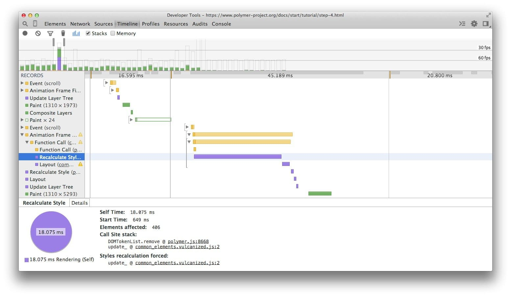
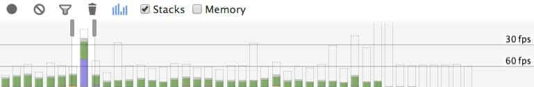
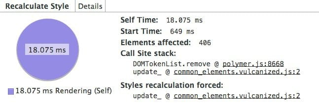

project_path: /web/_project.yaml
book_path: /web/fundamentals/_book.yaml
description:视觉变化通常是通过 JavaScript 触发的。有时是直接通过样式操作，有时是会产生视觉变化的计算，例如搜索某些数据或将其排序。时机不当或长时间运行的 JavaScript 可能是导致性能问题的常见原因，您应当设法尽可能减少其影响。

{# wf_updated_on:2018-07-23 #}
{# wf_published_on:2015-03-20 #}

# 缩小样式计算的范围并降低其复杂性 {: .page-title }



通过添加和删除元素，更改属性、类或通过动画来更改 DOM，全都会导致浏览器重新计算元素样式，在很多情况下还会对页面或页面的一部分进行布局（即自动重排）。这就是所谓的<em>计算样式的计算</em>。

计算样式的第一部分是创建一组匹配选择器，这实质上是浏览器计算出给指定元素应用哪些类、伪选择器和 ID。

第二部分涉及从匹配选择器中获取所有样式规则，并计算出此元素的最终样式。在 Blink（Chrome 和 Opera 的渲染引擎）中，这些过程的开销至少在目前是大致相同的：

> 用于计算某元素计算样式的时间中大约有 50% 用来匹配选择器，而另一半时间用于从匹配的规则中构建 RenderStyle（计算样式的表示）。
> Rune Lillesveen, Opera / [Blink 中的样式失效机制](https://docs.google.com/document/d/1vEW86DaeVs4uQzNFI5R-_xS9TcS1Cs_EUsHRSgCHGu8/view)

### TL;DR {: .hide-from-toc }

* 降低选择器的复杂性；使用以类为中心的方法，例如 BEM。
* 减少必须计算其样式的元素数量。

## 降低选择器的复杂性

在最简单的情况下，您在 CSS 中引用只有一个类的元素：

    .title {
      /* styles */
    }

但是，随着项目的增长，将可能产生更复杂的 CSS，最终您的选择器可能变成这样：

    .box:nth-last-child(-n+1) .title {
      /* styles */
    }

为了知道是否需要应用样式，浏览器实际上必须询问“这是否为有 title 类的元素，其父元素恰好是负第 N 个子元素加上 1 个带  box 类的元素？”计算此结果可能需要大量时间，具体取决于所用的选择器和相应的浏览器。选择器的预期行为可以更改为一个类：

    .final-box-title {
      /* styles */
    }

您可能对该类的名称有疑问，但此工作对于浏览器而言要简单得多。在上一版本中，为了知道（例如）该元素是否为其类型的最后一个，浏览器首先必须知道关于其他元素的所有情况，以及其后面是否有任何元素会是第 N 个最后子元素，因为其类匹配，这可能比简单地将选择器与元素匹配的开销要大得多。

## 减少要计算样式的元素数量
另一个性能考虑，对于_许多样式更新而言是更重要的因素_，即减少在元素更改时需要计算的工作量。

总体来说，计算元素的计算样式的最糟糕的开销情况是元素数量乘以选择器数量，因为需要对照每个样式对每个元素都检查至少一次，看它是否匹配。

Note: 以前曾经是这样：如果您改变了（例如）body 元素上的一个类，则该页的所有子元素将需要重新计算其计算样式。幸好情况不再是这样；对于更改时会导致重新计算样式的元素，某些浏览器维护一小组每个这种元素独有的规则。这意味着，根据元素在树中的位置以及所改变的具体属性，元素不一定需要重新计算。

样式计算可能经常是直接针对少量元素，而不是声明整个页面无效。在现代浏览器中，这往往不再是个问题，因为浏览器并不一定需要检查一项更改可能影响的所有元素。另一方面，较早的浏览器不一定针对此类任务进行了优化。应当尽可能**减少声明为无效的元素的数量**。

Note: 如果您热衷于网页组件，有一点值得注意，样式计算在这方面稍有不同，因为默认情况下样式不会跨越 Shadow DOM 的边界，并且范围限于单个组件，而不是整个树。但是，总体来看，同样的概念仍然适用：规则简单的小树比规则复杂的大树会得到更高效地处理。

## 测量样式重新计算的开销

测量样式重新计算的最简单、最好的方法是使用 Chrome DevTools 的 Timeline 模式。首先，打开 DevTools，转至 Timeline 选项卡，选中记录并与您的网站交互。停止记录后，将看到下图所示情况。

顶部的条表示每秒帧数，如果看到柱形超过较低的线，即 60fps 线，则存在长时间运行的帧。

如果一些滚动之类的交互或其他交互时出现长时间运行的帧，则应当进一步审查。

如果出现较大的紫色块，如上例所示，请点击记录了解到更多细节。

在这次抓取中，有一个长时间运行的重新计算样式事件，其时间刚好超过 18 毫秒，并且恰好发生在滚动期间，导致用户体验到明显的抖动。

如果点击事件本身，将看到一个调用栈，精确指出了您的 JavaScript 中导致触发样式更改的位置。此外，您还获得样式受更改影响的元素数量（本例中刚好超过 400 个元素），以及执行样式计算所花的时间。您可以使用此信息来开始尝试在代码中查找修正点。

## 使用块、元素、修饰符

[BEM（块、元素、修饰符）](https://bem.info/){: .external }之类的编码方法实际上纳入了上述选择器匹配的性能优势，因为它建议所有元素都有单个类，并且在需要层次结构时也纳入了类的名称：

    .list { }
    .list__list-item { }

如果需要一些修饰符，像在上面我们想为最后一个子元素做一些特别的东西，就可以按如下方式添加：

    .list__list-item--last-child {}

如果您在寻找一种好方法来组织您的 CSS，则 BEM 真的是个很好的起点，不仅从结构的角度如此，还因为样式查找得到了简化。

如果不喜欢 BEM，还可使用其他方法来组织您的 CSS，但是应评估其性能注意事项以及方法的人体工学。

##  资源

* [Blink 中的样式失效机制](https://docs.google.com/document/d/1vEW86DaeVs4uQzNFI5R-_xS9TcS1Cs_EUsHRSgCHGu8/edit)
* [BEM（块、元素、修饰符）](https://bem.info/){: .external }

{# wf_devsite_translation #}
