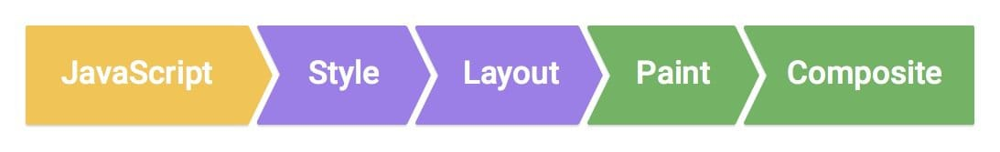
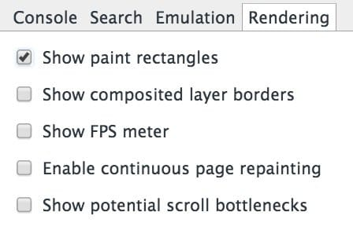
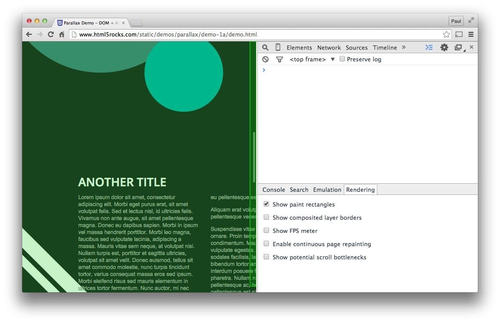
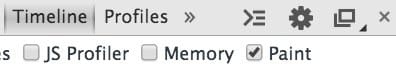
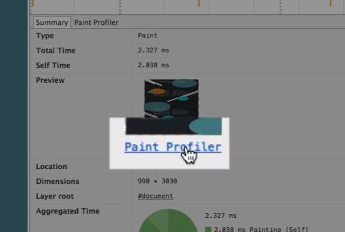
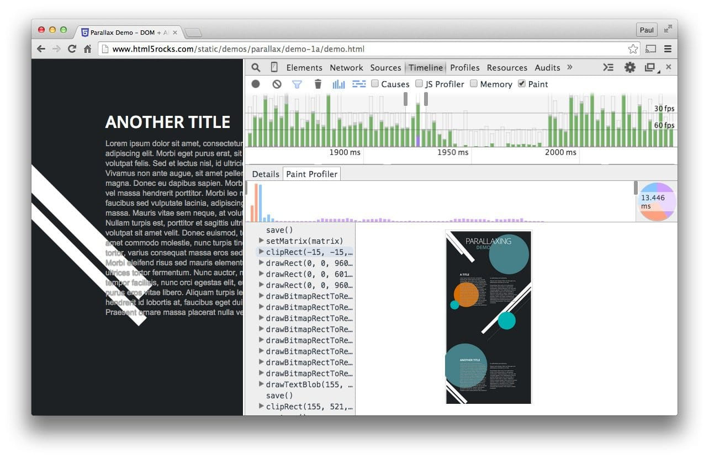
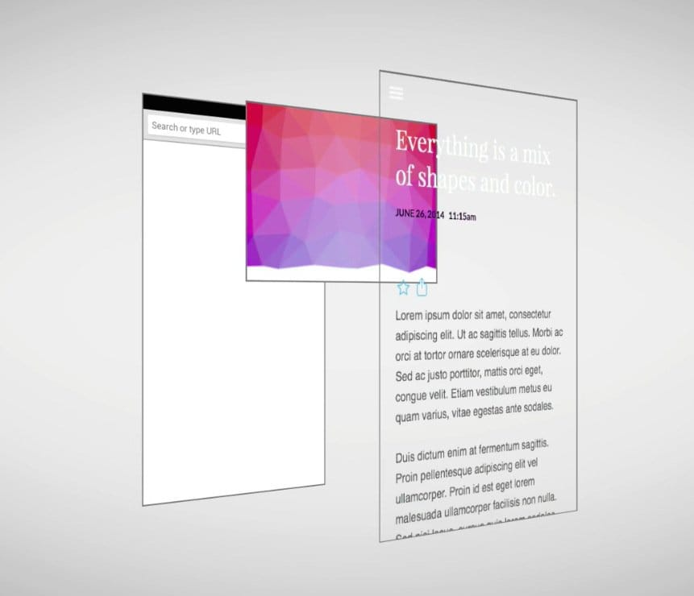
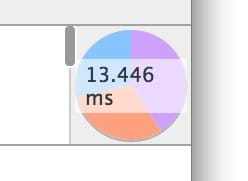

project_path: /web/_project.yaml
book_path: /web/fundamentals/_book.yaml
description:绘制是填充像素的过程，像素最终合成到用户的屏幕上。它往往是管道中运行时间最长的任务，应尽可能避免此任务。

{# wf_updated_on:2015-03-20 #}
{# wf_published_on:2015-03-20 #}

# 简化绘制的复杂度、减小绘制区域 {: .page-title }



绘制是填充像素的过程，像素最终合成到用户的屏幕上。
它往往是管道中运行时间最长的任务，应尽可能避免此任务。

### TL;DR {: .hide-from-toc } 

* 除 transform 或 opacity 属性之外，更改任何属性始终都会触发绘制。
* 绘制通常是像素管道中开销最大的部分；应尽可能避免绘制。
* 通过层的提升和动画的编排来减少绘制区域。
* 使用 Chrome DevTools 绘制分析器来评估绘制的复杂性和开销；应尽可能降低复杂性并减少开销。

## 触发布局与绘制

如果您触发布局，则总是会触发绘制，因为更改任何元素的几何属性意味着其像素需要修正！

如果更改非几何属性，例如背景、文本或阴影，也可能触发绘制。在这些情况下，不需要布局，并且管道将如下所示：

##  使用 Chrome DevTools 快速确定绘制瓶颈

  <figure>
    
  </figure>

您可以使用 Chrome DevTools 来快速确定正在绘制的区域。打开 DevTools，按下键盘上的 Esc 键。在出现的面板中，转到“rendering”标签，然后选中“Show paint rectangles”。

打开此选项后，每次发生绘制时，Chrome 将让屏幕闪烁绿色。如果看到整个屏幕闪烁绿色，或看到您认为不应绘制的屏幕区域，则应当进一步研究。

  <figure>
    
  </figure>

Chrome DevTools Timeline 中有一个选项为您提供更多信息：绘制分析器。要启用此选项，转至 Timeline，然后选中顶部的“Paint”框。需要注意的是，请务必仅在尝试分析绘制问题时才打开此选项，因为它会产生开销，并且会歪曲您的性能分析结果。最好是在想要更深入了解具体绘制内容时使用。

  <figure>
    
  </figure>

完成了上述设置之后，现在可以运行 Timeline 录制，并且绘制记录将包含明显更多的细节。通过点击一帧的绘制记录，您将进入该帧的绘制分析器：

点击绘制分析器将调出一个视图，您可以查看所绘制的元素、所花的时间，以及所需的各个绘制调用：

此分析器让您知道区域和复杂性（实际上就是绘制所花的时间），如果不能选择避免绘制，这两个都是您可以设法修正的方面。

## 提升移动或淡出的元素

绘制并非总是绘制到内存中的单个图像。事实上，在必要时浏览器可以绘制到多个图像或合成器层。

此方法的优点是，定期重绘的或通过变形在屏幕上移动的元素，可以在不影响其他元素的情况下进行处理。Sketch、GIMP 或 Photoshop 之类的艺术文件也是如此，各个层可以在彼此的上面处理并合成，以创建最终图像。

创建新层的最佳方式是使用 `will-change` CSS 属性。此方法在 Chrome、Opera 和 Firefox 上有效，并且通过 `transform` 的值将创建一个新的合成器层：

    .moving-element {
      will-change: transform;
    }

对于不支持 `will-change` 但受益于层创建的浏览器，例如 Safari 和 Mobile Safari，需要使用（滥用）3D 变形来强制创建一个新层：

    .moving-element {
      transform: translateZ(0);
    }

但需要注意的是：不要创建太多层，因为每层都需要内存和管理开销。有关此主题的更多信息，请参考[坚持仅合成器的属性和管理层计数](stick-to-compositor-only-properties-and-manage-layer-count)部分。

如果您已将一个元素提升到一个新层，可使用 DevTools 确认这样做已给您带来性能优势。**请勿在不分析的情况下提升元素。**

## 减少绘制区域

然而有时，虽然提升元素，却仍需要绘制工作。绘制问题的一个大挑战是，浏览器将两个需要绘制的区域联合在一起，而这可能导致整个屏幕重绘。因此，举例而言，如果页面顶层有一个固定标头，而在屏幕底部还有正在绘制的元素，则整个屏幕可能最终要重绘。

注：在高 DPI 屏幕上，固定位置的元素会被自动提升到其自有的渲染合并层。在低 DPI 设备上则不是这样，因为提升会将文本渲染从亚像素更改为灰度，并且层提升需要手动完成。

减少绘制区域往往是编排您的动画和变换，使其不过多重叠，或设法避免对页面的某些部分设置动画。

## 降低绘制的复杂性

  <figure>
    
  </figure>

在谈到绘制时，一些绘制比其他绘制的开销更大。例如，绘制任何涉及模糊（例如阴影）的元素所花的时间将比（例如）绘制一个红框的时间要长。但是，对于 CSS 而言，这点并不总是很明显：`background: red;` 和 `box-shadow: 0, 4px, 4px, rgba(0,0,0,0.5);` 看起来不一定有截然不同的性能特性，但确实很不相同。

利用上述绘制分析器，您可以确定是否需要寻求其他方式来实现效果。问问自己，是否可能使用一组开销更小的样式或替代方式来实现最终结果。

您要尽可能的避免绘制的发生，特别是在动画效果中。因为每帧 **10 毫秒**的时间预算一般来说是不足以完成绘制工作的，尤其是在移动设备上。

{# wf_devsite_translation #}
