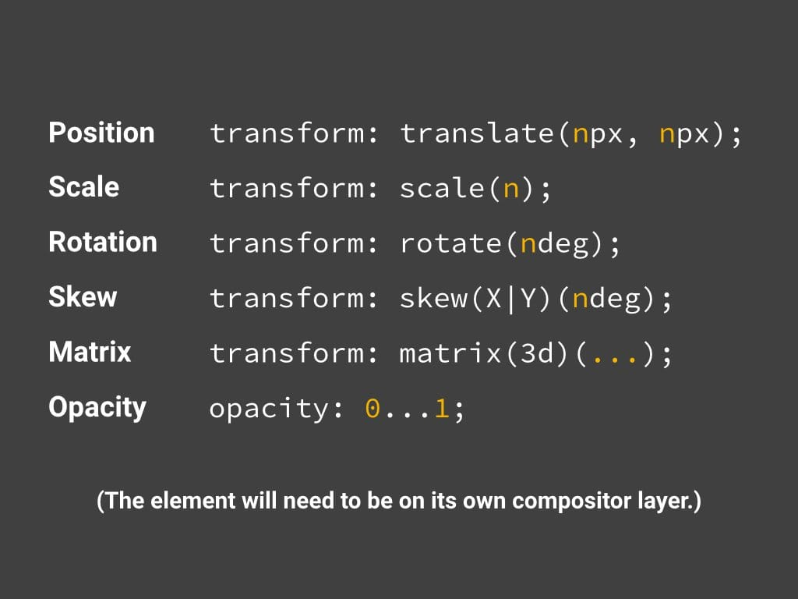
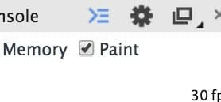
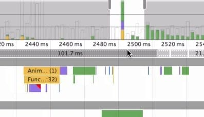
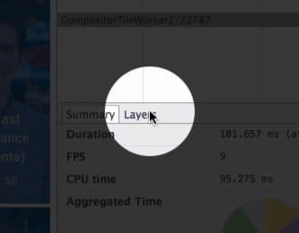
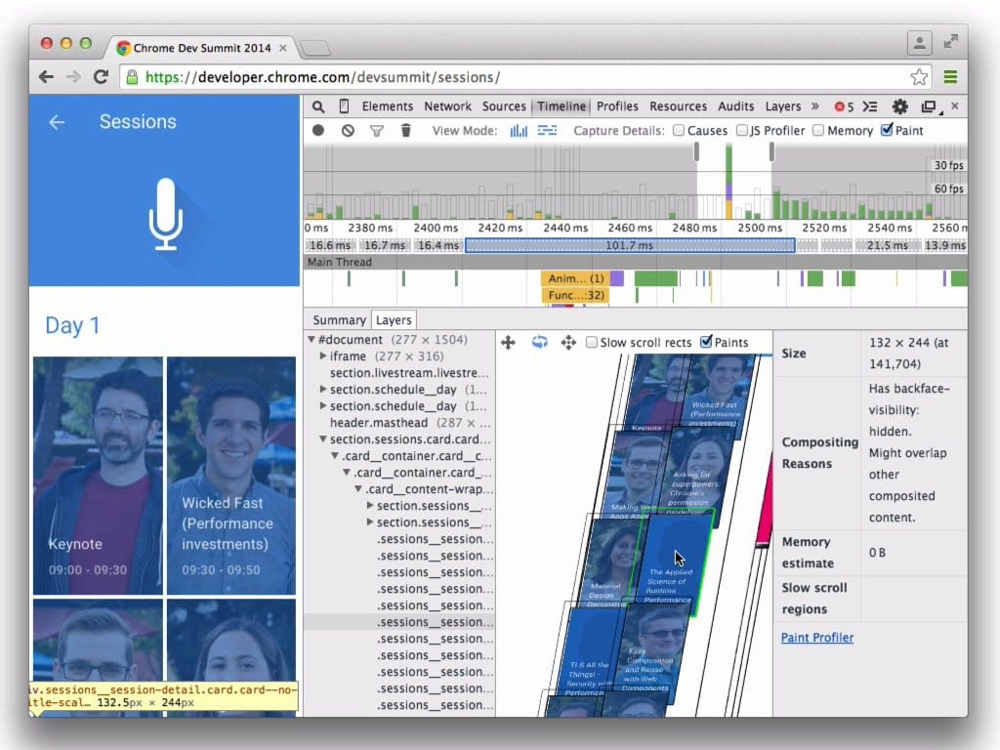

project_path: /web/_project.yaml
book_path: /web/fundamentals/_book.yaml
description:合成是将页面的已绘制部分放在一起以在屏幕上显示的过程。

{# wf_updated_on:2015-03-20 #}
{# wf_published_on:2015-03-20 #}

# 坚持仅合成器的属性和管理层计数 {: .page-title }



合成是将页面的已绘制部分放在一起以在屏幕上显示的过程。

此方面有两个关键因素影响页面的性能：需要管理的合成器层数量，以及您用于动画的属性。

### TL;DR {: .hide-from-toc }

* 坚持使用 transform 和 opacity 属性更改来实现动画。
* 使用 `will-change` 或 `translateZ` 提升移动的元素。
* 避免过度使用提升规则；各层都需要内存和管理开销。

## 使用 transform 和 opacity 属性更改来实现动画

性能最佳的像素管道版本会避免布局和绘制，只需要合成更改：

为了实现此目标，需要坚持更改可以由合成器单独处理的属性。目前只有两个属性符合条件：**`transforms`** 和 **`opacity`**：

使用 `transform` 和 `opacity` 时要注意的是，您更改这些属性所在的元素应处于其自身的合成器层。要做一个层，您必须提升元素，后面我们将介绍方法。

Note: 如果担心可能无法限制动画只使用这些属性，请看看 [FLIP 原则](https://aerotwist.com/blog/flip-your-animations)，这可能帮助您将动画从开销更大的属性重新映射为变形和透明度的更改。

## 提升您打算设置动画的元素

正如我们在“[降低绘制的复杂性并减少绘制区域](simplify-paint-complexity-and-reduce-paint-areas)”一节所述，应当将您打算设置动画的元素（在合理范围内，不要过度！）提升到其自己的层：

    .moving-element {
      will-change: transform;
    }

或者，对于旧版浏览器，或者不支持 will-change 的浏览器：

    .moving-element {
      transform: translateZ(0);
    }

这可以提前警示浏览器即将出现更改，根据您打算更改的元素，浏览器可能可以预先安排，如创建合成器层。

## 管理层并避免层数激增

层往往有助于性能，知道这一点可能会诱使开发者通过以下代码来提升页面上的所有元素：

    * {
      will-change: transform;
      transform: translateZ(0);
    }

这是以迂回方式说您想要提升页面上的每个元素。此处的问题是您创建的每一层都需要内存和管理，而这些并不是免费的。事实上，在内存有限的设备上，对性能的影响可能远远超过创建层带来的任何好处。每一层的纹理都需要上传到 GPU，使 CPU 与 GPU 之间的带宽、GPU 上可用于纹理处理的内存都受到进一步限制。

Warning: 如无必要，请勿提升元素。

## 使用 Chrome DevTools 来了解应用中的层

  <figure>
    
  </figure>

要了解应用中的层，以及某元素有层的原因，您必须在 Chrome DevTools 的 Timeline 中启用绘制分析器：

打开此选项后，您应当进行录制。录制结束后，您将能够点击单个帧，这些帧位于 FPS 柱形之间，细节如下：

点击此处将为您提供一个新的详情选项：“layer”选项卡。

此选项将调出新的视图，使您能够平移、扫描和放大该帧中的所有层，并了解每层被创建的原因。

您可以使用此视图来跟踪所用的层数。如果您在滚动或变换之类的性能关键型操作期间花了很多时间在合成上（应当力争在 **4-5 毫秒**左右），则可以使用此处的信息来查看有多少层、创建层的原因，并从此处管理应用中的层数。

{# wf_devsite_translation #}
